# Appendix

A systematic compilation of advanced technical elements for the practical implementation of natural language macro programming. This appendix provides technical details crucial for real-world operations, including reliability assurance in LLM systems with probabilistic behavioral characteristics, external system integration, type safety, and quality assurance.

## Table of Contents

- [A.1: System Control and Resource Management](#a1-system-control-and-resource-management)
- [A.2: Event-Driven Execution](#a2-event-driven-execution)
- [A.3: Risk Mitigation Strategies for Important Tasks](#a3-risk-mitigation-strategies-for-important-tasks)
- [A.4: Python Tool Integration](#a4-python-tool-integration)
- [A.5: Multi-Agent System Design](#a5-multi-agent-system-design)
- [A.6: Audit Log System](#a6-audit-log-system)
- [A.7: LLM-based Verification System (LLM-based Lint)](#a7-llm-based-verification-system-llm-based-lint)
- [A.8: Metaprogramming](#a8-metaprogramming)
- [A.9: Ensemble Execution and Consensus Formation](#a9-ensemble-execution-and-consensus-formation)
- [A.10: Type Safety and Schema Management](#a10-type-safety-and-schema-management)
- [A.11: Concurrent Access Control and Optimistic Locking](#a11-concurrent-access-control-and-optimistic-locking)
- [A.12: LLM-based Evaluation Testing](#a12-llm-based-evaluation-testing)
- [A.13: Variable Management Persistence and Scaling: Database Utilization](#a13-variable-management-persistence-and-scaling-database-utilization)
- [A.14: Vector Database and RAG Utilization](#a14-vector-database-and-rag-utilization)
- [A.15: Goal-Oriented Architecture and Autonomous Planning](#a15-goal-oriented-architecture-and-autonomous-planning)
- [A.16: Python Orchestration-Based Hybrid Approach](#a16-python-orchestration-based-hybrid-approach)
- [A.17: SQLite-Based Variable Management Implementation](#a17-sqlite-based-variable-management-implementation)

---

## A.1: System Control and Resource Management

When agents perform tasks, they need to be mindful of resource constraints (budget, API call limits, time allowances, computational costs, etc.). Real-world agents do not possess infinite resources, and cost-conscious decision-making under resource constraints is essential for practical systems.

### What are Slash Commands?

**Slash commands** are special commands in Claude Code that begin with "/". They can be executed directly during natural language conversations and enable checking and controlling Claude Code's system state. Unlike traditional command-line operations, they can be executed seamlessly within the flow of dialogue.

#### Main Built-in Commands

Claude Code provides the following built-in slash commands:

- `/help` - Display list and descriptions of available commands
- `/clear` - Reset conversation history and context (memory optimization)
- `/model` - Switch between Claude models (Opus/Sonnet, etc.)
- `/ide` - Check IDE integration status (open files, linter errors, etc.)
- `/permissions` - Manage tool allowlists


### Key Points

**1. Actual System Information Retrieval**
- Real-time development environment status checking via `/ide`
- Dynamic discovery of available functions via `/help`
- Decision-making based on actual system state

**2. Dynamic Environment Control**
- Timely memory management via `/clear`
- Optimization according to processing characteristics via `/model`
- Dynamic adjustment based on performance requirements

**3. Integration with Conditional Branching**
- Processing branches based on system state
- Determining next actions based on execution results
- Practical workflow automation

**4. Economic Rationality-based Resource Management**
- Cost prediction before task execution and outcome maximization within budget constraints
- Dynamic model selection based on task importance (`/model` strategic switching)
- Continuous budget monitoring and automatic throttling when exceeding risk occurs

The use of slash commands enables economically rational agent design that considers resource constraints.

## A.2: Event-Driven Execution

Many processes in the real world occur asynchronously. Systems that can immediately respond to external stimuli such as file creation, email reception, and sensor value changes are required to have high responsiveness. Event-Driven execution is a primitive that asynchronously listens for specific events and executes corresponding tasks when detected.

### What is Event-Driven?

**Event-Driven execution** is an execution model that starts tasks asynchronously triggered by external events, in contrast to Sequential Pipeline which is synchronous. Agents monitor events in a waiting state and automatically begin processing when specific conditions are met.

### External Trigger Model

The most practical and robust approach is a hybrid design that delegates event monitoring to existing proven technologies and allows the LLM to focus on post-trigger processing.

#### Main Implementation Technology Examples

**1. Time Triggers with cron**
- Automatic invocation at specified times
- Basic implementation method for scheduled tasks

**2. File Monitoring with watchdog**
- File system monitoring using Python's watchdog library
- Detection of file creation, modification, and deletion events
- Continuous monitoring of specified directories with immediate response

**3. Polling**
- Change detection through periodic state checking
- Monitoring SQLite databases and API endpoints
- Simple and reliable implementation with resource usage trade-offs

### Integration Patterns

Typical integration example: "Continuously monitor directory `/orders`, and when a new file (e.g., `order123.json`) is created, evaluate `order_processing.md` with that file path as an argument" by running a resident script.

**Variable Change Monitoring**: Variable changes within SQLite databases can also be utilized as event sources. Through polling monitoring with `watch_variables.py`, patterns such as "execute the next macro when {{status}} changes to completed" become feasible (see A.17 for detailed implementation).

### Key Points

**1. Asynchronous Processing Implementation**
- Immediate response to external events
- Parallel monitoring of multiple events
- Improved system-wide responsiveness

**2. Flexibility in Technology Selection**
- Choice of monitoring technology according to requirements
- Easy integration with existing systems
- Adaptability to operational environments

**3. Integration with Macro Files**
- Separation of event information and processing logic
- Dynamic modification of processing content
- Construction of reusable processing patterns

Event-Driven execution enables the construction of agent systems with high responsiveness for real-time systems and business automation.

## A.3: Risk Mitigation Strategies for Important Tasks

### Background and Challenge Recognition

Natural Language Macro Programming is expected to be utilized across diverse fields due to its intuitiveness and high explainability. However, due to uncertainties derived from the probabilistic behavioral characteristics of LLMs (Large Language Models), appropriate risk mitigation strategies are necessary for high-importance tasks.

**Characteristics and Challenges of Probabilistic Systems**:
- Difficulty in guaranteeing 100% operational reliability in principle (probabilistic operating system)
- Possibility of unexpected interpretations or execution results
- Need for careful operation in important business processes
- Clarification of application scope and recognition of limitations

**Purpose of This Section**:
Assuming the nature of probabilistic systems, to achieve safe and responsible utilization of natural language macro programming for important business tasks through a four-layer defense strategy (proactive design prevention, runtime error handling, auditing and continuous improvement, quality assurance testing).

### Layer 1: Proactive Design Measures (Proactive Design)

Incorporate risk reduction mechanisms in advance during the workflow design stage.

#### 1. Strategic Placement of Human-in-the-Loop (HITL)

**Approval Gate Design at Critical Points**:

```markdown
## Approval Process for Critical Decisions
Please review the following processing content:
{{proposed_action}}

This process includes irreversible changes.
Please respond with "Approved" or "Revision Required".
Will not proceed to next step without approval.

Save approval result to {{human_approval}}.

## Safety Control through Conditional Branching
Only when {{human_approval}} is "Approved":
Execute critical_operation.md

Otherwise:
Stop processing and transition to revision pending state.
```

**Implementation Points**:
- Must be placed immediately before irreversible operations (file deletion, external API calls, financial transactions, etc.)
- Utilize "Approval Waiting Pattern" from "Human-in-the-Loop" pattern
- Predefine clear approval and rejection criteria

#### 2. Graceful Degradation Design

Design that continues to provide limited but valuable service when ideal conditions are not available, rather than immediately stopping the system.

```markdown
## Staged Alternative Processing for API Connections
Try the following process:
Retrieve latest data from external API and save to {{latest_data}}

If it fails (Catch):
Retrieve latest available data from local cache and save to {{cached_data}}
Set warning "Note: Data is from {{cache_date}}" to {{warning}}

Finally:
Continue analysis using {{latest_data}} or {{cached_data}}
Include {{warning}} in results if quality degradation warning exists
```

#### 3. Execution Permission Minimization

Minimize permissions granted to the system and implement strict access control for functions involving risks.

```markdown
## Permission Control Implementation Example
/permissions Allow file reading and text generation only

When dangerous command execution is required:
"This operation requires system administrator privileges.
Request manual execution by administrator."
Pause processing and wait for human intervention
```

#### 4. Sandbox-based Execution Environment Isolation

Execute agent-generated and executed code within secure environments completely isolated from the host system. This achieves fundamental security protection based on "Secure by Design" principles.

##### Container-based Sandbox

**Complete Isolation via Docker Containers**:

```markdown
## Automatic Sandboxing for Dangerous Code Execution
Please execute the following Python script in an isolated environment:

{{generated_script}}

Sandbox Configuration:
- Execution Environment: Docker container (python:3.11-alpine)
- Filesystem: Access only to /sandbox directory
- Network: External connections blocked (localhost excluded)
- Resource Limits: 512MB memory, 1 CPU core, 5-minute execution time

Save execution result to {{sandbox_result}},
Record error details in {{sandbox_error}} if abnormal termination occurs
```

**Implementation Key Points**:
- Complete blocking of direct access to host filesystem
- Mounting only dedicated temporary directory (/sandbox)
- Runaway prevention through execution time and resource limits
- Prevention of unintended external access through network isolation

##### Graduated Security Policy Application

**Automatic Isolation Based on Risk Level**:

```markdown
## Risk Assessment of Execution Content and Sandbox Selection

Automatic judgment based on code analysis results:
{{code_risk_assessment}}

Execution environment selection by judgment result:
- Safe (read-only operations): Direct execution in host environment
- Caution (file creation/modification): Restricted host environment
- Dangerous (system calls/external communication): Docker sandbox
- Extremely dangerous (admin privilege requests): Execution refusal, human intervention required

Selected execution environment: {{selected_sandbox}}
Approval rationale: {{approval_reason}}
```

##### Integration Effects with Existing Technologies

**Synergy with Execution Permission Minimization**:
- Dual protection through permission control + environment isolation
- Fundamental neutralization of privilege escalation attacks
- Implementation of zero-trust principles

**Coordination with A.7 LLM-based Verification**:
- Risk assessment through pre-verification
- Automatic sandbox level selection based on assessment results
- Execution of verified code also in isolated environment

**Combination with A.15 Autonomous Planning**:
- Safe long-term execution of autonomous agents
- Security risk assessment at planning stage
- Experimental code execution within sandbox

### Layer 2: Runtime Error Handling

Prevent the system from falling into catastrophic states when unexpected errors occur.

#### 1. Redundancy through Try-Catch-Finally

```markdown
## Robust External Integration Processing
Try the following process:
Retrieve important data from main API

If it fails (Catch):
Retrieve similar data from backup API
Record that source is different in {{data_source_warning}}

If backup also fails (Catch):
Search existing database for available alternative data
Set "Data freshness is limited" to {{limitation_note}}

Finally:
Clearly record retrieved data and its limitations
Report quality level along with processing results
```

#### 2. State Persistence and Recovery Mechanisms

Address the risk of process interruption, especially for long-running tasks.

```markdown
## Design for Interruptible Long-term Processing
Save progress to progress_state.json at each stage of long-term tasks:

Upon Step 1 completion:
{"completed_steps": ["data_collection"], "current_step": "analysis", "timestamp": "2025-01-15T10:30:00Z"}

Upon Step 2 completion:
{"completed_steps": ["data_collection", "analysis"], "current_step": "report_generation", "timestamp": "2025-01-15T11:45:00Z"}

## Recovery Processing
Check progress_state.json and resume processing from last completed step
Record "Processing resumed from {{timestamp}}" in log
```

### Layer 3: Auditing and Continuous Improvement

Record and analyze system behavior to reduce future risks.

#### 1. Log Recording Examples

```markdown
## Create Audit Log for All Processing
At execution start:
{"timestamp": "2025-01-15T09:00:00Z", "action": "process_start", "user_input": "{{original_request}}", "system_state": "{{initial_state}}"}

During Human-in-the-Loop intervention:
{"timestamp": "2025-01-15T09:15:00Z", "action": "human_intervention", "decision": "{{human_decision}}", "rationale": "{{human_rationale}}", "context": "{{decision_context}}"}

When error occurs:
{"timestamp": "2025-01-15T09:30:00Z", "action": "error_occurred", "error_type": "{{error_type}}", "error_message": "{{error_details}}", "recovery_action": "{{recovery_method}}"}

Persist all logs to audit_log.json
```

#### 2. Utilizing Learning from Experience

```markdown
## Converting Failure Patterns to Learning Data
Update learning database when errors occur:

Record in failure_patterns.json:
{
  "error_type": "API_timeout",
  "context": "high_traffic_period",
  "failed_action": "external_data_fetch",
  "successful_recovery": "switch_to_cached_data",
  "lesson_learned": "Prioritize cached data from the start during high traffic periods"
}

In similar situations next time:
Check past failure patterns and proactively use cached data
"Selected safe alternative based on past learning"
```

Understanding the probabilistic characteristics of natural language macro programming and implementing appropriate risk mitigation measures enables safe and responsible utilization across diverse fields.

### Layer 4: Testing Strategy for Quality Assurance

In quality assurance for natural language macro programming, selecting appropriate testing methods based on the nature of test targets is crucial.

#### Classification of Test Targets

**Deterministic/Definitive Elements** (traditional unit testing methods applicable):
- variables.json operations (success/failure of save, load, update)
- Module execution completion verification (success/failure of `filename.md execution`)
- Basic conditional branching operations (branch execution under specified conditions)
- File operation completion verification (success/failure of read, write, delete)

**Probabilistic/Creative Elements** (LLM-based validity assessment test promising):
- Quality and validity of natural language generation
- Logical consistency of reasoning processes
- Appropriateness of complex judgments
- Evaluation of creative outputs (haiku, articles, etc.)

#### LLM-based Validity Assessment Test

For probabilistic and creative elements, objective quality assessment methods using LLM evaluators with independent contexts are effective. This approach maintains context independence and enables validity judgments from perspectives different from the executor.

**Implementation Patterns**

```markdown
Enhanced evaluator instruction example:
"Please evaluate the validity of the following execution results as an independent assessor:

Input request: {{original_request}}
Execution output: {{final_result}}
Execution log: {{debug_output}}

Evaluation criteria:
1. Task completion rate (0-100%) - Degree to which the original request was fulfilled
2. Process validity (appropriate/inappropriate) - Logical soundness of the execution approach
3. Output quality assessment (A-D rating) - Overall quality of the final deliverable
4. Logical consistency (consistent/inconsistent) - Internal coherence of reasoning and outputs
5. Creative appropriateness (1-5 scale) - Suitability of creative elements to the task context
6. Error handling effectiveness (excellent/good/poor) - Quality of error management and recovery

For each criterion, provide:
- Numerical/categorical score
- Specific reasoning with evidence from the execution log
- Recommendations for improvement (if applicable)

Maintain objectivity by focusing solely on observable outputs and documented processes."
```

**Specific Evaluation Criteria and Methodology**

The evaluation framework employs a multi-dimensional assessment matrix:

*Functional Correctness*: Verification that the macro achieved its stated objectives, measured through task completion rates and requirement fulfillment analysis.

*Process Quality*: Assessment of the execution methodology, including logical flow, decision-making rationale, and adherence to best practices.

*Output Excellence*: Evaluation of final deliverable quality, considering factors like clarity, completeness, creativity, and appropriateness to context.

*Robustness Analysis*: Assessment of error handling, edge case management, and system resilience during execution.

**Expected Effects and Technical Advantages**

*Quality Assurance Realization*: The system provides objective quality measurement for probabilistic systems, enabling systematic improvement of natural language macro programming effectiveness. This addresses the fundamental challenge of maintaining quality standards in non-deterministic environments.

*Large-scale Automated Testing*: Independent evaluators can assess thousands of macro executions simultaneously, providing comprehensive quality coverage that would be impractical with human evaluation alone. This scalability enables continuous integration and deployment practices for natural language macro systems.

*Continuous Improvement Cycles*: Evaluation results feed back into macro development, creating self-improving systems that learn from performance patterns and user feedback. This iterative enhancement mechanism enables natural language macro programming to achieve increasing sophistication over time.

**Current Status and Limitations**

*Technical Challenges*: The methodology faces several implementation hurdles including evaluator consistency calibration, computational resource requirements for large-scale assessment, and the need for robust evaluation prompt engineering to ensure reliable results.

*Research Development Directions*: Current research focuses on developing standardized evaluation frameworks, creating benchmarks for different types of natural language tasks, and investigating methods to minimize evaluator bias while maintaining assessment quality.

*Future Prospects*: The approach shows promise for development into an integrated testing framework (A.9 candidate) that would enable construction of multi-layer quality assurance systems with executors, evaluators, and meta-evaluators. This evolution could establish natural language macro programming as a reliable foundation for critical business applications, expanding its applicability beyond experimental contexts to production environments requiring high reliability and accountability.

For planning-stage risk analysis and preventive quality management through continuous monitoring, see [A.15: Goal-Oriented Architecture and Autonomous Planning](#a15-goal-oriented-architecture-and-autonomous-planning) for detailed coverage.

## A.4: Python Tool Integration

### Background and Concept

Python Tool Integration enables natural language macro programming to achieve universal access to the entire Python ecosystem, making possible a wide range of applications from specialized computational processing to business automation.

In natural language macro programming, information exchange between macros and Python programs through the variables.json file or SQLite database (see A.17) enables utilization of Python's rich library ecosystem. This integration approach makes it possible to infinitely extend the functionality of macro systems.

### Basic Integration Pattern

#### Standard Python Tool Structure

```python
#!/usr/bin/env python3
# -*- coding: utf-8 -*-
import json
from pathlib import Path

def main():
    try:
        # Read data from variables.json
        with open("variables.json", 'r', encoding='utf-8') as f:
            data = json.load(f)
        
        # Get input data
        input_data = data.get("input_key", "")
        
        # Execute Python processing (e.g., text analysis)
        result = analyze_data(input_data)
        
        # Write results back to variables.json
        data["output_key"] = result
        with open("variables.json", 'w', encoding='utf-8') as f:
            json.dump(data, f, ensure_ascii=False, indent=2)
        
        print("Processing completed")
        
    except Exception as e:
        # Record error information
        try:
            with open("variables.json", 'r', encoding='utf-8') as f:
                data = json.load(f)
            data["error"] = {"message": str(e), "status": "failed"}
            with open("variables.json", 'w', encoding='utf-8') as f:
                json.dump(data, f, ensure_ascii=False, indent=2)
        except:
            pass
        print(f"An error occurred: {e}")

def analyze_data(input_data):
    """Actual processing logic"""
    # Implement processing using Python libraries here
    return {"processed": input_data, "analysis": "result"}

if __name__ == "__main__":
    main()
```

#### Macro Invocation

```markdown
## Execute Python Tool
Execute analysis_tool.py.

Set processing results to {{analysis_result}}.
```

### Practical Example: Haiku Data Analysis Tool

As a validated example, we present a tool for detailed haiku analysis:

#### Processing Content
- **Structure Analysis**: Evaluation of 5-7-5 syllable structure
- **Vocabulary Analysis**: Classification and diversity measurement of used words
- **Creativity Evaluation**: Quantification of poetic techniques and creativity
- **Statistics Generation**: Automatic generation of overall statistics and recommendations

#### Information Exchange Flow
1. Read haiku data (`haiku_1`~`haiku_4`, `themes`, etc.) from variables.json
2. Execute detailed text analysis processing using Python
3. Save structured analysis results as `analysis_report` in variables.json

#### Macro Usage

**Prerequisites**: variables.json contains haiku data after executing the haiku generation system (haiku_direct.md)

```markdown
To analyze the haiku data currently saved in variables.json,
execute haiku_analyzer_en.py.

Set analysis results to {{analysis_report}}.
```

**Execution Example**:
1. `Execute haiku_direct.md` - Save haiku data to variables.json
2. `Execute haiku_analyzer_en.py` - Analyze saved haiku data

### Application Possibilities

#### Numerical and Scientific Computing
- **NumPy/SciPy**: Advanced numerical analysis, statistical processing, optimization calculations
- **SymPy**: Symbolic mathematics, calculus, equation solving

#### Data Analysis and Visualization
- **pandas**: CSV/Excel processing, data cleansing, aggregation analysis
- **matplotlib/plotly**: Graph generation, chart creation, data visualization

#### Machine Learning and AI
- **scikit-learn**: Classification, regression, clustering analysis
- **TensorFlow/PyTorch**: Deep learning model construction and execution

#### Business Automation
- **requests/beautifulsoup**: Web scraping, API integration
- **openpyxl/xlsxwriter**: Excel automation, report generation
- **PIL/OpenCV**: Image processing, image analysis

### Design Advantages

#### Transparency and Debuggability
- All information exchange visualized through variables.json file
- Processing states before and after can be directly verified
- Easy diagnosis when errors occur

#### Natural Integration
- Complete integration with existing macro syntax
- No complex API design or configuration required
- Intuitive invocation using natural language

#### Extensibility and Maintainability
- Implementable with standard Python code
- Free choice and combination of libraries
- Reusability through modularization

### Python Quality Guidelines

**Quality Standards**: We recommend applying the Python development guidelines for scientific computing described in [python_dev.md](./python_dev.md).


## A.5: Multi-Agent System Design

### Basic Architecture

In natural language macro programming, a multi-agent system where multiple agents cooperate can be constructed by utilizing variables.json or SQLite database (see A.17) as a shared blackboard (Blackboard Model). Each agent shares data through the shared state and achieves cooperative execution through various methods suited to their purpose, such as file monitoring, polling, or direct execution control.

**Important**: In multi-agent environments where concurrent access occurs frequently, SQLite-based variable management (A.17) is recommended. SQLite provides concurrent access control, transaction management, and data integrity, enabling more robust multi-agent cooperation than variables.json.

All inter-agent communication occurs via the shared state, resulting in a loosely coupled design where agents have no direct dependencies on each other. This design facilitates dynamic addition, removal, and modification of agents while ensuring system-wide transparency.

#### Schema-Based Communication Protocol (Optional)

**Note**: This feature is not required for basic multi-agent systems. Starting with simple data sharing through variables.json or SQLite is recommended.

For more advanced use cases or systems where quality assurance is critical, the following schema validation features can be added:

In inter-agent data exchange, schema validation enables standardization of communication protocols and integrity assurance. Sending agents output data in specified formats, while receiving agents safely retrieve data through schema validation. This enables compatibility verification when adding agents, impact scope identification during protocol changes, and improved debugging efficiency (see [A.10: Type Safety and Schema Management](#a10-type-safety-and-schema-management) for details).

### Implementation Patterns

**Parallel Processing Pattern**: Multiple agents execute independent tasks simultaneously, saving results to different keys in variables.json. Agent progress status is shared, and overall processing flow is cooperatively controlled.

**Collaborative Problem-Solving Pattern**: Complex problems are divided among multiple agents, with intermediate results shared for step-by-step resolution. Information integration and decision-making are executed jointly between agents. For code collaboration examples, see [A.8: Metaprogramming](#a8-metaprogramming).

**Autonomous Learning Pattern**: A monitoring agent for system performance, an optimization proposal agent, and an improvement implementation agent cooperate to achieve continuous system improvement.

### Basic Implementation Example

```json
{
  "agent_status": {
    "data_collector": "completed",
    "analyzer": "processing", 
    "reporter": "waiting"
  },
  "shared_data": {
    "raw_data": "collected data",
    "analysis_result": null,
    "final_report": null
  }
}
```

### Advantages

**Rapid Prototyping**: Multi-agent systems can be constructed with minimal code. Learning costs are low due to leveraging existing variables.json knowledge.

**High Visibility**: The entire system state is centrally visualized through variables.json, making debugging, monitoring, and troubleshooting easy. All inter-agent information exchange is also fully traceable.

**Flexible Extensibility**: Dynamic addition, modification, and removal of agents is possible, allowing configuration changes without stopping the system. Easy combination of agents with different processing capabilities and specializations.

**Seamless Description**: Inter-agent message communication can also be described using the same methods as variable management (`save to {{message_key}}`, `check {{status_key}}`). No need to learn new communication protocols, as existing natural language macro syntax can be used directly.

### Practical Sample: Haiku Generation Multi-Agent System

The following is a complete implementation example of multi-agent collaboration using the shared blackboard model. This demonstrates a collaborative system where multiple agents independently generate haiku poems and ultimately select the best work.

#### Technical Requirements

**⚠️ Concurrent Access Control**: This multi-agent system is designed based on the optimistic locking mechanism detailed in [A.11 Concurrent Access Control and Optimistic Locking](#a11-concurrent-access-control-and-optimistic-locking). Safe concurrent writing to variables.json is ensured through optimistic locking implementation (optimistic_lock.py). Race conditions may occur with standard variables.json operations.

#### Main System (haiku-agent.md)

The following defines the control logic for the multi-agent system:

```markdown
# 🎌 Haiku Generation Multi-Agent System

## Complete Initialization (Clean Start)

Delete variables.json if it exists
Delete all files in the agents/ folder
Clear all TODO lists

## System Configuration

Set {{agent_count}} to 5.

Display "=== Haiku Generation Multi-Agent System Started ==="

## Theme Generation

Generate {{agent_count}} creative and unusual haiku themes. Focus on unique and interesting concepts rather than seasonal or natural elements.

Output each theme in the following format:
1. [Theme 1]
2. [Theme 2]
(Continue up to {{agent_count}} themes)

Output themes only, no additional explanations needed.

## Theme Distribution

Distribute the generated themes to each agent:

Examples:
- Save the 1st theme to {{agent_1_theme}}
- Save the 2nd theme to {{agent_2_theme}}

Generalization: For 3rd and beyond, use {{agent_N_theme}} format (N is number 3,4,5...) continuing up to {{agent_count}}

Save all themes to {{themes}}.

## Multi-Agent Haiku Generation

**⚠️ Important Notice**: The agent.md file is read-only. You can read its contents, but never modify or overwrite it. Always save to new files in the agents/ folder.

**Launch {{agent_count}} agent processes in parallel using the Task tool:**

Execute {{agent_count}} Tasks in parallel following this pattern:

**⚠️ Security Warning**: The `--dangerously-skip-permissions` option bypasses permission checks and poses security risks. Use only with trusted code and avoid execution in environments containing important data.

Examples:
### Task 1: Agent 1 Execution
1. Read agent.md content as read-only, replace all <<ID>> with "1" and save to agents/agent_1.md
2. Then execute the following command:
   cat agents/agent_1.md | claude -p --dangerously-skip-permissions 

### Task 2: Agent 2 Execution
1. Read agent.md content as read-only, replace all <<ID>> with "2" and save to agents/agent_2.md
2. Then execute the following command:
   cat agents/agent_2.md | claude -p --dangerously-skip-permissions 

Generalization: Tasks 3 and beyond follow the same pattern, replacing <<ID>> with corresponding numbers, executing {{agent_count}} tasks in parallel.

Display "{{agent_count}} agent processes completed in parallel."

## Haiku Evaluation and Selection

Evaluate the collected haiku and select the most unusual and impressive one:

**Generated Themes**: {{themes}}

**Haiku Candidates**:
Evaluate {{agent_count}} haiku following this pattern:

Examples:
1. {{agent_1_haiku}}
2. {{agent_2_haiku}}

Generalization: For 3rd and beyond, use {{agent_N_haiku}} format (N is number 3,4,5...) continuing up to {{agent_count}}.

Evaluation Criteria:
- Originality and unusualness
- Poetic expression beauty
- Impact strength

Exclude empty results from evaluation.

Select the most excellent haiku and display the evaluation results in the following format:
**Best Haiku**: [Display selected haiku as-is]
**Selection**: Haiku [number]
**Reason**: [Specific reason in 1-2 sentences]

Save this evaluation result (all three items: best haiku, selection, reason) to {{best_selection}}.

Display "=== Haiku Generation Multi-Agent System Completed ==="
```

#### Agent Template (agent.md)

Template file defining individual agent behavior. The `<<ID>>` placeholder is replaced with specific numbers at runtime:

```markdown
# 🤖 Haiku Generation Agent<<ID>>

## Agent Initialization

Display "=== Haiku Generation Agent<<ID>> Started ==="

## Theme Retrieval

Display "Assigned Theme: {{agent_<<ID>>_theme}}"

## Haiku Creation

Create a haiku based on {{agent_<<ID>>_theme}}.

Requirements:
- Follow 5-7-5 syllable structure
- Express the theme's unusualness and uniqueness
- Use poetic and impressive words
- Emphasize creativity and impact

Output only the haiku, no additional explanations needed.

Save the created haiku to {{agent_<<ID>>_haiku}}.

## Completion Report

Display "Agent<<ID>> completed: {{agent_<<ID>>_haiku}}"

Display "=== Haiku Generation Agent<<ID>> Ended ==="
```

#### Systematic Analysis of Key Ideas

**1. Dynamic Agent Generation Pattern**:
Template-based design using `<<ID>>` placeholders. Automatically generates any number of agent instances from a single agent.md file. This achieves both dynamic control of agent count (via `{{agent_count}}` setting) and implementation consistency.

**2. Parallel Execution Management**:
True parallel processing utilizing the Task tool. Each agent runs as an independent Claude Code process, concurrently saving results to variables.json. Parallelism is flexibly controlled by `{{agent_count}}`.

**3. Shared Blackboard Model Implementation**:
variables.json functions as the central information sharing platform. Theme distribution (`{{agent_N_theme}}`), result collection (`{{agent_N_haiku}}`), and final evaluation (`{{best_selection}}`) are all realized through unified variable management methods.

**4. Scalability Design**:
Dynamic scale control via `{{agent_count}}`. Agent count can be arbitrarily set from 2 to 10, requiring no system architecture changes. Extension to large-scale systems requires only variable value changes.

**5. Concurrent Safety Assurance**:
Prevention of race conditions through A.11 optimistic locking mechanism. Ensures data integrity when multiple agents simultaneously update variables.json. Achieves high reliability through version management and retry functionality.

#### Technical Features

**Collaborative Problem-Solving Pattern Implementation**:
- **Division of Labor**: Each agent works independently on different themes
- **Collaboration**: Information exchange through shared blackboard (variables.json)
- **Integration**: Centralized evaluation and selection process

**Event-Driven Integration**:
Automatic evaluation initiation after multi-agent execution completion. Agent synchronization realized through shared state monitoring.

**High Visibility**:
All agent states (themes, progress, results) are centrally managed in variables.json, enabling real-time monitoring.

This implementation example demonstrates the practicality and technical depth of multi-agent systems through natural language macro programming, providing industrial-level reliability through integration with [A.11 Concurrent Access Control](#a11-concurrent-access-control-and-optimistic-locking).

## A.6: Audit Log System

**Relationship to 4-Layer Defense Strategy**: This system specifically implements Layer 3 "Auditing and Continuous Improvement" from [A.3](#a3-risk-mitigation-strategies-for-important-tasks). It records all system actions and utilizes them for future risk reduction and quality improvement.

### Basic Architecture

In natural language macro programming, an audit log system that extends variables.json enables recording of all important processing steps and decisions in chronological order. Complete integration with existing macro syntax ensures transparency and accountability tracking.

### Implementation Patterns

**Standard Log Structure**: Add audit_log array to variables.json with automatic recording at each processing step

```json
{
  "current_data": {"task_status": "processing"},
  "audit_log": [
    {
      "timestamp": "2025-07-01T10:30:00Z",
      "event_type": "user_input",
      "content": "Create market analysis report",
      "source": "human"
    },
    {
      "timestamp": "2025-07-01T10:35:00Z", 
      "event_type": "human_approval",
      "content": "Data collection scope approval: Approved",
      "source": "human"
    }
  ]
}
```

**Recording from Macros**: Intuitive log recording using natural language

```markdown
Record "Process started: {{task_description}}" to audit_log
Add "Awaiting approval: {{approval_request}}" to audit_log
```

### Automatic Variable Change Logging

By utilizing the optimistic locking mechanism, it is possible to automatically record changes to variables.json in the audit log. This logs change content for each variable update operation, enhancing system transparency. For detailed implementation, refer to [A.13 Variable Server](#a13-variable-server).

### Key Recording Targets

**System Operations**: File operations, external API calls, Python Tool execution
**Human Interventions**: Human-in-the-Loop approvals, modification instructions, emergency stops  
**Error Handling**: Exception occurrences, recovery processing, alternative method selection
**Agent Communication**: Message exchange in multi-agent systems

### Advantages

**Transparency**: Complete visualization of all processing steps and decision-making processes
**Learning Capability**: Continuous improvement through analysis of success and failure patterns
**Reliability**: Compliance with research ethics reviews and business audit requirements

## A.7: LLM-based Verification System (LLM-based Lint)

**Relationship to 4-Layer Defense Strategy**: This system automates Layer 1 "Proactive Design" and Layer 4 "Quality Assurance Testing" from [A.3](#a3-risk-mitigation-strategies-for-important-tasks). Through pre-execution static verification, it proactively detects and avoids risks that are difficult to discover through post-execution testing.

### Basic Architecture

In natural language macro programming, an LLM-based verification system can be constructed where LLM performs static analysis of macros before execution. This represents a form of metaprogramming as "code that reads code," managing verification results through variables.json and ensuring safety through conditional branching.

### Key Verification Items

**Security Analysis**: Detection of dangerous system commands, external network access, and confidential information exposure risks
**Syntax Consistency**: Analysis of variable reference consistency, logical contradictions, and infinite loop possibilities
**Quality Assessment**: Evaluation of error handling completeness and appropriateness of Human-in-the-Loop approval points

### Implementation Patterns

**Pre-execution Verification**: Analyze macro content to detect security risks, syntax issues, and quality concerns

```markdown
"Please verify the safety of the following macro: {{macro_content}}"
Save verification results to {{lint_result}}
```

**Result Judgment**: Conditional execution based on verification results

```markdown
If {{lint_result}} severity is "error", halt execution
If {{lint_result}} severity is "warning", request human approval
```

### Advantages

**Proactive Safety**: Problem avoidance through pre-execution risk detection
**Development Efficiency**: Time savings and quality improvement through early problem detection
**Learning Support**: Real-time guidance and best practice recommendations for beginners

### Enhancing Verification Reliability

**Applying Context Independence**

While not mandatory, static checks by context-independent LLMs are desirable. Applying the "context independence" concept detailed in A.3 enables more objective and reliable verification:

- **Information Isolation**: Verification LLMs refer only to the macro code itself, performing evaluations independent from execution context or intent
- **Temporal Separation**: Independent verification before execution avoids interference with the execution process
- **Perspective Neutrality**: Objective security and quality assessment maintaining distance from original task objectives

This independence provides verification results with reduced bias and more robust static check functionality.

### 📁 Practical Samples

Detailed practical examples of self-verification systems:

- **Basic**: [Code Verification System](./examples/self_lint/code_verification.md) - Automated execution of basic security, syntax, and quality checks

## A.8: Metaprogramming

### Background and Concept

In natural language macro programming, **metaprogramming** realizes the concept of "programs that manipulate programs" at the natural language level through advanced techniques. Similar to LISP's "Code as Data" philosophy, macros themselves are treated as data for dynamic generation, verification, and improvement.

By utilizing variables.json as shared metadata storage, a complete metaprogramming cycle from macro generation to execution, evaluation, and improvement can be constructed. This enables intelligent macro systems that self-adapt to situations rather than fixed macros.

### Implementation Patterns

#### 1. Dynamic Macro Generation

**Parameterized template-based** runtime macro construction. Automatically generates appropriate macros based on user requirements or environmental conditions.

```markdown
## Macro Generation Meta-System
Analyze {{user_request}} and dynamically generate macros according to the following conditions:

If {{task_type}} is "analysis":
Generate macro for {{target_data}} based on data_analysis_template.md

If {{task_type}} is "reporting":
Generate macro for {{output_format}} based on report_generation_template.md

Save generated macro to {{generated_macro}} and execute after verification with A.7 LLM-based Lint
```

#### 2. LLM-based Verification Integration

**Integration with A.7 LLM-based Lint** automates quality assurance of generated macros. Meta-verification (macros verifying macros) ensures advanced reliability.

```markdown
## Meta-Verification Process
For generated macro {{generated_macro}}:

1. Execute security verification and save to {{security_result}}
2. Verify syntax consistency and save to {{syntax_result}}  
3. Execute quality assessment and save to {{quality_result}}

Only when {{security_result}}, {{syntax_result}}, and {{quality_result}} are all "passed":
Approve macro execution and set {{execution_approved}} to true
```

#### 3. Execution & Evaluation

**Quantitative performance measurement** of generated and verified macros through actual execution, providing foundational data for the next-stage improvement process.

```markdown
## Macro Execution & Evaluation System
Execute generated macro {{generated_macro}} and measure the following evaluation metrics:

Measure execution time and record to {{execution_time}}
Analyze success/failure status and record to {{success_rate}}
Score output quality and evaluate in {{output_quality}}
Record error occurrence patterns to {{error_analysis}}
Record resource usage to {{resource_usage}}

Integrate all evaluation results and save as {{performance_metrics}}
```

#### 4. Macro Improvement

**One-shot improvement execution** that analyzes evaluation values obtained from the previous stage and addresses identified issues. Improved macros are re-verified and output as final versions.

```markdown
## One-Shot Improvement System
Analyze evaluation values in {{performance_metrics}} and execute the following improvements:

If {{execution_time}} exceeds baseline values:
Apply algorithmic optimization for processing efficiency to {{improved_macro}}

If {{success_rate}} is below threshold:
Add error handling enhancements and fallback mechanisms to {{improved_macro}}

If {{output_quality}} is insufficient:
Implement output generation logic improvements to {{improved_macro}}

For issues identified in {{error_analysis}}:
Reflect root cause fixes to {{improved_macro}}

Perform final verification of improved macro with A.7 LLM-based Lint and output as {{final_macro}}
```

### Practical Example

**Integrated Metaprogramming Workflow**: Complete automation in report generation systems

```markdown
## Self-Adaptive Report Generation System
1. Requirement Analysis: Automatically extract report specifications from {{user_requirement}}
2. Macro Generation: Build optimal report generation macro based on specifications
3. Quality Verification: Confirm safety of generated macro with A.7 LLM-based Verification
4. Execution Monitoring: Automatic measurement of performance indicators and quality evaluation
5. Learning Integration: Utilize execution results to improve next-generation accuracy

Metadata Recording:
- Generated macro patterns: {{macro_patterns}}
- Execution performance: {{performance_metrics}}  
- Improvement history: {{improvement_history}}
- Optimization suggestions: {{optimization_suggestions}}
```

### Code Collaboration Metaprogramming Example

**Python Code Generation System through Specialized Agent Cooperation**

A practical metaprogramming example where Python code creation and review are cooperatively processed by two specialized agents. Combined with multi-agent systems ([A.5](#a5-multi-agent-system-design)), this achieves advanced implementation of code that generates code.

#### System Configuration

**1. Orchestrator (code_collaboration.md)**
```markdown
# System initialization
Set {{task_theme}} to "String processing utility functions"

# Sequential execution of specialized agents
cat agents/code_writer.md | claude -p --dangerously-skip-permissions
cat agents/code_reviewer.md | claude -p --dangerously-skip-permissions

# Integrated result display
Output {{generated_code}} and {{review_report}} in integrated report format
```

**2. Code Creation Agent (agents/code_writer.md)**
```markdown
# Specialization: Python code creation
Create practical Python code in {{generated_code}} based on {{task_theme}}:
- Clear function names and appropriate comments
- Basic error handling
- Executability and usage examples
```

**3. Code Review Agent (agents/code_reviewer.md)**
```markdown
# Specialization: Code quality evaluation
Evaluate {{generated_code}} from multiple perspectives and create {{review_report}}:
- Accuracy, readability, maintainability
- Pythonic style, error handling
- Specific improvement suggestions
```

#### Execution Flow

1. **Theme Setting**: Save task content to variables.json
2. **Code Generation**: Specialized agent creates Python code
3. **Quality Evaluation**: Another specialized agent performs detailed review
4. **Result Integration**: Integrated output of generated code and review report

#### Metaprogramming Characteristics

- **Code Generation through Natural Language**: Direct code generation from requirement specifications
- **Automated Quality Assurance**: Automatic review functionality for generated code
- **Separation of Expertise**: Independent agents for creation and evaluation specialization
- **Repeatability**: Learning effects through repeated execution with different themes

#### Advantages of Context Separation

By having the code creation agent and review agent operate in **independent contexts**:

- **Objective Evaluation**: Review agent evaluates code from a neutral perspective uninfluenced by the creation process
- **Bias Elimination**: Pure quality assessment without attachment or assumptions about "self-written code"
- **Multi-perspective Approach**: Well-balanced output optimized from different viewpoints (creation efficiency vs maintainability)
- **Scalability**: Easy to add parallel evaluation by multiple review agents or agents with different specializations

### Advantages

**1. Advanced Automation**: Complete automation of macro design, generation, and optimization processes reduces human workload. Enables rapid response to complex requirements.

**2. Systematic Quality Assurance**: LLM-based inspection functionality automatically guarantees safety and reliability of generated macros. Significantly reduces error rates and improves operational stability.

**3. Continuous Learning Capability**: System itself learns and improves from experience through accumulation and analysis of execution history. Self-evolving system that improves in accuracy and efficiency with use.

**4. Extensibility and Maintainability**: Dynamic incorporation of new patterns and templates is possible. Minimizes design changes during system expansion and ensures flexibility in long-term operation.

## A.9: Ensemble Execution and Consensus Formation

### Background and Basic Concepts

The probabilistic behavioral characteristics of LLMs (Large Language Models) in natural language macro programming create the potential for different outputs to be generated for identical inputs. Ensemble execution and consensus formation provide established reliability enhancement techniques as a **classical yet powerful approach** to address this **single probabilistic failure risk**.

**Challenges in Probabilistic Behavior**:
- **Output Uncertainty**: Potential for different results to be generated for each execution in critical decisions
- **Single Execution Dependency Risk**: The danger of decision-making based on results from a single execution
- **Quality Assurance Difficulties**: Establishing consistent quality standards in probabilistic systems

### Concept

Ensemble execution is a method that improves reliability by having **independent multiple AI instances** simultaneously execute important processing steps, then taking a majority vote or consensus of the results.

**Basic Mechanism**:
1. **Ensuring Independence**: Each execution runs in completely independent contexts unaffected by other execution results
2. **Result Comparison**: Systematic comparison and evaluation of multiple output results
3. **Consensus Formation**: When two or more results match, that result is considered "correct" and processing proceeds to the next step
4. **Error Handling**: When all results differ, the issue is escalated to human judgment

### Implementation Pattern

```markdown
## Basic Ensemble Execution Pattern
Three independent executions for important sentiment analysis:

Analyze the sentiment of customer review X and save to {{result_1}}
Analyze the sentiment of customer review X and save to {{result_2}}
Analyze the sentiment of customer review X and save to {{result_3}}

## Consensus Formation
Compare {{result_1}}, {{result_2}}, {{result_3}}:
- If two or more results match: Save that result to {{final_sentiment}}
- If all results differ: Output "Consensus formation failed. Manual verification required" and halt processing
```

### Technical Value

**Statistical Reliability Enhancement**:
- **Probabilistic Correction**: Statistical correction of incidental bias through multiple executions
- **Quality Floor Guarantee**: Maintenance of certain quality standards even in worst-case scenarios
- **Transparency**: Complete visualization of the consensus formation process

**Risk Distribution Effects**:
- **Elimination of Single Points of Failure**: Minimization of the impact that one execution failure has on the overall system
- **Objective Determination**: Automatic adoption or rejection of results based on clear criteria
- **Human Escalation**: Appropriate transition to higher-level judgment when consensus formation fails

### Significance and Positioning

Ensemble execution and consensus formation represent an approach that actively utilizes the characteristics of probabilistic systems as a **foundation for statistical robustness**, rather than avoiding them as "constraints". This methodology ensures practical reliability for important tasks and enables broader applications in natural language macro programming with LLM probabilistic behavioral characteristics.

## A.10: Type Safety and Schema Management

### Background and Importance

Natural language macro programming is fundamentally designed with string-based variable management as its foundation. However, when considering advanced features such as the Python Tool Integration proposed in this guide, along with applications in numerical computation, large-scale data processing, and external API integration, **type safety and data integrity** become important considerations. In these domains, type mismatches may lead to runtime errors or unexpected results.

**Type Safety Differences by Variable Management Approach**:
- **variables.json**: Primarily string-based management, with type safety ensured through JSON schema validation described in this section
- **SQLite-based (see A.17)**: Database type system (INTEGER, REAL, TEXT, etc.) automatically guarantees type constraints and integrity at the database level

**Purpose of This Section**:
- Present methods for gradual type safety enhancement
- Describe systematic data management approaches based on schemas
- Outline migration strategies from basic to advanced usage
- Systematize practical type management methods

### Basic Type Specification Features

#### Direct Type Information Description

**As a future extension option**, type safety can be ensured through direct type information description within variables.json. While not required for basic macro operations, it contributes to enhanced safety for complex Python integrations and scenarios demanding high reliability.

```json
{
  "user_name": "John Doe",           // Basic format (recommended)
  "user_age": {                      // Type specification (optional)
    "value": 30,
    "type": "integer"
  },
  "analysis_results": {              // Array type example
    "value": [1.2, 3.4, 5.6],
    "type": "array",
    "element_type": "number"
  },
  "config_flag": {                   // Boolean type example
    "value": true,
    "type": "boolean"
  }
}
```

#### Natural Language Type Specification

Type safety can be specified intuitively, following the basic philosophy of natural language macros:

```markdown
## Type-Safe Variable Setting Examples

Set {{user_age}} type to integer
Set {{success_rate}} type to number
Set {{feature_enabled}} type to boolean

## Type-Constrained Value Storage
Save 30 as integer type to {{user_age}}
Save "enabled" as boolean true to {{status}}
```

#### Target Applications and Selective Implementation

Selective implementation for **specific use cases where type mismatches could cause serious issues**, such as numerical computation, large-scale data processing, and external API integration. Basic format is sufficient for daily macro usage. Gradual introduction of type safety features is possible as needed.

### Schema File-Based Systematic Management

#### Pre-defined Schema Files

**For more advanced type management**, introducing schema files that predefine the structure of variables.json is effective:

```json
// Example of variables.schema.json
{
  "$schema": "http://json-schema.org/draft-07/schema#",
  "type": "object",
  "properties": {
    "analysis_config": {
      "type": "object",
      "properties": {
        "precision": {"type": "number", "minimum": 0.1, "maximum": 1.0},
        "iterations": {"type": "integer", "minimum": 1},
        "output_format": {"type": "string", "enum": ["json", "csv", "xml"]}
      },
      "required": ["precision", "iterations"]
    },
    "user_profile": {
      "type": "object",
      "properties": {
        "name": {"type": "string", "minLength": 1},
        "age": {"type": "integer", "minimum": 0, "maximum": 150},
        "preferences": {
          "type": "array",
          "items": {"type": "string"},
          "uniqueItems": true
        }
      },
      "required": ["name", "age"]
    },
    "processing_results": {
      "type": "object",
      "properties": {
        "status": {"type": "string", "enum": ["pending", "processing", "completed", "failed"]},
        "timestamp": {"type": "string", "format": "date-time"},
        "data": {"type": "array", "items": {"type": "number"}}
      }
    }
  }
}
```

#### Schema Validation Integration

Implementation example of schema validation in Python Tool Integration:

```python
import json
import jsonschema
from pathlib import Path

def validate_and_load_variables():
    """Load variables.json with schema validation"""
    try:
        # Load schema file
        with open("variables.schema.json", 'r', encoding='utf-8') as f:
            schema = json.load(f)
        
        # Load variables.json
        with open("variables.json", 'r', encoding='utf-8') as f:
            data = json.load(f)
        
        # Schema validation
        jsonschema.validate(instance=data, schema=schema)
        
        print("Schema validation successful")
        return data
        
    except jsonschema.ValidationError as e:
        print(f"Schema validation error: {e.message}")
        return None
    except Exception as e:
        print(f"File loading error: {e}")
        return None
```

#### Usage and Practical Examples

**Basic Usage**:
```python
# Load data with schema validation
data = validate_and_load_variables()
if data is not None:
    user_name = data.get("user_name", "anonymous")
    precision = data.get("analysis_precision", 0.8)
    print(f"User: {user_name}, Precision: {precision}")
else:
    print("Schema validation failed")
```

**Integration with Natural Language Macros**:
```markdown
# Project settings validation and loading
Retrieve {{project_settings}} value with schema validation, and continue processing only if settings are correct

# Type-safe processing of numerical data
Verify {{calculation_params}} with schema validation, and execute calculations only if all values are numeric types
```

#### Application in Inter-Agent Communication

In multi-agent environments, schema validation is utilized as an inter-agent communication protocol. Each agent writes data to variables.json following a common schema, providing a mechanism for other agents to safely read the data. This enables early detection of communication errors, prevention of invalid data injection, and improved overall system robustness (see [A.5: Multi-Agent System Design](#a5-multi-agent-system-design) for details).

### Graduated Introduction Strategy

#### Three Levels of Implementation

**Basic Usage** (recommended starting level):
- No schema file, simple variable management
- String-based basic value storage and reference
- Type errors naturally discovered and corrected at runtime

**Intermediate Usage** (partial implementation for specific use cases):
- Schema definition for important data only
- Partial type validation (numerical computation sections, API integration sections, etc.)
- Basic sections remain as before, type safety ensured only for critical sections

**Advanced Usage** (mission-critical applications):
- Complete schema-based type management
- Strict validation and error handling
- Consistent type management across entire project

#### Practical Migration Strategy Examples

```markdown
## Practical Migration Examples

### Step 1: Migration from Basic to Intermediate Usage
Introduce schema definition for important numerical settings only:

Save {{analysis_precision}} as 0.95 (number type, 0.1-1.0 range)
Save {{iteration_count}} as 100 (integer type, minimum 1)

### Step 2: Migration from Intermediate to Advanced Usage
Create variables.schema.json and systematic management of all data:

Execute variables.json validation based on schema file
Report errors and suggest corrections for type constraint violations
```


Type safety and schema management provide methods for natural language macro programming to maintain basic ease of use while offering enhanced reliability and maintainability.

## A.11: Concurrent Access Control and Optimistic Locking

### Background and Problem Definition

In natural language macro programming, the variables.json file may be accessed simultaneously by multiple processes. Particularly when utilizing advanced features such as parallel processing (Pattern 2), multi-agent systems (A.5), and event-driven execution (A.2), **concurrent access control** becomes a crucial technical challenge.

**Note**: When using variables.json, the optimistic locking mechanisms described in this section are necessary. Alternatively, SQLite-based variable management (see A.17) automatically resolves these issues through database-native concurrent control features.

**Typical Concurrent Access Problems**:
- **Race Conditions**: Multiple processes simultaneously read variables.json, perform different updates, and some updates are lost
- **Data Corruption**: Another process reads during write operations, resulting in inconsistent data generation
- **File Lock Conflicts**: Simple file locking can cause deadlocks or prolonged blocking

### Optimistic Locking Implementation

**Optimistic Locking** is an established concurrent control method also adopted in database systems. Unlike pessimistic locking, it does not acquire locks at the start of processing but verifies data integrity during updates, minimizing performance degradation.

#### Implementation Architecture

Add version management functionality to variables.json and verify version integrity during updates:

```json
{
  "_version": 15,
  "user_name": "Tanaka Taro",
  "analysis_results": [1.2, 3.4, 5.6],
  "task_status": "completed"
}
```

#### Python Implementation Example

The following is optimistic locking implementation code with confirmed stable operation:

```python
#!/usr/bin/env python3
# -*- coding: utf-8 -*-
"""
Simple optimistic locking implementation
"""
import json
import time
import random

class VersionConflictError(Exception):
    """Version conflict error"""
    pass

def update_with_optimistic_lock(key, value):
    max_retries = 5
    for i in range(max_retries):
        try:
            # 1. Read file and get version
            try:
                with open("variables.json", 'r') as f:
                    data = json.load(f)
                    original_version = data.get("_version", 0)
            except FileNotFoundError:
                data = {"_version": 0}
                original_version = 0

            # 2. Apply updates from LLM instructions in memory
            data[key] = value
            data["_version"] = original_version + 1

            # 3. Write to file
            with open("variables.json", 'w') as f:
                json.dump(data, f, ensure_ascii=False, indent=2)

            return "Success"

        except Exception as e:
            if i < max_retries - 1:
                # Wait briefly before retry
                time.sleep(random.uniform(0.1, 0.5)) 
                continue
            else:
                return f"Failed after multiple retries: {str(e)}"
    
    return "Failed after multiple retries"

def save_variable(key, value):
    """Save variable with optimistic locking"""
    return update_with_optimistic_lock(key, value)

def load_variable(key):
    """Load variable"""
    try:
        with open("variables.json", 'r') as f:
            data = json.load(f)
            return data.get(key)
    except FileNotFoundError:
        return None
    except Exception:
        return None
```

#### Key Implementation Features

**1. Version Management Functionality**:
- Tracking update count through `_version` field
- Automatic start from version 0 when file doesn't exist
- Automatic version increment with each update

**2. Retry Functionality**:
- Up to 5 retries to handle temporary conflicts
- Random delay (0.1-0.5 seconds) for collision avoidance
- Linear delay simplification instead of exponential backoff

**3. Error Handling**:
- Proper initialization when file doesn't exist
- Robust handling of various exceptions
- Clear error messages for problem diagnosis support

### Integration with Natural Language Macro Programming

#### Application to CLAUDE.md Variable Writing Rules

Safer concurrent processing can be achieved by integrating optimistic locking functionality into CLAUDE.md. For detailed implementation, refer to the practical example section below.

#### Implementation Benefits

**1. Transparency**:
- Add concurrent access control without modifying existing macro code
- Basic variable operations maintain traditional behavior
- Concurrent control features automatically applied only when using advanced functions

**2. Robustness**:
- Effective prevention of race condition occurrence
- Retry functionality for temporary conflicts
- Avoidance of data corruption and inconsistencies

**3. Performance**:
- Maintain high performance through optimistic locking
- Minimize overhead when no conflicts occur
- Efficient conflict resolution through appropriate retry strategy

### Application Scenarios

**1. Safety Assurance in Parallel Processing**:
- In Pattern 2 parallel processing, when multiple Tasks simultaneously update variables.json
- Each task independently updates data while maintaining final data consistency

**2. Coordination in Multi-Agent Systems**:
- Safe information sharing in A.5 multi-agent systems using shared blackboard model
- Consistency guarantee when multiple agents simultaneously update variables.json

**3. Robustness in Event-Driven Execution**:
- In A.2 event-driven execution, when multiple events occur simultaneously and variable updates conflict
- Each event handler safely updates variables while maintaining overall system consistency

### Implementation Evaluation

**Stability**:
- Long-term operation testing in concurrent access environments confirmed no data corruption or lock conflicts
- Stable operation confirmed in multiple implementation environments

**Scalability**:
- Easy addition of more advanced concurrent control features based on basic optimistic locking functionality
- Capable of extension to distributed systems and cluster environments

**Maintainability**:
- Easy understanding through simple implementation
- Ability to leverage existing knowledge through adoption of standard optimistic locking methods

### Practical Example: Optimistic Locking-Compatible CLAUDE.md Rules

The following shows the actual CLAUDE.md rules for optimistic locking compatibility that have been implemented and verified. This example provides concrete specifications for operating the optimistic locking mechanism explained in the theoretical background within an actual natural language macro programming environment.

#### Optimistic Locking-Compatible Variable Save Rules

**Important**: Agent code is written using conventional natural language notation. Optimistic locking processing is executed transparently.

```markdown
### 🚨 Absolute Compliance Rule: Variable Save (Optimistic Locking Compatible)

When receiving variable save instructions "Save VALUE to {{variable_name}}" or "Store VALUE in {{variable_name}}":

1. **Automatically execute optimistic locking save via optimistic_lock.py**
   - Agent writes conventionally "Save to {{variable_name}}"
   - Internally uses optimistic locking library for safe storage
   - Automatically prevents data conflicts between parallel processes

2. **Internal Processing (Transparent to Agent)**
   ```python
   # The following processing is automatically executed (no need to write in agent code)
   from optimistic_lock import save_variable
   result = save_variable("variable_name", "VALUE")
   ```

3. **Automatic Save Result Reporting**
   - On success: "Saved 'VALUE' to {{variable_name}}"
   - On conflict resolution: "Saved 'VALUE' to {{variable_name}}" (conflict resolved internally)
   - On failure: Report failure with error details

4. **Automatic Safety Guarantee in Parallel Execution Environment**
   - Automatically maintain data consistency even with simultaneous execution of multiple agents
   - Conflict resolution through version management and automatic retry
   - No changes required to agent code
```

#### Execution Example: Transparent Conflict Resolution

```markdown
# Variable save example (optimistic locking compatible - agent side uses conventional notation)
Agent Code: "Save Tanaka Taro to {{user_name}}"
AI Execution:
1. Automatically execute optimistic_lock.py according to CLAUDE.md rules
2. Safe save with optimistic locking: save_variable("user_name", "Tanaka Taro")
3. Conflict detection and retry processing (executed transparently)
4. Display: "Saved 'Tanaka Taro' to {{user_name}}"

# Transparent conflict resolution during parallel execution
When multiple agents simultaneously update variables:
1. Agent1: "Save haiku to {{agent_1_haiku}}"
2. Agent2: "Save haiku to {{agent_2_haiku}}"  
3. Optimistic locking automatically detects and resolves conflicts
4. Both agents complete saving normally
5. Agent code remains in conventional natural language notation
6. Data consistency is transparently guaranteed
```

#### Implementation Transparency

The most important feature of this example is **minimizing the burden on agent developers**:

**1. Simplicity of Description**:
- Agents write conventionally "Save to {{variable_name}}"
- Hide complexity of concurrent control while maintaining natural language-like description

**2. Automated Safety**:
- Optimistic locking conflict detection and resolution executed transparently
- No need for agent side to be aware of concurrent control

**3. Complete Compatibility with Existing Code**:
- No changes required to existing agent code even when enabling optimistic locking functionality
- Gradual migration is possible

This example represents a proven method for operating theoretical optimistic locking implementation in actual natural language macro programming environments, enabling construction of systems with high-level reliability through integration with **A.5 Multi-Agent Systems** and **Pattern 2 Parallel Processing**.

## A.12: LLM-based Evaluation Testing

**Relationship to 4-Layer Defense Strategy**: This system addresses evaluation challenges specific to probabilistic systems in Layer 4 "Quality Assurance Testing" of [A.3](#a3-risk-mitigation-strategies-for-important-tasks). It objectively realizes evaluation of creativity, logic, and appropriateness that are difficult to achieve with conventional software testing.

**Distinction from Pre-execution Evaluation**: While [A.7 LLM-based Verification System](#a7-llm-based-verification-system-llm-based-lint) handles pre-execution evaluation through static analysis, this section focuses on post-execution evaluation that includes actual output results.

### Basic Concepts

Natural language macro programming has probabilistic behavioral characteristics, making quality assurance difficult with conventional deterministic testing methods. **LLM-based Evaluation Testing** addresses this challenge through objective quality evaluation by LLM evaluators with independent contexts.

#### Evaluation Challenges in Probabilistic Systems

**Limitations of Conventional Testing**:
- **Static Analysis**: Pre-execution syntax checking is possible, but runtime logical consistency and creativity cannot be evaluated
- **Unit Testing**: Difficult to apply due to unpredictable input-output relationships
- **Human Evaluation**: High cost and unsuitable for large-scale automated testing

#### Importance of Context Independence

**Evaluator Bias Elimination**: Realizes pure evaluation uninfluenced by the executor LLM's thought processes or assumptions.

**Meta-cognitive Evaluation**: Prevents logical contradictions from "self-evaluation" through objective validity judgment from a perspective different from the executor.

### Systematization of Evaluation Axes

#### 1. Quality Evaluation
- **Output Completeness**: Conformity to task requirements
- **Utility**: Actual practical value
- **Accuracy**: Factual accuracy and logical consistency

#### 2. Creativity Evaluation
- **Originality**: Novelty and innovation
- **Diversity**: Breadth of approaches
- **Insight**: Ideas based on deep understanding

#### 3. Logic Evaluation
- **Reasoning Validity**: Accuracy of logical steps
- **Consistency**: Alignment between conclusions and evidence
- **Completeness**: Comprehensiveness of argumentation

#### 4. Appropriateness Evaluation
- **Context Understanding**: Appropriate response according to situation
- **Ethical Consideration**: Socially responsible content
- **Risk Assessment**: Recognition of potential problems

### Implementation Patterns

#### Independent Evaluator Design

```markdown
Example Instructions for Evaluator:
"You are an independent quality evaluator. Please objectively evaluate the following execution results:

【Execution Content】
Input Request: {{original_request}}
Execution Output: {{final_result}}
Execution Log: {{debug_output}}

【Evaluation Criteria】
1. Quality Evaluation (A-D): Completeness, utility, accuracy
2. Creativity Evaluation (1-10): Originality, diversity, insight
3. Logic Evaluation (Appropriate/Inappropriate): Reasoning validity, consistency
4. Appropriateness Evaluation (Appropriate/Needs Improvement): Context understanding, ethical consideration

【Important】
- Evaluate purely based on results without considering executor's intentions or background
- Provide specific rationale for each evaluation item
- Include improvement suggestions if available

Save evaluation results to {{evaluation_result}}"
```

#### Bias Elimination Methods

**Consensus by Multiple Evaluators**:
```markdown
Integrate three independent evaluations {{evaluation_result_1}}, {{evaluation_result_2}}, {{evaluation_result_3}} and save final quality assessment to {{final_assessment}}.

If there are significant differences between evaluators, analyze the reasons and record in {{discrepancy_analysis}}.
```

### Technical Challenges and Solutions

#### 1. Ensuring Evaluator Consistency

**Challenge**: Possibility of different evaluations by the same evaluator at different times

**Solutions**: 
- Explicit documentation of evaluation criteria with concrete examples
- Specialization of evaluators (writing evaluation, logic evaluation, creativity evaluation, etc.)
- Regular monitoring and adjustment of evaluation accuracy

#### 2. Ensuring Scalability

**Challenge**: Evaluation time and cost in large-scale testing

**Solutions**:
- Construction of parallel evaluation systems
- Adjustment of evaluation depth according to importance
- Integration with continuous integration

#### 3. Optimization of Computational Costs

**Challenge**: Increased costs due to multiple evaluator evaluation

**Solutions**:
- Staged evaluation (screening → detailed evaluation)
- Prioritization of evaluation targets
- Caching of evaluation results

### Future Prospects

#### Integration with A.9 Ensemble Systems

The combination of single evaluator (A.12) and consensus formation by multiple evaluators (A.9) is expected to enable construction of evaluation systems with higher reliability.

#### Development of Specialized Evaluators

**Writing Evaluation Specialist**: Specialized in style, expressiveness, readability
**Logic Evaluation Specialist**: Specialized in reasoning, argumentation, consistency  
**Creativity Evaluation Specialist**: Specialized in originality, artistry, innovation

#### Quality Monitoring by Meta-evaluators

Implementation of meta-evaluation systems that monitor the evaluation accuracy of evaluators themselves and realize continuous improvement can further enhance the reliability of LLM-based evaluation testing.

LLM-based Evaluation Testing represents one approach to quality assurance in probabilistic systems and may contribute to improving the reliability of natural language macro programming.

---

## A.13: Variable Management Persistence and Scaling: Database Utilization

### Background and Purpose

This guide's basic blackboard model prioritizes prototyping speed and readability by aggregating state in a single file called variables.json. However, as the number of agents increases and systems operate for extended periods with high frequency, file I/O contention, performance, and data reliability become significant challenges.

This section explains database-powered state management architecture for scaling the blackboard model from experimental prototypes to robust production systems.

### Key Benefits of Database Implementation

Replacing variables.json with databases (such as SQLite, MongoDB, Redis, etc.) provides systems with the following powerful advantages.

#### Robust Concurrent Access Control

Databases safely handle simultaneous write requests from multiple agents through transactions and locking mechanisms. This enables more reliable implementation of features like "optimistic locking" and definitively prevents "lost update problems."

#### Performance and Scalability

Instead of reading and writing entire files, systems can efficiently update and query only necessary data. Index functionality enables high-speed retrieval of specific states even from large datasets.

#### Snapshots and Rollback

Database standard features facilitate creating snapshots (backups) of system state at arbitrary points in time and safe rollback of entire processes when errors occur. This is essential for ensuring reliability in long-running tasks.

#### Automatic Audit Logging (Traceability)

Database trigger functionality automatically logs which agent changed which variable when and how on the server side. This achieves complete traceability and audit capabilities without polluting agent-side implementations.

### Database Selection by Use Case

#### SQLite: Server-free File-based Database

Optimal as the first step for introducing database robustness like transactions and schema definitions while maintaining the convenience of variables.json.

**Features:**
- File-based with no server required
- Standard SQL support
- Transaction support
- Lightweight and fast

**Implementation Details**: For specific SQLite-based implementation examples, please refer to [A.17: SQLite-Based Variable Management Implementation](#a17-sqlite-based-variable-management-implementation).

#### MongoDB (Document-oriented DB)

Since it handles data in the same JSON format as variables.json, systems can benefit from powerful database features (querying, indexing, concurrent access control) while maintaining schema flexibility. This offers one of the best balances between flexibility and reliability.

**Features:**
- Natural data representation in JSON/BSON format
- Complex queries and indexing
- Replication and sharding
- Schema-less flexibility


#### Redis (Key-Value DB)

Suitable for managing highly volatile states (e.g., current agent activities) requiring ultra-high-speed read/write operations.

**Features:**
- In-memory high-speed processing
- Atomic operations and publish/subscribe
- Data expiration settings
- Clustering support

### Gradual Migration Strategy

The most practical approach involves gradual migration according to system maturity.

#### Prototyping Phase: Use variables.json for rapid idea validation

```
Phase 1: variables.json
↓
Idea validation and feature verification
```

#### Stable Operations Phase: Replace blackboard implementation with SQLite or MongoDB after system data structures stabilize

```
Phase 2: Database migration
↓
- SQLite: Easy introduction, transaction support
- MongoDB: JSON compatibility, advanced querying
- Redis: High-speed access, event notifications
```

The advantage of this migration is that only the internal implementation of tools used by LLM agents needs replacement. Agent-side macros (`{{variable}}` read/write instructions) require no changes, enabling smooth strengthening of the system's core as it grows.

### Database Implementation Design Principles

In database-based variable management, design based on the following principles is important:

#### Optimistic Locking Mechanism
Implement version management-based optimistic locking to safely handle concurrent variable updates. Specific implementation methods should be selected according to each database's characteristics.

#### Automatic Audit Logging
Utilize database trigger functionality to automatically record complete variable change history. This achieves highly transparent audit systems without polluting agent code.

**Specific Implementation Examples**: For detailed SQLite-based implementations, please refer to [A.17: SQLite-Based Variable Management Implementation](#a17-sqlite-based-variable-management-implementation).

### Integration with Existing Technologies

#### Integration with A.5 Multi-Agent Systems

Database implementation enables collaborative operations among multiple agents mentioned in [A.5 Multi-Agent Systems](#a5-multi-agent-system-design) on more robust and reliable foundations.

#### Natural Integration with A.6 Audit Log System

Database change log functionality integrates completely with [A.6 Audit Log System](#a6-audit-log-system). In particular, automatic variable change logging mentioned in A.6 is naturally implemented in database environments.

#### Extension of A.11 Concurrent Access Control

Optimistic locking described in [A.11 Concurrent Access Control](#a11-concurrent-access-control-and-optimistic-locking) is implemented more reliably at the database level, supporting safe collaborative operations among multiple agents.

### Integration with Event-Driven Execution

Database systems provide powerful event notification capabilities by integrating with [A.2 Event-Driven Execution](#a2-event-driven-execution):

#### Automatic Variable Change Event Notifications

**Database Triggers and Event Notifications:**
```python
# Event notifications using Redis Pub/Sub
import redis

r = redis.Redis()

def set_variable_with_notification(name, value):
    # Variable update
    old_value = get_variable(name)
    set_variable(name, value)
    
    # Event notification
    r.publish(f'variable_changed:{name}', json.dumps({
        'name': name,
        'old_value': old_value,
        'new_value': value,
        'timestamp': datetime.utcnow().isoformat()
    }))

# Event subscription in agents
def listen_for_changes():
    pubsub = r.pubsub()
    pubsub.subscribe('variable_changed:*')
    
    for message in pubsub.listen():
        if message['type'] == 'message':
            # Execute processing in response to variable changes
            handle_variable_change(json.loads(message['data']))
```

#### Practical Use Cases

```
# Multi-Agent Collaboration
Agent A: "Set data collection completion to {{data_ready}}"
Agent B: "Monitor {{data_ready}} change events and automatically start analysis processing when true"

# Condition Monitoring System
Monitor Agent: "Execute alert processing when {{cpu_usage}} exceeds 80%"
Response Agent: "Monitor {{alert_level}} change events and start emergency response when 'critical'"
```

### Technical Considerations

#### Security

- **Access Control**: Database-level authentication and authorization
- **Encryption**: Data encryption at rest and in transit
- **Connection Security**: Mandatory SSL/TLS communication

#### Reliability

- **Backup Strategy**: Regular automated backups
- **Replication**: Data replication for high availability
- **Failure Recovery**: Response mechanisms for temporary connection failures

### Practical Value

Database utilization provides natural language macro programming with the following benefits:

1. **Scalability**: Support for large numbers of agents and data
2. **Reliability**: Consistency guarantees through ACID properties
3. **Performance**: Index and query optimization
4. **Operability**: Leverage existing database management tools
5. **Transparency**: Complete compatibility with existing `{{variable}}` syntax

This extension significantly expands system possibilities without wasting any existing learning investment, making it a crucial technical component.

## A.14: Vector Database and RAG Utilization

### Background and Purpose

The evolution from static knowledge bases (existing knowledge_base_patterns) to dynamic knowledge systems significantly expands the capabilities of natural language macro programming. Through the fusion of external knowledge utilization via RAG (Retrieval-Augmented Generation) and experience learning, we aim to realize "knowledge-rich and experience-rich agents."

### Dual Vector Utilization Architecture

#### 1. RAG Knowledge Base

**Basic Flow:**
```
External documents/knowledge → Chunk splitting → Vectorization → Knowledge DB storage
Query → Similarity search → Relevant knowledge retrieval → Response generation
```

**Use Cases:**
- Knowledge extraction and utilization from specialized documents
- Real-time information search for response generation
- Dynamic transformation of existing knowledge_base_patterns

#### 2. Experience Learning System

**Basic Flow:**
```
Task completion → Experience summary → Vectorization → Experience DB storage
New task → Similar experience search → Strategy planning → Execution
```

**Use Cases:**
- Evolution of Pattern 6: Semantic experience storage and recall
- Utilization of success patterns from similar tasks
- Associative problem-solving support (e.g., "Sea of electrons" → "Fog of data" analogy)

### Technology Choices and Architecture

#### Vector Database Selection

**Chroma**
- Lightweight and easy to set up
- Optimal for local development
- Open source with high extensibility

**Pinecone**
- Cloud-based high performance
- Supports large-scale datasets
- Enterprise-grade reliability and availability

**Weaviate**
- Specialized in semantic search
- Graph-based relationship discovery
- Supports complex queries

#### Embedding Strategy

**Document Splitting Techniques:**
- Chunk size optimization (512-1024 tokens)
- Context preservation through overlapping sections
- Semantic splitting by sections

**Vectorization:**
- OpenAI Embeddings (text-embedding-3-small/large)
- Multilingual embedding support
- Custom fine-tuning

### Major Utilization Patterns

#### RAG Knowledge Base Utilization

**Dynamic Utilization of Specialized Documents:**
```
"Based on this technical document, propose the optimal implementation method for {{project_requirements}}"
→ Search relevant document sections and generate specific proposals according to requirements
```

**Real-time Knowledge Search:**
```
"Search the knowledge base for solutions to similar problems regarding {{current_issue}}"
→ Discover and present related solutions through semantic similarity
```

#### Experience Learning Utilization

**Similar Experience Recall:**
```
New task: "Create haiku with theme 'Digital Age'"
→ Recall past success "Used metaphors for theme 'Sea of electrons' with high evaluation"
→ Strategy planning applying metaphor techniques to current theme
```

**Continuous Learning:**
```
Task completion: "Early prototype creation was the key to success in this project"
→ Vectorize this lesson and store in experience DB
→ Automatically reference and utilize in future similar projects
```

### System Integration

#### Integration with Existing Technologies

**Integration with A.6 Audit Logs:**
Automatically convert execution history into experience data for learning success and failure patterns.

**A.13 Database Integration:**
Achieve comprehensive state management through hybrid utilization of structured data (variables.json) and vector data.

**A.5 Multi-Agent:**
Enable mutual utilization of knowledge and experience among agents through shared knowledge and experience pools.

**Existing knowledge_base_patterns:**
Provide evolution paths from static patterns to dynamic search, maximizing utilization of existing knowledge assets.

### New Variable Syntax Proposals

#### Basic Search Syntax

```
{{knowledge:query}} - RAG knowledge search
"Determine implementation policy referring to {{knowledge:TypeScript optimization techniques}}"

{{memory:query}} - Similar experience search
"Refer to past success cases of {{memory:user interface improvement}}"

{{learning:summary}} - Experience summary storage
"Store today's learning '{{learning:importance of early feedback}}' as experience"
```

#### Integrated Search Syntax

```
{{hybrid:query}} - Knowledge + experience integrated search
"Provide proposals for {{hybrid:project management improvement}} from both document knowledge and past experience"
```

Through vector database and RAG utilization, natural language macro programming evolves from mere task execution to "intelligent systems with rich knowledge and experience," acquiring more practical and adaptive problem-solving capabilities.

## A.15: Goal-Oriented Architecture and Autonomous Planning

### Background and Necessity

The 10 patterns and Appendix technologies have primarily focused on "efficient execution of given tasks." However, truly autonomous agents require the ability to "set goals themselves, formulate plans, execute them, evaluate results, and continuously improve." This section presents a complete operational model for autonomous systems by integrating existing technical elements.

### 4-Stage Flow of Goal-Oriented Architecture

#### 1. Planning

**Starting Point**: Long-term goals given by users or possessed by the agent itself

**Process**: The agent systematically analyzes the major steps and tasks necessary to achieve the goal. This applies the capabilities of [Pattern 5: Problem Solving & Recursion] to decompose abstract objectives into concrete subtask groups.

**Technology Utilization**:
- **Pattern 5**: Hierarchical decomposition of complex goals
- **TodoWrite Tool**: Structuring executable task lists
- **A.14 RAG**: Leveraging insights from past similar projects

**Output**: Structured executable task list

#### 2. Evaluation

**Purpose**: Multi-faceted verification of whether the formulated plan is a "good plan" before execution

**Evaluation Axes**:
- **Logical Consistency**: Static analysis of plan contradictions and inefficiencies using [A.7: LLM-based Verification System]
- **Resource/Cost Evaluation**: Estimation of API calls, execution time, and computational resources required
- **Success Probability**: Prediction based on past similar experiences accumulated through [A.14: Vector DB & RAG]
- **Risk Analysis**: Proactive identification of potential problems based on [A.3: Risk Mitigation Strategies]

**Technology Utilization**:
```markdown
# Plan Evaluation Macro Example
"Please execute A.7 LLM-based verification for the following execution plan:
{{plan_content}}

Evaluation Items:
1. Logical consistency (presence of contradictions)
2. Execution time estimation (based on API call count)
3. Success rate prediction from {{memory:similar_projects}}
4. Potential risk identification

Save evaluation results to {{plan_evaluation}}"
```

**Output**: Verified or evaluation-based modified execution plan

#### 3. Execution

**Process**: Execute the evaluated and approved plan using existing patterns and Appendix technologies

**Integrated Technology Utilization**:
- **[Pattern 1: Sequential Pipeline]**: Efficient execution of sequential tasks
- **[Pattern 2: Parallel Processing]**: Simultaneous execution of parallelizable tasks
- **[A.4: Python Tool Integration]**: Utilization of external specialized tools
- **[A.11: Concurrent Access Control]**: Safe state updates
- **[A.13: Database Utilization]**: Large-scale state management

**Execution Monitoring**:
```markdown
# Execution Monitoring Macro Example
"Please continue the following monitoring during task execution:
1. Regular updates to {{task_progress}}
2. Switch to A.9 ensemble execution when errors occur
3. Plan re-evaluation when execution time exceeds 150% of schedule
4. Record entire execution process via A.6 audit log system"
```

#### 4. Monitoring & Analysis

**Purpose**: Evaluate how much the execution results contributed to goal achievement and utilize for continuous improvement

**Analysis Process**:
- **[Pattern 7: Environment Sensing]**: Detection and evaluation of environmental changes
- **[A.6: Audit Log System]**: Systematic reflection on one's own action history
- **[A.12: LLM-based Evaluation Testing]**: Quality, creativity, and logic evaluation of outcomes
- **[A.14: Experience Learning]**: Extraction and storage of success/failure patterns

**Feedback Loop**:
```markdown
# PDCA Cycle Implementation Example
"Post-execution analysis:
1. Goal achievement evaluation (0-100%)
2. Deviation analysis from plan (time, quality, cost)
3. Save experience as {{learning:important_lessons_learned}}
4. Generate improvement proposals and save to {{next_iteration_plan}}
5. Automatically formulate revised plan if goal unachieved"
```

### Continuous Improvement through PDCA Cycle

#### Cycle Design

```mermaid
graph TD
    A[Goal Setting] --> B(① Planning);
    B --> C(② Evaluation);
    C --> D(③ Execution);
    D --> E{④ Monitoring & Analysis};
    E -- Goal Unachieved --> F[Learning & Improvement];
    F --> B;
    E -- Goal Achieved --> G[Completion & New Goal Setting];
    G --> A;
```



#### Autonomous Improvement Mechanism

**Learning and Adaptation**:
- Analysis of failure patterns and automatic generation of avoidance strategies
- Extraction of success factors and application to other tasks
- Dynamic response to environmental changes

**Meta-improvement**:
- Improvement of planning methodologies themselves
- Refinement of evaluation criteria
- Optimization of execution efficiency

### Implementation Example: Long-term Project Management Agent

#### Initialization

```markdown
# Long-term Project Management Agent Startup
"Starting management of a new product development project.

Goal: Launch new product within 6 months and achieve 1 million yen in first-month sales

Save goal to {{project_goal}} and start A.15's 4-stage flow:
1. First search {{memory:product_development_projects}} for similar cases
2. Decompose into major tasks using Pattern 5
3. Verify logical consistency of plan using A.7
4. Start execution after approval"
```

#### Dynamic Adjustment During Execution

```markdown
# Mid-term Evaluation and Plan Revision
"2 months since project start. Execute progress evaluation:

1. Check current status of {{project_progress}}
2. Analyze deviation from original plan
3. Evaluate external environmental changes (competitive trends, market conditions)
4. Revise plan as needed and save to {{revised_plan}}
5. Generate explanation materials for team on revision content"
```

### Integration Value with Existing Technologies

#### Architecture Integration

**Data Management Layer**:
- A.13 (Database Utilization): Persistence of structured data
- A.14 (Vector DB & RAG): Utilization of knowledge and experience

**Execution Control Layer**:
- Pattern 1-10: Various execution patterns
- A.11 (Concurrent Control): Safe state management

**Quality Assurance Layer**:
- A.7 (LLM-based Verification): Pre-verification
- A.12 (LLM-based Evaluation): Post-evaluation

**Meta-control Layer**:
- A.15 (This section): Integrated control of the whole

#### Technical Synergy Effects

**1. Improved Prediction Accuracy**:
- A.14's RAG-based similar case search × A.12's evaluation result accumulation
- High-precision planning from past success/failure patterns

**2. Dynamic Optimization**:
- Pattern 7's environment sensing × A.15's continuous monitoring
- Real-time plan adjustment and optimization

**3. Cumulative Learning**:
- A.6's audit logs × A.14's experience learning
- Long-term capability improvement and knowledge accumulation

### Summary

Through A.15, natural language macro programming evolves from a "passive task execution tool" to an "active autonomous agent." The existing 10 patterns and Appendix technologies are organically integrated, realizing a true "intelligent agent system."

This integrated architecture enables users to delegate long-term, strategic goal achievement to agents beyond simple task execution.

---

## A.16: Python Orchestration-Based Hybrid Approach

Systematizes a hybrid approach that combines Python orchestration with natural language macro programming for systems requiring high speed, token efficiency, and event processing capabilities. Provides methodology for building lightweight yet powerful agent systems without relying on external frameworks.

### Design Concept

#### Optimal Role Distribution

**Python-side Responsibilities**:
- High-speed control flow management and orchestration
- Event monitoring and asynchronous processing
- State management and error handling
- Low-cost execution of routine processing

**Natural Language Macro-side Responsibilities**:
- Flexible judgment and creative processing
- Complex context understanding and content generation
- Human collaboration and exceptional situation handling
- High-dimensional decision making

#### Efficiency Pursuit

**Token Usage Optimization**:
- Execute routine processing in Python to save LLM tokens
- Send only essential information to natural language macros
- Efficient post-processing through result structuring

**Processing Speed Improvement**:
- Immediate response through event-driven architecture
- Utilization of parallel processing and callback mechanisms
- High-speed data exchange via lightweight variables.json integration

### Event-Driven Architecture

#### File System Monitoring Integration

**Collaboration with watchdog** (Extended application of A.2):
```python
# File monitoring + natural language macro collaboration
class DocumentProcessor:
    def on_created(self, event):
        # Python: High-speed preprocessing
        file_info = self.extract_metadata(event.src_path)
        # Natural language macro: Content analysis
        analysis = self.call_nlmacro("analyze_document.md", file_info)
        # Python: Automated processing based on results
        self.route_document(analysis)
```

#### Database Watch Integration

**Utilizing MongoDB Change Streams** (Integration with A.13):
```python
# MongoDB + natural language macro collaboration
def watch_orders_collection():
    with client.watch([{"$match": {"operationType": "insert"}}]) as stream:
        for change in stream:
            # Python: Order data structuring
            order_data = extract_order_details(change.fullDocument)
            # Natural language macro: Order evaluation judgment
            evaluation = call_nlmacro("evaluate_order.md", order_data)
            # Python: Automatic routing based on evaluation
            route_to_fulfillment(evaluation)
```

**Other Databases**: PostgreSQL LISTEN/NOTIFY, Redis Pub/Sub, etc. can be integrated using similar patterns.

#### Time-Based Triggers

**Cron Scheduler Integration**:
```python
# Periodic execution + natural language macro
def daily_report_generation():
    # Python: Data collection and preprocessing
    raw_data = collect_daily_metrics()
    # Natural language macro: Report generation and insight extraction
    report = call_nlmacro("generate_daily_report.md", raw_data)
    # Python: Distribution and archiving
    distribute_report(report)
```

### Orchestration Patterns

#### Basic Integration Pattern

**variables.json-centered data exchange**:
```python
def call_nlmacro(macro_file, input_data):
    # Python → Natural language macro
    update_variables_json(input_data)
    
    # Execute natural language macro
    result = subprocess.run(
        ["claude", "-f", macro_file], 
        capture_output=True, text=True
    )
    
    # Natural language macro → Python
    return load_variables_json()
```

#### Asynchronous Processing and Callbacks

**Event-driven processing flow**:
```python
class EventOrchestrator:
    def __init__(self):
        self.event_queue = Queue()
        self.nlmacro_pool = ThreadPoolExecutor(max_workers=3)
    
    def process_event_async(self, event_data):
        # Execute natural language macro asynchronously
        future = self.nlmacro_pool.submit(
            self.call_nlmacro, "process_event.md", event_data
        )
        future.add_done_callback(self.handle_result)
```

### Integration Value with Existing Technologies

#### System Integration Effects

**Evolutionary relationship with A.2 (Event-Driven Execution)**:
- Continuous orchestration based on A.2's monitoring technologies
- Extension from single event processing to complex workflow management

**Relationship with A.4 (Python Tool Integration)**:
- Resident-type system utilizing A.4's integration patterns
- Evolution from single tool execution to continuous collaborative processing

**Integration with A.13 (Database Utilization)**:
- Utilization of database real-time monitoring capabilities
- Immediate detection and automatic response to persisted state changes

### Practical Example: Order Processing System

```markdown
# evaluate_order.md
"Analyze the order content in {{order_data}} and make the following determinations:

1. Set priority level (high/medium/low) in {{priority}}
2. Set {{special_handling}} to true if special handling is required
3. Save estimated processing time in {{estimated_time}}
4. Generate customer notification message in {{customer_message}}

Consider special requirements and urgency indicators in your judgment."
```

### Python Implementation Quality Standards

To ensure reliability of the orchestration layer, we strongly recommend adherence to quality standards in Python implementation.

#### Pursuit of Robustness

**Development Guidelines**: Implementation following [python_dev.md](./python_dev.md) ensures the following important characteristics:

- **Type Safety**: Improved safety of variables.json operations through type hints
- **Error Handling**: Robust exception handling for long-running systems
- **Testing Strategy**: Comprehensive testing of event processing and asynchronous processing
- **Reproducibility**: Consistent operation guarantee in production environments

#### AI-Collaborative Implementation

Recommended approach when generating orchestration code with LLM:

```markdown
"Implement a MongoDB Change Streams integration orchestrator.
Follow the quality standards in python_dev.md, including:
- Class design with type hints
- Exception handling and log output
- Test code and mock utilization
- Operation verification in uv environment"
```

This enables the construction of enterprise-level Python orchestration systems that can withstand operational demands.

### Summary

Python orchestration-based hybrid approach enables the construction of fast and efficient agent systems without depending on external frameworks. Positioned as a natural evolution of existing A.2, A.4, and A.13 technologies, it provides the foundation for practical business automation systems.

This approach is particularly effective as an implementation methodology that balances cost efficiency and flexibility in enterprise environments where token usage and response speed are critical.

## A.17: SQLite-Based Variable Management Implementation

### Overview and Positioning

This section provides specific implementation examples utilizing SQLite databases based on the theoretical background described in [A.13: Variable Management Persistence and Scaling](#a13-variable-management-persistence-and-scaling-database-utilization). As a gradual migration path from variables.json, it offers a practical solution that maintains convenience while significantly improving robustness.

### System Architecture

This implementation consists of the following four components:

#### 1. variable_db.py - SQLite Database Management System

**Key Features:**
- Concurrency improvements through WAL mode (Write-Ahead Logging)
- Retry mechanism with exponential backoff
- Timestamped variable history management
- Full Unicode support

**Technical Specifications:**
```python
class VariableDB:
    """SQLite-based variable storage manager."""
    
    def __init__(self, db_path: str | Path = "variables.db", timeout: float = 30.0):
        # WAL mode configuration for improved concurrency
        # Cache size optimization
        # Timestamp trigger setup
```

#### 2. watch_variables.py - Real-time Monitoring and Debugging Tool

**Monitoring Features:**
- Real-time variable change monitoring (`--continuous`)
- Specific variable watching (`--watch variable_name`)
- Multiple output formats (table/json/simple)
- Color output support
- Database statistics display

**Usage Examples:**
```bash
# Display all variables once
uv run python watch_variables.py --once

# Continuous monitoring (1-second interval)
uv run python watch_variables.py --continuous

# Monitor specific variable
uv run python watch_variables.py --watch user_name --continuous
```

#### 3. CLAUDE.md - SQLite-Based Macro Syntax Definition

**Variable Storage Syntax:**
```bash
uv run python -c "from variable_db import save_variable; save_variable('variable_name', 'VALUE'); print('Saved \"VALUE\" to {{variable_name}}')"
```

**Variable Retrieval Syntax:**
```bash
uv run python -c "from variable_db import get_variable; print(get_variable('variable_name'))"
```

#### 4. haiku_direct.md - Practical Example (Haiku Generation System)

Complete haiku generation agent system implementation example using SQLite-based variable management.

### Detailed Technical Specifications

#### WAL Mode and Concurrent Access Control

```python
# Optimization settings during database initialization
conn.execute("PRAGMA journal_mode=WAL")        # Concurrent read/write support
conn.execute("PRAGMA synchronous=NORMAL")      # Performance/safety balance
conn.execute("PRAGMA cache_size=10000")        # Increased cache size
conn.execute("PRAGMA temp_store=memory")       # Memory temporary storage
```

#### Robust Retry Mechanism

```python
def _execute_with_retry(self, operation, max_retries: int = 3):
    """Database operation with retry logic for concurrent access."""
    for attempt in range(max_retries):
        try:
            return operation()
        except sqlite3.OperationalError as e:
            if "database is locked" in str(e).lower() and attempt < max_retries - 1:
                # Exponential backoff + jitter
                wait_time = random.uniform(0.05, 0.15) * (2 ** attempt)
                time.sleep(wait_time)
                continue
            raise
```

#### Automatic Timestamp Management

```sql
CREATE TABLE variables (
    name TEXT PRIMARY KEY,
    value TEXT NOT NULL,
    created_at TIMESTAMP DEFAULT CURRENT_TIMESTAMP,
    updated_at TIMESTAMP DEFAULT CURRENT_TIMESTAMP
);

CREATE TRIGGER update_timestamp 
AFTER UPDATE ON variables
BEGIN
    UPDATE variables 
    SET updated_at = CURRENT_TIMESTAMP 
    WHERE name = NEW.name;
END;
```


### Future Extension Possibilities

Based on the current implementation, extensions to more advanced features such as optimistic locking mechanisms (concurrency control through version management) and audit log systems (complete change history recording) are also possible.

### Performance Characteristics

#### Performance Expectations

**variables.json vs SQLite Theoretical Comparison:**
- **Small scale (10 variables)**: Equivalent performance expected
- **Medium scale (100 variables)**: SQLite advantages anticipated
- **Large scale (1000 variables)**: Significant SQLite performance improvements expected
- **Concurrent access**: SQLite theoretically superior (JSON risks file lock contention)

#### Optimization Points

1. **WAL Mode**: Improved concurrent read/write performance
2. **Cache Size**: Acceleration of frequently accessed variables
3. **Prepared Statements**: Reduced SQL parsing overhead
4. **Batch Processing**: Bulk updates of multiple variables

### Compliance with python_dev.md Quality Standards

This implementation fully complies with the quality standards defined in [python_dev.md](./python_dev.md):

#### Type Safety
```python
def save_variable(self, name: str, value: str) -> None:
    """Method definition with type hints."""

def get_variable(self, name: str) -> str:
    """Explicit return type specification."""
```

#### Error Handling
```python
try:
    return operation()
except sqlite3.OperationalError as e:
    # Specific exception handling
    if "database is locked" in str(e).lower():
        # Appropriate retry logic
```

#### Testing Strategy
```python
# pytest usage example
def test_save_and_get_variable():
    db = VariableDB(":memory:")  # In-memory DB for testing
    db.save_variable("test_key", "test_value")
    assert db.get_variable("test_key") == "test_value"
```

#### Internationalization Support
- Function names, variable names, comments: All in English
- docstrings: NumPy style, English description
- Output messages: English standard (with Japanese support)

### Troubleshooting

#### Common Issues and Solutions

**1. Database Lock Errors**
```
sqlite3.OperationalError: database is locked
```
**Solution**: Automatically resolved by retry mechanism. If frequent, increase timeout value.

**2. WAL File Accumulation**
```
variables.db-wal file size increase
```
**Solution**: Regular CHECKPOINT execution or WAL mode disabling.

**3. Unicode Character Corruption**
```
Japanese variable value corruption
```
**Solution**: Verify UTF-8 encoding, store as Python strings.

### Integration with Existing Technologies

#### Collaboration with A.4: Python Tool Integration
The SQLite implementation itself functions as an example of Python tool integration, providing complete compatibility with variables.json-based systems.

#### Implementation Example of A.11: Concurrent Access Control
The specific implementation of optimistic locking mechanisms realizes the theory described in A.11 as a practical system.

#### Integration with A.6: Audit Log System
Automatic change log recording through database triggers naturally integrates the audit system proposed in A.6.

### Summary

The SQLite-based variable management system provides an approach aimed at improving robustness, scalability, and audit capabilities while maintaining the convenience of variables.json. It enables easy gradual migration and is expected to achieve performance and reliability improvements while maintaining compatibility with existing macro systems.

**Key Benefits:**
- Concurrent access safety
- Automatic change history recording
- Real-time monitoring capabilities
- python_dev.md quality standard compliance
- Easy migration from existing systems

This system is expected to enable natural language macro programming to evolve into a platform suitable for more serious operational use beyond prototyping.

---