# Appendix

A systematic compilation of advanced technical elements for the practical implementation of natural language macro programming. This appendix provides technical details crucial for real-world operations, including reliability assurance in LLM systems with probabilistic behavioral characteristics, external system integration, type safety, and quality assurance.

## Variable Management System Policy

All technical elements in this appendix are unified around an **SQLite-based variable management system** implementation approach. This represents an evolution from the traditional variables.json method to a robust and scalable database-based management system.

### Implementation Consistency
- **Core System**: SQLite database variable management (see [A.14](#a14-sqlite-based-variable-management))
- **Extensions**: Type safety (A.8), audit logs (A.4), vector search (A.11), etc. are integrated with SQLite
- **Concurrency Control**: Safe concurrent access through WAL mode
- **Monitoring Tools**: Real-time status monitoring with watch_variables.py

### Importance of A.15
Implementation details, migration methods, and technical specifications are comprehensively covered in **[A.15: SQLite-Based Variable Management](#a15-sqlite-based-variable-management)**. We recommend understanding the basic architecture in A.15 first before reading other sections.

## Table of Contents

- [A.1: Event-Driven Execution](#a1-event-driven-execution)
- [A.2: Four-Layer Defense Strategy](#a2-four-layer-defense-strategy)
- [A.3: Python Tool Integration](#a3-python-tool-integration)
- [A.4: Multi-Agent System Design](#a4-multi-agent-system-design)
- [A.5: Audit Log System](#a5-audit-log-system)
- [A.6: LLM-based Pre-execution Inspection](#a6-llm-based-pre-execution-inspection)
- [A.7: Metaprogramming](#a7-metaprogramming)
- [A.8: Ensemble Execution and Consensus Formation](#a8-ensemble-execution-and-consensus-formation)
- [A.9: Type Safety and Schema Management](#a9-type-safety-and-schema-management)
- [A.10: LLM-based Post-execution Evaluation](#a10-llm-based-post-execution-evaluation)
- [A.11: Variable Management Persistence and Scaling: Database Utilization](#a11-variable-management-persistence-and-scaling-database-utilization)
- [A.12: Vector Database and RAG Utilization](#a12-vector-database-and-rag-utilization)
- [A.13: Goal-Oriented Architecture and Autonomous Planning](#a13-goal-oriented-architecture-and-autonomous-planning)
- [A.14: Python Orchestration-Based Hybrid Approach](#a14-python-orchestration-based-hybrid-approach)
- [A.15: SQLite-Based Variable Management](#a15-sqlite-based-variable-management)

---

## A.1: Event-Driven Execution

Real-world processes occur asynchronously. Event-driven execution monitors external events and automatically executes macros when changes are detected. The most practical approach is a hybrid design that delegates monitoring to existing technologies while the LLM focuses on post-trigger processing.

### Implementation Example: Polling-Based Event Monitoring

This section demonstrates a polling-based implementation that monitors SQLite variable changes and automatically executes macros when modifications occur.

#### File Structure

```
event/
├── event_handler.py      # Variable monitoring and automatic macro execution
├── simple_macro.md       # Macro file to be executed
├── CLAUDE.md            # Natural language macro syntax definition
├── variable_db.py       # SQLite variable management system
├── watch_variables.py   # Variable monitoring debug tool
└── variables.db         # SQLite variable database
```

#### Implementation Details

**event_handler.py**: Monitors changes to the `user_status` variable with 0.1-second polling intervals and automatically executes `simple_macro.md` when the value changes. During initialization, all variables are cleared and initial values are set for monitored variables.

```python
# Core monitoring loop
while True:
    current_value = get_variable(WATCH_VARIABLE)
    
    if current_value != last_value:
        print("event detected")
        run_macro()  # Execute macro via Claude CLI
        last_value = current_value
    
    time.sleep(0.1)
```

**simple_macro.md**: Natural language macro executed when events are detected. Demonstrates basic patterns of variable reference and storage.

```markdown
{{user_status}}の値を{{macro_result}}に保存してください。
```

**Execution Workflow**:
1. System initialization (variable clearing, initial value setting)
2. Continuous monitoring of `user_status` variable
3. Immediate macro execution upon value change detection
4. Automatic storage of results in `macro_result` variable

#### Technical Features

**1. Polling Monitoring**: Simple and reliable implementation. Achieves balance between real-time responsiveness and resource efficiency with 0.1-second intervals.

**2. Automatic Macro Execution**: Direct execution of natural language macros through Claude CLI enables complex processing logic to be written in natural language.

<<<<<<< Updated upstream
**3. Error Handling**: Proper exception handling for macro execution failures ensures continuous system operation.

**4. Variable-Based Events**: Utilizing SQLite database variable changes as event sources enables collaborative operation between multiple processes.

This implementation enables automatic processing execution triggered by external system variable updates, making it possible to build highly responsive agent systems for real-time systems and business automation.

## A.2: Four-Layer Defense Strategy
=======
Real-world processes occur asynchronously. Event-driven execution monitors external events and automatically executes macros when changes are detected. The most practical approach is a hybrid design that delegates monitoring to existing technologies while the LLM focuses on post-trigger processing.

### Implementation Example: Polling-Based Event Monitoring

This section demonstrates a polling-based implementation that monitors SQLite variable changes and automatically executes macros when modifications occur.

#### File Structure

```
event/
├── event_handler.py      # Variable monitoring and automatic macro execution
├── simple_macro.md       # Macro file to be executed
├── CLAUDE.md            # Natural language macro syntax definition
├── variable_db.py       # SQLite variable management system
├── watch_variables.py   # Variable monitoring debug tool
└── variables.db         # SQLite variable database
```

#### Implementation Details

**event_handler.py**: Monitors changes to the `user_status` variable with 0.1-second polling intervals and automatically executes `simple_macro.md` when the value changes. During initialization, all variables are cleared and initial values are set for monitored variables.

```python
# Core monitoring loop
while True:
    current_value = get_variable(WATCH_VARIABLE)
    
    if current_value != last_value:
        print("event detected")
        run_macro()  # Execute macro via Claude CLI
        last_value = current_value
    
    time.sleep(0.1)
```

**simple_macro.md**: Natural language macro executed when events are detected. Demonstrates basic patterns of variable reference and storage.

```markdown
{{user_status}}の値を{{macro_result}}に保存してください。
```

**Execution Workflow**:
1. System initialization (variable clearing, initial value setting)
2. Continuous monitoring of `user_status` variable
3. Immediate macro execution upon value change detection
4. Automatic storage of results in `macro_result` variable

#### Technical Features

**1. Polling Monitoring**: Simple and reliable implementation. Achieves balance between real-time responsiveness and resource efficiency with 0.1-second intervals.

**2. Automatic Macro Execution**: Direct execution of natural language macros through Claude CLI enables complex processing logic to be written in natural language.

**3. Error Handling**: Proper exception handling for macro execution failures ensures continuous system operation.

**4. Variable-Based Events**: Utilizing SQLite database variable changes as event sources enables collaborative operation between multiple processes.

This implementation enables automatic processing execution triggered by external system variable updates, making it possible to build highly responsive agent systems for real-time systems and business automation.

## A.3: Four-Layer Defense Strategy
>>>>>>> Stashed changes

### Background and Challenge Recognition

Natural Language Macro Programming is expected to be utilized across diverse fields due to its intuitiveness and high explainability. However, due to uncertainties derived from the probabilistic behavioral characteristics of LLMs (Large Language Models), appropriate risk mitigation strategies are necessary for high-importance tasks.

**Characteristics and Challenges of Probabilistic Systems**:
- Difficulty in guaranteeing 100% operational reliability in principle (probabilistic operating system)
- Possibility of unexpected interpretations or execution results
- Need for careful operation in important business processes
- Clarification of application scope and recognition of limitations

**Purpose of This Section**:
Assuming the nature of probabilistic systems, to achieve safe and responsible utilization of natural language macro programming for important business tasks through a four-layer defense strategy (proactive design prevention, runtime error handling, auditing and continuous improvement, quality assurance testing).

### Layer 1: Proactive Design Measures (Proactive Design)

Incorporate risk reduction mechanisms in advance during the workflow design stage.

#### 1. Strategic Placement of Human-in-the-Loop (HITL)

**Approval Gate Design at Critical Points**:

```markdown
## Approval Process for Critical Decisions
Please review the following processing content:
{{proposed_action}}

This process includes irreversible changes.
Please respond with "Approved" or "Revision Required".
Will not proceed to next step without approval.

Save approval result to {{human_approval}}.

## Safety Control through Conditional Branching
Only when {{human_approval}} is "Approved":
Execute critical_operation.md

Otherwise:
Stop processing and transition to revision pending state.
```

**Implementation Points**:
- Must be placed immediately before irreversible operations (file deletion, external API calls, financial transactions, etc.)
- Utilize "Approval Waiting Pattern" from "Human-in-the-Loop" pattern
- Predefine clear approval and rejection criteria

#### 2. Graceful Degradation Design

Design that continues to provide limited but valuable service when ideal conditions are not available, rather than immediately stopping the system.

```markdown
## Staged Alternative Processing for API Connections
Try the following process:
Retrieve latest data from external API and save to {{latest_data}}

If it fails (Catch):
Retrieve latest available data from local cache and save to {{cached_data}}
Set warning "Note: Data is from {{cache_date}}" to {{warning}}

Finally:
Continue analysis using {{latest_data}} or {{cached_data}}
Include {{warning}} in results if quality degradation warning exists
```

#### 3. Execution Permission Minimization

Minimize permissions granted to the system and implement strict access control for functions involving risks.

```markdown
## Permission Control Implementation Example
/permissions Allow file reading and text generation only

When dangerous command execution is required:
"This operation requires system administrator privileges.
Request manual execution by administrator."
Pause processing and wait for human intervention
```

#### 4. Sandbox-based Execution Environment Isolation

Execute agent-generated and executed code within secure environments completely isolated from the host system. This achieves fundamental security protection based on "Secure by Design" principles.

##### Container-based Sandbox

**Complete Isolation via Docker Containers**:

```markdown
## Automatic Sandboxing for Dangerous Code Execution
Please execute the following Python script in an isolated environment:

{{generated_script}}

Sandbox Configuration:
- Execution Environment: Docker container (python:3.11-alpine)
- Filesystem: Access only to /sandbox directory
- Network: External connections blocked (localhost excluded)
- Resource Limits: 512MB memory, 1 CPU core, 5-minute execution time

Save execution result to {{sandbox_result}},
Record error details in {{sandbox_error}} if abnormal termination occurs
```

**Implementation Key Points**:
- Complete blocking of direct access to host filesystem
- Mounting only dedicated temporary directory (/sandbox)
- Runaway prevention through execution time and resource limits
- Prevention of unintended external access through network isolation

##### Graduated Security Policy Application

**Automatic Isolation Based on Risk Level**:

```markdown
## Risk Assessment of Execution Content and Sandbox Selection

Automatic judgment based on code analysis results:
{{code_risk_assessment}}

Execution environment selection by judgment result:
- Safe (read-only operations): Direct execution in host environment
- Caution (file creation/modification): Restricted host environment
- Dangerous (system calls/external communication): Docker sandbox
- Extremely dangerous (admin privilege requests): Execution refusal, human intervention required

Selected execution environment: {{selected_sandbox}}
Approval rationale: {{approval_reason}}
```

##### Integration Effects with Existing Technologies

**Synergy with Execution Permission Minimization**:
- Dual protection through permission control + environment isolation
- Fundamental neutralization of privilege escalation attacks
- Implementation of zero-trust principles

**Coordination with A.6 LLM-based Verification**:
- Risk assessment through pre-verification
- Automatic sandbox level selection based on assessment results
- Execution of verified code also in isolated environment

**Combination with A.13 Autonomous Planning**:
- Safe long-term execution of autonomous agents
- Security risk assessment at planning stage
- Experimental code execution within sandbox

### Layer 2: Runtime Error Handling

Prevent the system from falling into catastrophic states when unexpected errors occur.

#### 1. Redundancy through Try-Catch-Finally

```markdown
## Robust External Integration Processing
Try the following process:
Retrieve important data from main API

If it fails (Catch):
Retrieve similar data from backup API
Record that source is different in {{data_source_warning}}

If backup also fails (Catch):
Search existing database for available alternative data
Set "Data freshness is limited" to {{limitation_note}}

Finally:
Clearly record retrieved data and its limitations
Report quality level along with processing results
```

#### 2. State Persistence and Recovery Mechanisms

Address the risk of process interruption, especially for long-running tasks.

```markdown
## Design for Interruptible Long-term Processing
Save progress to progress_state.json at each stage of long-term tasks:

Upon Step 1 completion:
{"completed_steps": ["data_collection"], "current_step": "analysis", "timestamp": "2025-01-15T10:30:00Z"}

Upon Step 2 completion:
{"completed_steps": ["data_collection", "analysis"], "current_step": "report_generation", "timestamp": "2025-01-15T11:45:00Z"}

## Recovery Processing
Check progress_state.json and resume processing from last completed step
Record "Processing resumed from {{timestamp}}" in log
```

### Layer 3: Auditing and Continuous Improvement

Record and analyze system behavior to reduce future risks.

#### 1. Log Recording Examples

```markdown
## Create Audit Log for All Processing
At execution start:
{"timestamp": "2025-01-15T09:00:00Z", "action": "process_start", "user_input": "{{original_request}}", "system_state": "{{initial_state}}"}

During Human-in-the-Loop intervention:
{"timestamp": "2025-01-15T09:15:00Z", "action": "human_intervention", "decision": "{{human_decision}}", "rationale": "{{human_rationale}}", "context": "{{decision_context}}"}

When error occurs:
{"timestamp": "2025-01-15T09:30:00Z", "action": "error_occurred", "error_type": "{{error_type}}", "error_message": "{{error_details}}", "recovery_action": "{{recovery_method}}"}

Persist all logs to audit_log.json
```

#### 2. Utilizing Learning from Experience

```markdown
## Converting Failure Patterns to Learning Data
Update learning database when errors occur:

Record in failure_patterns.json:
{
  "error_type": "API_timeout",
  "context": "high_traffic_period",
  "failed_action": "external_data_fetch",
  "successful_recovery": "switch_to_cached_data",
  "lesson_learned": "Prioritize cached data from the start during high traffic periods"
}

In similar situations next time:
Check past failure patterns and proactively use cached data
"Selected safe alternative based on past learning"
```

Understanding the probabilistic characteristics of natural language macro programming and implementing appropriate risk mitigation measures enables safe and responsible utilization across diverse fields.

### Layer 4: Testing Strategy for Quality Assurance

In quality assurance for natural language macro programming, selecting appropriate testing methods based on the nature of test targets is crucial.

#### Classification of Test Targets

**Deterministic/Definitive Elements** (traditional unit testing methods applicable):
- SQLite variable operations (success/failure of save, load, update)
- Module execution completion verification (success/failure of `filename.md execution`)
- Basic conditional branching operations (branch execution under specified conditions)
- File operation completion verification (success/failure of read, write, delete)

**Probabilistic/Creative Elements** (LLM-based validity assessment test promising):
- Quality and validity of natural language generation
- Logical consistency of reasoning processes
- Appropriateness of complex judgments
- Evaluation of creative outputs (haiku, articles, etc.)

#### LLM-based Validity Assessment Test

For probabilistic and creative elements, objective quality assessment methods using LLM evaluators with independent contexts are effective. This approach maintains context independence and enables validity judgments from perspectives different from the executor.

**Implementation Patterns**

```markdown
Enhanced evaluator instruction example:
"Please evaluate the validity of the following execution results as an independent assessor:

Input request: {{original_request}}
Execution output: {{final_result}}
Execution log: {{debug_output}}

Evaluation criteria:
1. Task completion rate (0-100%) - Degree to which the original request was fulfilled
2. Process validity (appropriate/inappropriate) - Logical soundness of the execution approach
3. Output quality assessment (A-D rating) - Overall quality of the final deliverable
4. Logical consistency (consistent/inconsistent) - Internal coherence of reasoning and outputs
5. Creative appropriateness (1-5 scale) - Suitability of creative elements to the task context
6. Error handling effectiveness (excellent/good/poor) - Quality of error management and recovery

For each criterion, provide:
- Numerical/categorical score
- Specific reasoning with evidence from the execution log
- Recommendations for improvement (if applicable)

Maintain objectivity by focusing solely on observable outputs and documented processes."
```

**Specific Evaluation Criteria and Methodology**

The evaluation framework employs a multi-dimensional assessment matrix:

*Functional Correctness*: Verification that the macro achieved its stated objectives, measured through task completion rates and requirement fulfillment analysis.

*Process Quality*: Assessment of the execution methodology, including logical flow, decision-making rationale, and adherence to best practices.

*Output Excellence*: Evaluation of final deliverable quality, considering factors like clarity, completeness, creativity, and appropriateness to context.

*Robustness Analysis*: Assessment of error handling, edge case management, and system resilience during execution.

**Expected Effects and Technical Advantages**

*Quality Assurance Realization*: The system provides objective quality measurement for probabilistic systems, enabling systematic improvement of natural language macro programming effectiveness. This addresses the fundamental challenge of maintaining quality standards in non-deterministic environments.

*Large-scale Automated Testing*: Independent evaluators can assess thousands of macro executions simultaneously, providing comprehensive quality coverage that would be impractical with human evaluation alone. This scalability enables continuous integration and deployment practices for natural language macro systems.

*Continuous Improvement Cycles*: Evaluation results feed back into macro development, creating self-improving systems that learn from performance patterns and user feedback. This iterative enhancement mechanism enables natural language macro programming to achieve increasing sophistication over time.

**Current Status and Limitations**

*Technical Challenges*: The methodology faces several implementation hurdles including evaluator consistency calibration, computational resource requirements for large-scale assessment, and the need for robust evaluation prompt engineering to ensure reliable results.

*Research Development Directions*: Current research focuses on developing standardized evaluation frameworks, creating benchmarks for different types of natural language tasks, and investigating methods to minimize evaluator bias while maintaining assessment quality.

*Future Prospects*: The approach shows promise for development into an integrated testing framework (A.8 candidate) that would enable construction of multi-layer quality assurance systems with executors, evaluators, and meta-evaluators. This evolution could establish natural language macro programming as a reliable foundation for critical business applications, expanding its applicability beyond experimental contexts to production environments requiring high reliability and accountability.

For planning-stage risk analysis and preventive quality management through continuous monitoring, see [A.12: Goal-Oriented Architecture and Autonomous Planning](#a12-goal-oriented-architecture-and-autonomous-planning) for detailed coverage.

## A.3: Python Tool Integration

### Background and Concept

Python Tool Integration enables natural language macro programming to achieve universal access to the entire Python ecosystem, making possible a wide range of applications from specialized computational processing to business automation.

In natural language macro programming, information exchange between macros and Python programs through SQLite database (see A.14) enables utilization of Python's rich library ecosystem. This integration approach makes it possible to infinitely extend the functionality of macro systems.

### Basic Integration Pattern

#### Standard Python Tool Structure

```python
#!/usr/bin/env python3
# -*- coding: utf-8 -*-
from variable_db import get_variable, save_variable

def main():
    try:
        # Get input data from SQLite database
        num1 = float(get_variable('number1') or '0')
        num2 = float(get_variable('number2') or '0')
        
        # Execute calculation processing
        result = num1 + num2
        average = result / 2
        
        # Save results to SQLite database
        save_variable('sum_result', str(result))
        save_variable('average_result', str(average))
        
        print(f"Calculation completed: {num1} + {num2} = {result}, Average: {average}")
        
    except Exception as e:
        # Record error information
        save_variable('calculation_error', str(e))
        print(f"An error occurred: {e}")

if __name__ == "__main__":
    main()
```

#### Macro Invocation

```markdown
## Execute Numerical Calculation
Save 15 to {{number1}}
Save 25 to {{number2}}

Execute calculator.py

Check calculation results:
- Sum: {{sum_result}}
- Average: {{average_result}}
```

### Practical Example: Data Processing Tools

Practical data processing examples utilizing SQLite variable management:

#### Processing Pattern Examples

**1. Text Processing Tool**
```python
from variable_db import get_variable, save_variable

def process_text():
    text = get_variable('input_text')
    result = {
        'length': len(text),
        'words': len(text.split()),
        'upper': text.upper()
    }
    save_variable('text_analysis', str(result))
```

**2. List Calculation Tool**
```python
from variable_db import get_variable, save_variable
import json

def calculate_stats():
    numbers_str = get_variable('number_list')
    numbers = json.loads(numbers_str)
    
    stats = {
        'sum': sum(numbers),
        'average': sum(numbers) / len(numbers),
        'max': max(numbers),
        'min': min(numbers)
    }
    save_variable('statistics', json.dumps(stats))
```

### Application Possibilities

#### Numerical and Scientific Computing
- **NumPy/SciPy**: Advanced numerical analysis, statistical processing, optimization calculations
- **SymPy**: Symbolic mathematics, calculus, equation solving

#### Data Analysis and Visualization
- **pandas**: CSV/Excel processing, data cleansing, aggregation analysis
- **matplotlib/plotly**: Graph generation, chart creation, data visualization

#### Machine Learning and AI
- **scikit-learn**: Classification, regression, clustering analysis
- **TensorFlow/PyTorch**: Deep learning model construction and execution

#### Business Automation
- **requests/beautifulsoup**: Web scraping, API integration
- **openpyxl/xlsxwriter**: Excel automation, report generation
- **PIL/OpenCV**: Image processing, image analysis

### Practical Implementation: Data Visualization Integration System

**Complete Implementation Demonstrating Integration Patterns**

The practical system located in the `integration/` folder demonstrates complete integration between natural language macro programming and Python tools through SQLite-based variable management.

#### System Architecture

**File Structure**:
```
integration/
├── CLAUDE.md               # SQLite-based natural language macro syntax definition
├── data_visualizer.py      # matplotlib data visualization tool
├── random_generator.py     # Random number generation tool
├── variable_db.py          # SQLite variable management system
├── visualization_demo.md   # Integration demonstration
└── watch_variables.py      # Real-time variable monitoring tool
```

#### Implemented Python Tools

**1. Random Number Generator Tool (random_generator.py)**:
```python
def main():
    # Get settings from SQLite variables
    count = int(get_variable("random_count") or "10")
    min_val = float(get_variable("random_min") or "1.0")
    max_val = float(get_variable("random_max") or "10.0")
    
    # Generate random numbers
    numbers = [round(random.uniform(min_val, max_val), 1) for _ in range(count)]
    data_str = ",".join(map(str, numbers))
    
    # Save results to SQLite
    save_variable("data_values", data_str)
    print(f"Generated {count} random numbers: {data_str}")
```

**2. Data Visualization Tool (data_visualizer.py)**:
```python
def main():
    # Get data and settings from SQLite variables
    data_str = get_variable("data_values")
    title = get_variable("chart_title") or "Data Visualization"
    x_label = get_variable("x_label") or "Index"
    y_label = get_variable("y_label") or "Value"
    output_file = get_variable("output_filename") or "chart.png"
    
    # Data analysis and visualization
    data = [float(x.strip()) for x in data_str.split(",")]
    plt.figure(figsize=(10, 6))
    plt.plot(data, marker='o')
    plt.title(title)
    plt.xlabel(x_label)
    plt.ylabel(y_label)
    plt.grid(True)
    plt.savefig(output_file)
    
    # Save results to SQLite
    save_variable("output_file", output_file)
    print(f"Chart saved as {output_file}")
```

#### Natural Language Macro Execution Example

**Complete Executable Workflow** (`visualization_demo.md`):
```markdown
# Data Visualization Demo - Natural Language Macro Programming

## Step 1: Random Generation Parameter Setup
Save "12" to {{random_count}}
Save "2.5" to {{random_min}}
Save "15.0" to {{random_max}}

## Step 2: Random Data Generation
Execute random_generator.py

## Step 3: Visualization Settings
Save "Custom Random Data Analysis" to {{chart_title}}
Save "Sample Number" to {{x_label}}
Save "Measured Score" to {{y_label}}
Save "custom_analysis.png" to {{output_filename}}

## Step 4: Data Visualization Execution
Execute data_visualizer.py

## Step 5: Results Confirmation
Retrieve {{output_file}}
```

#### Integration Pattern Characteristics

**1. Loosely Coupled Architecture**:
- Natural language macros and Python tools are completely independent
- Asynchronous data exchange through SQLite database
- Individual testing and debugging of each component possible

**2. Configuration-Driven Processing**:
- Complete control of Python tool behavior through variables
- Multiple processing patterns with the same tool
- Flexible application through configuration changes

**3. Real-time Monitoring**:
<<<<<<< Updated upstream
For variable state monitoring, see [A.14: SQLite-Based Variable Management](#a14-sqlite-based-variable-management).
=======
For variable state monitoring, see [A.16: SQLite-Based Variable Management](#a16-sqlite-based-variable-management).
>>>>>>> Stashed changes

**4. Execution Demonstration**:
```bash
# Execute in integration folder
cd integration
cat visualization_demo.md | claude -p --dangerously-skip-permissions
```

#### Extensibility

**Templates for Other Python Libraries**:
- **NumPy/SciPy**: Scientific computing processing
- **pandas**: DataFrame manipulation
- **scikit-learn**: Machine learning pipelines
- **requests**: Web API integration

This implementation example demonstrates theoretical integration patterns as a completely executable system, providing a foundation for extension to the entire Python ecosystem.

### Python Quality Guidelines

For robust and reliable system construction in natural language macro and Python tool integration, we recommend adherence to Python code quality standards.

#### Development Guidelines

**Quality Standards**: We recommend applying the Python development guidelines for scientific computing described in [python_dev.md](./python_dev.md). This provides the following benefits:

- **Accuracy Assurance**: Robust SQLite variable management integration through type hints and testing
- **Improved Readability**: Maintainable code adhering to international development standards
- **Reproducibility**: Consistent execution environment through uv environment management

#### AI Collaborative Development

When requesting Python code generation from LLMs, referencing python_dev.md standards can deliver the following effects:

- Consistent quality code generation
- Appropriate error handling implementation
- Design suitable for long-term maintenance

**Implementation Example**:
```markdown
"Please create a Python script to process order data.
Follow python_dev.md quality standards, including type hints, error handling,
and test code implementation."
```


## A.4: Multi-Agent System Design

### Basic Architecture

In natural language macro programming, a multi-agent system where multiple agents cooperate can be constructed by utilizing SQLite database (see A.14) as a shared blackboard (Blackboard Model).

**Important**: In multi-agent environments where concurrent access occurs frequently, SQLite-based variable management (A.14) is recommended. SQLite provides concurrent access control, transaction management, and data integrity, enabling robust multi-agent cooperation.

All inter-agent communication occurs via the shared state, resulting in a loosely coupled design where agents have no direct dependencies on each other. This design facilitates dynamic addition, removal, and modification of agents while ensuring system-wide transparency.

### Complete Implementation Example: multi-haiku Haiku Generation System (SQLite Version)

This section details the complete implementation of a fully operational multi-agent system **utilizing SQLite-based variable management** located in the **multi-haiku/ folder**. This is a tested system that integrates theory and practice, providing concrete implementation patterns for multi-agent design leveraging SQLite's concurrent access control capabilities.

#### System Overview and File Structure

**File Structure**:
```
multi-haiku/
├── CLAUDE.md         # SQLite version macro definition file
├── agent.md          # Individual agent template file
├── haiku-agent.md    # Multi-agent system main file
├── variable_db.py    # SQLite variable management system implementation
└── watch_variables.py # Variable monitoring and debugging tool
```

**Note**: The `variables.db` file is an SQLite database file automatically generated at runtime.

#### Dynamic Agent Generation Mechanism

**Template-Based Design**:
Place `<<ID>>` placeholders in the `agent.md` file and dynamically replace them with specific numbers at runtime to generate any number of agent instances from a single template.

```markdown
# 🤖 Haiku Generation Agent<<ID>>

## Theme Retrieval
"Assigned theme: {{agent_<<ID>>_theme}}"

## Haiku Creation
Create a haiku based on {{agent_<<ID>>_theme}} and save it to {{agent_<<ID>>_haiku}}.
```

**Dynamic Scalability**:
Dynamic control of agent count via `{{agent_count}}` variable. Arbitrarily configurable from 2 to 10 agents with no system architecture changes required.

#### Parallel Execution Flow and Task Tool Utilization

**True Parallel Processing**:
Utilize Task tool to simultaneously execute multiple Claude Code processes. Each agent operates as an independent process and saves results to the SQLite database in parallel.

```markdown
### Task 1: Agent 1 Execution
1. Read agent.md content, replace <<ID>> with "1" and save to agents/agent_1.md
2. cat agents/agent_1.md | claude -p --dangerously-skip-permissions

### Task 2: Agent 2 Execution
1. Read agent.md content, replace <<ID>> with "2" and save to agents/agent_2.md  
2. cat agents/agent_2.md | claude -p --dangerously-skip-permissions
```

#### SQLite Variable Management Shared Blackboard Implementation

**Unified Variable Clearing**:
Demonstrates migration from JSON file-based variable management to SQLite-based "Clear all variables" command.

**Concurrent Access Control**:
SQLite's WAL mode, retry mechanisms, and transaction management safely handle simultaneous variable updates by multiple agents. SQLite-based implementations provide built-in concurrency control through database-native features, ensuring safety without additional implementation requirements.

**Structured Data Management**:
- Theme distribution: `{{agent_1_theme}}`, `{{agent_2_theme}}`, etc.
- Result collection: `{{agent_1_haiku}}`, `{{agent_2_haiku}}`, etc.
- Final evaluation: `{{best_selection}}`

#### Variable Monitoring Tool Utilization

<<<<<<< Updated upstream
Multi-agent environment real-time variable monitoring is available through `watch_variables.py`. For detailed usage and features, see [A.14: SQLite-Based Variable Management](#a14-sqlite-based-variable-management).
=======
Multi-agent environment real-time variable monitoring is available through `watch_variables.py`. For detailed usage and features, see [A.16: SQLite-Based Variable Management](#a16-sqlite-based-variable-management).
>>>>>>> Stashed changes

```bash
# Basic real-time monitoring example
python watch_variables.py --continuous

# Track specific agent variables
python watch_variables.py --watch agent_1_haiku --continuous
```

### Technical Design Principles

Systematize the general-purpose design principles for multi-agent systems extracted from the multi-haiku implementation.

#### 1. Template-Based Dynamic Generation

**Placeholder Design**:
Use replaceable identifiers like `<<ID>>` and dynamically replace them with specific values at runtime to generate unlimited agent instances from a single template.

**Benefits**:
- **Code Duplication Elimination**: Manage all agents with a single template
- **Maintainability Enhancement**: Template modifications immediately reflect across all agents
- **Extensibility Assurance**: No architecture changes needed when agent count changes

#### 2. Loosely Coupled Agent Design

**Indirect Communication via Shared State**:
Eliminate direct inter-agent communication and adopt indirect communication mediated by SQLite databases or variable management systems.

**Benefits**:
- **Independence Assurance**: Easy dynamic addition, removal, and modification of agents
- **Debug Support**: All communications recorded and traceable in database
- **Extensibility**: Adding new agent types doesn't affect existing systems

#### 3. Scalability Control Methods

**Dynamic Parameter Control**:
Runtime control of system scale through variables like `{{agent_count}}`.

**Implementation Patterns**:
- Variable naming convention: `{{agent_N_variable}}` (N=1,2,3...)
- Generic loop structure: "Generalization: 3rd and beyond continue with ... up to {{agent_count}}"
- Dynamic file generation: Template × ID replacement × parallel execution

#### 4. Concurrent Safety Assurance

**Database-Level Control**:
Concurrent access control through SQLite's WAL mode, transactions, and retry mechanisms. Database-level concurrency control provides safe and efficient simultaneous access capabilities.

### Application Extension Guidelines

Provide guidelines for applying multi-haiku design principles to other domains.

#### Application Patterns to Other Domains

**1. Analysis and Reporting Systems**
```markdown
# Agent Configuration Example
- data_collector_agent.md: Data collection responsibility
- analyzer_agent.md: Statistical analysis responsibility
- visualizer_agent.md: Graph generation responsibility
- reporter_agent.md: Report integration responsibility

# Variable Design Example
{{data_source_N}}, {{analysis_result_N}}, {{chart_N}}, {{final_report}}
```

**2. Content Generation Systems**
```markdown
# Agent Configuration Example
- researcher_agent.md: Information gathering responsibility
- writer_agent.md: Writing responsibility
- editor_agent.md: Editing responsibility
- reviewer_agent.md: Quality assurance responsibility

# Variable Design Example
{{research_topic_N}}, {{draft_content_N}}, {{edited_content_N}}, {{final_content}}
```

**3. Decision Support Systems**
```markdown
# Agent Configuration Example
- option_generator_agent.md: Option generation responsibility
- evaluator_agent.md: Evaluation responsibility
- risk_assessor_agent.md: Risk analysis responsibility
- decision_agent.md: Final decision responsibility

# Variable Design Example
{{option_N}}, {{evaluation_N}}, {{risk_assessment_N}}, {{final_decision}}
```


### Implementation Patterns

**Parallel Processing Pattern**: Multiple agents execute independent tasks simultaneously, saving results to different keys in the shared SQLite variable management system. Agent progress status is shared, and overall processing flow is cooperatively controlled.

**Collaborative Problem-Solving Pattern**: Complex problems are divided among multiple agents, with intermediate results shared for step-by-step resolution. Information integration and decision-making are executed jointly between agents. For code collaboration examples, see [A.6: Metaprogramming](#a6-metaprogramming).

**Autonomous Learning Pattern**: A monitoring agent for system performance, an optimization proposal agent, and an improvement implementation agent cooperate to achieve continuous system improvement.

### Basic Implementation Example

```json
{
  "agent_status": {
    "data_collector": "completed",
    "analyzer": "processing", 
    "reporter": "waiting"
  },
  "shared_data": {
    "raw_data": "collected data",
    "analysis_result": null,
    "final_report": null
  }
}
```

### Advantages

**Rapid Prototyping**: Multi-agent systems can be constructed with minimal code. Learning costs are low due to leveraging existing natural language macro knowledge.

**High Visibility**: The entire system state is centrally visualized through SQLite database, making debugging, monitoring, and troubleshooting easy. All inter-agent information exchange is also fully traceable.

**Flexible Extensibility**: Dynamic addition, modification, and removal of agents is possible, allowing configuration changes without stopping the system. Easy combination of agents with different processing capabilities and specializations.

**Seamless Description**: Inter-agent message communication can also be described using the same methods as variable management (`save to {{message_key}}`, `check {{status_key}}`). No need to learn new communication protocols, as existing natural language macro syntax can be used directly.

### Practical Sample: Haiku Generation Multi-Agent System

The following is a complete implementation example of multi-agent collaboration using the shared blackboard model. This demonstrates a collaborative system where multiple agents independently generate haiku poems and ultimately select the best work.

#### Technical Requirements

**⚠️ Concurrent Access Control**: This multi-agent system is designed to use SQLite-based variable management for robust concurrent access control. Database-level transaction management ensures safe concurrent operations without race conditions. For optimal performance in multi-agent environments, SQLite-based implementation is recommended.

#### Main System (haiku-agent.md)

The following defines the control logic for the multi-agent system:

```markdown
# 🎌 Haiku Generation Multi-Agent System

## Complete Initialization (Clean Start)

Clear all variables from SQLite database
Delete all files in the agents/ folder
Clear all TODO lists

## System Configuration

Set {{agent_count}} to 5.

Display "=== Haiku Generation Multi-Agent System Started ==="

## Theme Generation

Generate {{agent_count}} creative and unusual haiku themes. Focus on unique and interesting concepts rather than seasonal or natural elements.

Output each theme in the following format:
1. [Theme 1]
2. [Theme 2]
(Continue up to {{agent_count}} themes)

Output themes only, no additional explanations needed.

## Theme Distribution

Distribute the generated themes to each agent:

Examples:
- Save the 1st theme to {{agent_1_theme}}
- Save the 2nd theme to {{agent_2_theme}}

Generalization: For 3rd and beyond, use {{agent_N_theme}} format (N is number 3,4,5...) continuing up to {{agent_count}}

Save all themes to {{themes}}.

## Multi-Agent Haiku Generation

**⚠️ Important Notice**: The agent.md file is read-only. You can read its contents, but never modify or overwrite it. Always save to new files in the agents/ folder.

**Launch {{agent_count}} agent processes in parallel using the Task tool:**

Execute {{agent_count}} Tasks in parallel following this pattern:

**⚠️ Security Warning**: The `--dangerously-skip-permissions` option bypasses permission checks and poses security risks. Use only with trusted code and avoid execution in environments containing important data.

Examples:
### Task 1: Agent 1 Execution
1. Read agent.md content as read-only, replace all <<ID>> with "1" and save to agents/agent_1.md
2. Then execute the following command:
   cat agents/agent_1.md | claude -p --dangerously-skip-permissions 

### Task 2: Agent 2 Execution
1. Read agent.md content as read-only, replace all <<ID>> with "2" and save to agents/agent_2.md
2. Then execute the following command:
   cat agents/agent_2.md | claude -p --dangerously-skip-permissions 

Generalization: Tasks 3 and beyond follow the same pattern, replacing <<ID>> with corresponding numbers, executing {{agent_count}} tasks in parallel.

Display "{{agent_count}} agent processes completed in parallel."

## Haiku Evaluation and Selection

Evaluate the collected haiku and select the most unusual and impressive one:

**Generated Themes**: {{themes}}

**Haiku Candidates**:
Evaluate {{agent_count}} haiku following this pattern:

Examples:
1. {{agent_1_haiku}}
2. {{agent_2_haiku}}

Generalization: For 3rd and beyond, use {{agent_N_haiku}} format (N is number 3,4,5...) continuing up to {{agent_count}}.

Evaluation Criteria:
- Originality and unusualness
- Poetic expression beauty
- Impact strength

Exclude empty results from evaluation.

Select the most excellent haiku and display the evaluation results in the following format:
**Best Haiku**: [Display selected haiku as-is]
**Selection**: Haiku [number]
**Reason**: [Specific reason in 1-2 sentences]

Save this evaluation result (all three items: best haiku, selection, reason) to {{best_selection}}.

Display "=== Haiku Generation Multi-Agent System Completed ==="
```

#### Agent Template (agent.md)

Template file defining individual agent behavior. The `<<ID>>` placeholder is replaced with specific numbers at runtime:

```markdown
# 🤖 Haiku Generation Agent<<ID>>

## Agent Initialization

Display "=== Haiku Generation Agent<<ID>> Started ==="

## Theme Retrieval

Display "Assigned Theme: {{agent_<<ID>>_theme}}"

## Haiku Creation

Create a haiku based on {{agent_<<ID>>_theme}}.

Requirements:
- Follow 5-7-5 syllable structure
- Express the theme's unusualness and uniqueness
- Use poetic and impressive words
- Emphasize creativity and impact

Output only the haiku, no additional explanations needed.

Save the created haiku to {{agent_<<ID>>_haiku}}.

## Completion Report

Display "Agent<<ID>> completed: {{agent_<<ID>>_haiku}}"

Display "=== Haiku Generation Agent<<ID>> Ended ==="
```

#### Systematic Analysis of Key Ideas

**1. Dynamic Agent Generation Pattern**:
Template-based design using `<<ID>>` placeholders. Automatically generates any number of agent instances from a single agent.md file. This achieves both dynamic control of agent count (via `{{agent_count}}` setting) and implementation consistency.

**2. Parallel Execution Management**:
True parallel processing utilizing the Task tool. Each agent runs as an independent Claude Code process, concurrently saving results to SQLite database. Parallelism is flexibly controlled by `{{agent_count}}`.

**3. Shared Blackboard Model Implementation**:
SQLite database functions as the central information sharing platform. Theme distribution (`{{agent_N_theme}}`), result collection (`{{agent_N_haiku}}`), and final evaluation (`{{best_selection}}`) are all realized through unified variable management methods.

**4. Scalability Design**:
Dynamic scale control via `{{agent_count}}`. Agent count can be arbitrarily set from 2 to 10, requiring no system architecture changes. Extension to large-scale systems requires only variable value changes.

**5. Concurrent Safety Assurance**:
Prevention of race conditions through SQLite's built-in concurrency control. Ensures data integrity when multiple agents simultaneously update the database. Achieves high reliability through transaction management and atomic operations.

#### Technical Features

**Collaborative Problem-Solving Pattern Implementation**:
- **Division of Labor**: Each agent works independently on different themes
- **Collaboration**: Information exchange through shared blackboard (SQLite database)
- **Integration**: Centralized evaluation and selection process

**Event-Driven Integration**:
Automatic evaluation initiation after multi-agent execution completion. Agent synchronization realized through shared state monitoring.

**High Visibility**:
All agent states (themes, progress, results) are centrally managed in SQLite database, enabling real-time monitoring.

This implementation example demonstrates the practicality and technical depth of multi-agent systems through natural language macro programming, providing industrial-level reliability through robust database-based variable management.

## A.5: Audit Log System

**Relationship to 4-Layer Defense Strategy**: This system specifically implements Layer 3 "Auditing and Continuous Improvement" from [A.1](#a1-risk-mitigation-strategies-for-important-tasks). It records all system actions and utilizes them for future risk reduction and quality improvement.

### Basic Architecture

In natural language macro programming, a comprehensive audit system is built using **SQLite-based AuditLogger class** that permanently records all variable operations, decisions, and reasoning processes. The AuditLogger in `audit_logger.py` extends `VariableDB` to integrate automatic audit recording with variable management functionality, ensuring complete transparency and explainability.

#### System Configuration

**File Structure**:
```
audit/
├── CLAUDE.md          # SQLite-based natural language macro syntax definition
├── audit_logger.py    # Audit log system (VariableDB extension)
├── audit_viewer.py    # Audit log analysis and visualization tool
├── test_macro.md      # Comprehensive verification test macro
├── variable_db.py     # SQLite variable management system
└── variables.db       # SQLite database file
```

**Architecture Features**:
- **Automatic Variable Logging**: All variable creation, updates, and deletions are automatically recorded in the audit_logs table
- **Decision Recording**: Decision content and rationale are structurally stored in permanent storage
- **Reasoning Process Recording**: Complete tracking of LLM thought processes as context, reasoning, and results
- **High-Performance Database**: Concurrent processing support through SQLite WAL mode and optimistic locking mechanisms

### Implementation Patterns

**SQLite Database Schema**: Comprehensive recording with structured audit log tables

```sql
CREATE TABLE audit_logs (
    id INTEGER PRIMARY KEY AUTOINCREMENT,
    timestamp TIMESTAMP DEFAULT CURRENT_TIMESTAMP,
    event_type TEXT NOT NULL,              -- variable_create, decision_made, etc.
    variable_name TEXT,                    -- Target variable name (if applicable)
    old_value TEXT,                        -- Previous value
    new_value TEXT,                        -- New value/decision content
    reasoning TEXT,                        -- Decision rationale/reasoning process
    source TEXT DEFAULT 'system',         -- macro, llm, human
    session_id TEXT,                       -- Session identifier
    metadata TEXT                          -- Additional information (JSON format)
);
```

**Automatic Variable Operation Logging**: All variable changes are automatically recorded

```bash
# Automatic log recording during variable save
uv run python -c "from audit_logger import save_variable; save_variable('user_name', 'Tanaka Taro'); print('Saved \"Tanaka Taro\" to {{user_name}}')"

# Auto-generated log (variable_create or variable_update)
# timestamp: 2025-07-01T10:30:00Z
# event_type: variable_create
# variable_name: user_name
# new_value: Tanaka Taro
# source: macro
```

**Decision Recording**: Ensuring transparency in decision-making processes

```bash
# Explicit recording of decision rationale
uv run python -c "from audit_logger import log_decision; log_decision('Score 85 determined as excellent', 'Meets excellent criteria of 80+ points'); print('Decision rationale logged')"
```

**Reasoning Process Recording**: Complete tracking of LLM thought processes

```bash
# Detailed recording of reasoning processes
uv run python -c "from audit_logger import log_reasoning; log_reasoning('Learning evaluation system', 'Score 85 >= 80 condition met, classified as excellent category', 'Excellent determination'); print('Reasoning process logged')"
```

### Automatic Variable Change Logging

The AuditLogger class extends `VariableDB` and automatically records all variable operations (creation, updates, deletions) to the audit_logs table. Unlike traditional JSON file manual recording, audit trails are transparently generated during variable operations, with operation intent, executor, and timestamps automatically saved.

**Automatic Recording Mechanism**:
```python
# Automatic log recording during save_variable execution
old_value = self.get_variable(name)
event_type = EventType.VARIABLE_UPDATE if old_value else EventType.VARIABLE_CREATE
super().save_variable(name, value)  # Variable storage
self.log_event(event_type=event_type, variable_name=name, 
               old_value=old_value, new_value=value, source="macro")
```

This allows macro executors to have all variable changes automatically saved as audit trails without being conscious of explicit log recording.

### Natural Language Audit Functionality Extensions

Through CLAUDE.md audit log syntax, decision rationale and reasoning processes beyond variable operations can also be recorded in natural language:

**Decision Recording Syntax**:
```
"{{score}} is 85 so determined as excellent. Record this decision rationale to log"
→ log_decision('{{score}}(85) determined as excellent', 'Meets excellent criteria of 80+ points')
```

**Reasoning Process Recording Syntax**:
```
"Record reasoning process in learning evaluation to log"
→ log_reasoning('Learning evaluation system', 'Score analysis-based classification determination', 'Excellent category')
```

### Audit Log Analysis and Visualization System

Advanced log analysis and color display functionality through `audit_viewer.py` enables efficient analysis of accumulated audit trails.

**Basic Functionality**:
```bash
# Display latest 10 audit logs
python audit_viewer.py --recent 10

# Display complete history for specific variable
python audit_viewer.py --variable user_score

# Display only decision and reasoning trails
python audit_viewer.py --decisions

# Display statistical summary
python audit_viewer.py --summary

# Output in JSON format
python audit_viewer.py --format json --recent 5
```

**Visualization Features**:
- **Color-coded Display**: Color coding by event type (create=green, update=yellow, delete=red, decision=blue)
- **Variable History Tracking**: Complete tracking of chronological changes for specific variables
- **Decision Trail Analysis**: Visualization of decision rationale and reasoning process chains
- **Statistical Analysis**: Most active variables, session analysis, time range analysis

### Key Recording Targets

**Variable Operations**: Automatic recording of all variable creation, updates, deletions (old_value → new_value)
**Decision Making**: Structured recording of decision content and rationale through `log_decision`
**Reasoning Processes**: Recording LLM thought processes as context, reasoning, and results through `log_reasoning`
**Macro Lifecycle**: Macro start/end times and session information
**Error Handling**: Exception occurrences, recovery processing, alternative method selection recording
**User Input**: Human-in-the-Loop interventions, modification instructions, approval processes

### Advantages

**Complete Transparency**: All processes from variable operations to decision-making are automatically recorded and can be analyzed in detail with `audit_viewer.py`
**High Performance and Reliability**: Stable audit recording in concurrent processing environments through SQLite WAL mode and optimistic locking mechanisms
**Explainability**: Complete tracking of LLM thought processes through structured recording of decision rationale and reasoning processes
**Continuous Improvement**: Discovery and learning from success and failure patterns through analysis of accumulated audit trails
**Compliance**: Comprehensive support for research ethics reviews, business audits, and regulatory requirements
**Debugging Support**: Dramatically improved efficiency in root cause analysis during problem occurrence through variable history tracking and decision trails
**Multi-Agent Support**: In [A.3 Multi-Agent System](#a3-multi-agent-system-design) environments, identifies concurrent variable operations by multiple agents through `source` and `session_id`, enabling complete chronological tracking of inter-agent interactions and state changes. Streamlines debugging of race conditions and unexpected behaviors


<<<<<<< Updated upstream
## A.6: LLM-based Pre-execution Inspection
=======
## A.7: LLM-based Pre-execution Inspection
>>>>>>> Stashed changes

**Overview**: An LLM-based verification system for natural language macro programming that performs static analysis before macro execution. A multi-layered inspection tool that comprehensively verifies security risks, feasibility, syntax consistency, and quality issues to prevent problems before execution.

**Relationship to 4-Layer Defense Strategy**: This system automates Layer 1 "Proactive Design" and Layer 4 "Quality Assurance Testing" from [A.1](#a1-risk-mitigation-strategies-for-important-tasks). Through pre-execution static verification, it proactively detects and avoids risks that are difficult to discover through post-execution testing.

---

### Key Verification Items

The safety and feasibility of natural language macros are systematically analyzed from the following 4 perspectives:

#### 1. Security Analysis
**Verification Content**: Detection of dangerous system commands, external network access, and confidential information exposure risks
**Detection Examples**: "sudo rm -rf", "unauthorized transmission of confidential files", "plaintext storage of authentication credentials"
**Judgment Criteria**: Risk assessment based on security principles from [A.1](#a1-risk-mitigation-strategies-for-important-tasks)

#### 2. Physical Feasibility
**Verification Content**: Determining whether AI agents can execute tasks in the physical world
**Detection Examples**: "fly to the moon and bring back lunar rocks", "physically hand-deliver printed documents"
**Judgment Criteria**: Realistic evaluation of execution feasibility in digital environments

#### 3. Tool & Resource Requirements
**Verification Content**: Confirming whether tools and resources required for execution are available in AI environments
**Detection Examples**: "my home printer", "specific physical devices", "uninstalled software"
**Judgment Criteria**: Verification against Claude Code's available tool range (file operations, web search, calculations, etc.)

#### 4. Quality & Clarity
**Verification Content**: Evaluation of error handling completeness, specificity, and appropriateness of Human-in-the-Loop approval points
**Detection Examples**: "make it nice", "please handle appropriately", "lack of error processing"
**Judgment Criteria**: Convertibility to executable specific instructions, presence of quality assurance mechanisms

### llm_lint System Implementation

The practical verification system deployed in the `llm_lint/` folder consists of a feasibility verification workflow centered on **natural_language_validator.md** and a SQLite-based variable management system (see [A.14](#a14-sqlite-based-variable-management)).

#### System Architecture

**File Structure**:
```
llm_lint/
├── CLAUDE.md                      # SQLite-based natural language macro syntax definition
├── natural_language_validator.md  # Feasibility verification workflow
├── variable_db.py                 # SQLite variable management system
├── variables.db                   # SQLite database file
└── watch_variables.py             # Real-time variable monitoring tool
```

#### Core Components

**natural_language_validator.md** - Complete 4-axis verification system implementation with 5 test cases (physical impossibility, logical contradictions, ambiguity, etc.), automated FEASIBLE/INFEASIBLE judgment, and staged verification process (initialization → analysis → judgment → report)

<<<<<<< Updated upstream
**variable_db.py, watch_variables.py** - See [A.14](#a14-sqlite-based-variable-management) for detailed SQLite-based variable management & monitoring system
=======
**variable_db.py, watch_variables.py** - See [A.16](#a16-sqlite-based-variable-management) for detailed SQLite-based variable management & monitoring system
>>>>>>> Stashed changes

### Practical Verification Workflow

#### Test Case Examples

**Detection of Physical Impossibility**:
```markdown
# Test Case 1
Save "Please eat an apple. Then, fly to the moon and bring back lunar rocks." to {{target_macro}}
→ Analysis Result: INFEASIBLE (impossible due to physical constraints)
```

**Detection of Logical Contradictions**:
```markdown
# Test Case 2
Save "Please completely delete file test.txt. After deletion, display the contents of that file test.txt." to {{target_macro}}
→ Analysis Result: INFEASIBLE (logical contradiction: cannot reference file after deletion)
```

**Detection of Ambiguity**:
```markdown
# Test Case 3
Save "Please make it nice. Thank you in advance. Please handle it appropriately." to {{target_macro}}
→ Analysis Result: INFEASIBLE (impossible due to insufficient specificity)
```

#### Verification Process

1. **Initialization**: Variable clearing and verification environment preparation
2. **Macro Input**: Set the natural language macro to be verified in {{target_macro}}
3. **LLM Analysis**: Systematic feasibility analysis using 4 axes
4. **Judgment**: Final FEASIBLE/INFEASIBLE determination with clear reasoning
5. **Report**: Detailed verification result report generation and recommended response presentation

## A.7: Metaprogramming

### Background and Concept

In natural language macro programming, **metaprogramming** realizes the concept of "programs that manipulate programs" at the natural language level through advanced techniques. Similar to LISP's "Code as Data" philosophy, macros themselves are treated as data for dynamic generation, verification, and improvement.

By utilizing SQLite database as shared metadata storage, a complete metaprogramming cycle from macro generation to execution, evaluation, and improvement can be constructed. This enables intelligent macro systems that self-adapt to situations rather than fixed macros.

### Implementation Patterns

#### 1. Dynamic Macro Generation

**Parameterized template-based** runtime macro construction. Automatically generates appropriate macros based on user requirements or environmental conditions.

```markdown
## Macro Generation Meta-System
Analyze {{user_request}} and dynamically generate macros according to the following conditions:

If {{task_type}} is "analysis":
Generate macro for {{target_data}} based on data_analysis_template.md

If {{task_type}} is "reporting":
Generate macro for {{output_format}} based on report_generation_template.md

Save generated macro to {{generated_macro}} and execute after verification with A.6 LLM-based Pre-execution Inspection
```

#### 2. LLM-based Verification Integration

**Integration with A.6 LLM-based Pre-execution Inspection** automates quality assurance of generated macros. Meta-verification (macros verifying macros) ensures advanced reliability.

```markdown
## Meta-Verification Process
For generated macro {{generated_macro}}:

1. Execute security verification and save to {{security_result}}
2. Verify syntax consistency and save to {{syntax_result}}  
3. Execute quality assessment and save to {{quality_result}}

Only when {{security_result}}, {{syntax_result}}, and {{quality_result}} are all "passed":
Approve macro execution and set {{execution_approved}} to true
```

### Practical Implementation: SQLite-based Code Generation & Evaluation System

**Real-world metaprogramming implementation** using the `meta/` folder system that demonstrates code generation, evaluation, and improvement through natural language macro programming. This system replaces theoretical concepts with actual working code.

#### System Architecture Overview

The meta folder contains a complete SQLite-based metaprogramming system:

```
meta/
├── variable_db.py           # SQLite variable management (replaces variables.json)
├── CLAUDE.md               # Enhanced natural language macro syntax
├── code_collaboration.md   # Multi-agent orchestrator
├── agents/
│   ├── code_writer.md     # Code generation specialist
│   └── code_reviewer.md   # Code evaluation specialist
└── watch_variables.py     # Real-time variable monitoring
```

#### Core Innovation: SQLite Variable Management

**Enhanced Variable System**: Replaces simple JSON files with SQLite database management for improved performance and concurrent access.

**Key Features of `variable_db.py`**:
```python
class VariableDB:
    def __init__(self, db_path="variables.db", timeout=30.0):
        # WAL mode for better concurrency
        # Optimized for multi-process access
        # Automatic timestamp tracking
    
    def save_variable(self, name: str, value: str) -> None:
        # Thread-safe variable storage with retry logic
        # Automatic timestamp updates
        
    def get_variable(self, name: str) -> str:
        # Concurrent-safe variable retrieval
        # Returns empty string if not found
```

**Advantages over variables.json**:
- **Concurrent Access**: Multiple agents can safely access variables simultaneously
- **Atomic Operations**: ACID transactions prevent data corruption
- **Performance**: Indexed queries for faster variable lookup
- **Reliability**: Built-in retry mechanisms for database locking scenarios
- **Audit Trail**: Automatic timestamp tracking for variable changes

#### Enhanced Natural Language Macro Syntax

**SQLite Integration**: The `meta/CLAUDE.md` specification extends the base natural language macro syntax with SQLite commands:

```markdown
# Variable Save Pattern
"{{variable_name}}に値を保存してください" triggers:

uv run python -c "from variable_db import save_variable; save_variable('variable_name', 'VALUE'); print('{{variable_name}}に\"VALUE\"を保存しました')"

# Variable Retrieval Pattern  
"{{variable_name}}を取得してください" triggers:

uv run python -c "from variable_db import get_variable; print(get_variable('variable_name'))"

# System Reset Pattern
"全ての変数をクリアしてください" triggers:

uv run python -c "from variable_db import VariableDB; db = VariableDB(); count = db.clear_all(); print(f'{count}個の変数をクリアしました')"
```

#### Practical Execution Flow: Code Collaboration System

**Real Implementation**: The `code_collaboration.md` orchestrator demonstrates actual metaprogramming:

```markdown
# 1. System Initialization
Clear all variables from SQLite database
Set {{task_theme}} to "Password strength checker"

# 2. Phase 1: Code Generation Agent
Execute: cat agents/code_writer.md | claude -p --dangerously-skip-permissions
→ Generates Python code and stores in {{generated_code}}

# 3. Phase 2: Code Review Agent  
Execute: cat agents/code_reviewer.md | claude -p --dangerously-skip-permissions
→ Analyzes {{generated_code}} and creates {{review_report}}

# 4. Results Integration
Retrieve and display {{generated_code}} and {{review_report}}
System completion notification
```

#### Specialized Agent Architecture

**Code Writer Agent** (`agents/code_writer.md`):
- Specializes in Python code generation
- Creates functional, documented code with error handling
- Stores results in SQLite-managed {{generated_code}} variable
- Follows best practices for readability and maintainability

**Code Reviewer Agent** (`agents/code_reviewer.md`):
- Operates in independent context for objective evaluation
- Analyzes code quality, security, and Pythonic style
- Provides specific improvement suggestions
- Stores comprehensive review in {{review_report}} variable

#### Advanced Features

**Real-time Variable Monitoring**:
<<<<<<< Updated upstream
For real-time variable monitoring, see [A.14: SQLite-Based Variable Management](#a14-sqlite-based-variable-management).
=======
For real-time variable monitoring, see [A.16: SQLite-Based Variable Management](#a16-sqlite-based-variable-management).
>>>>>>> Stashed changes

**Error Handling and Recovery**:
- Exponential backoff for database lock scenarios
- Graceful degradation when SQLite access fails
- Comprehensive error logging in {{error_log}} variables
- Human intervention points for critical failures

#### Integration with Other Appendix Sections

**Connection to A.4 (Multi-Agent Systems)**: The code collaboration system demonstrates advanced multi-agent coordination with shared SQLite state management, enabling more sophisticated agent interactions than simple JSON file sharing.

**Connection to A.6 (LLM-based Lint)**: Generated code automatically undergoes quality verification through the review agent, implementing practical LLM-based validation as described in A.6.

**Connection to A.14 (Performance Optimization)**: SQLite-based variable management provides significant performance improvements over JSON file I/O, especially in concurrent execution scenarios.

#### Measured Improvements

**Performance Benefits**:
- **Variable Access Speed**: SQLite indexed queries provide faster variable lookup compared to JSON parsing
- **Concurrent Safety**: Multiple agents can safely access variables without file locking issues
- **Memory Efficiency**: Database-based storage reduces memory footprint for large variable sets
- **Reliability**: ACID transactions prevent data corruption in multi-agent scenarios

**Note**: Specific performance metrics require empirical measurement under actual workloads and should be validated through benchmarking in production environments.

### Advantages of the Meta Folder Implementation

**1. Production-Ready Metaprogramming**: Complete working system demonstrating all metaprogramming concepts with actual code that can be executed and modified.

**2. Enhanced Reliability**: SQLite-based variable management provides enterprise-grade data integrity and concurrent access capabilities superior to file-based approaches.

**3. Real-world Scalability**: System architecture supports multiple concurrent agents and complex state management scenarios encountered in production environments.

**4. Demonstrable Learning**: Actual execution results provide concrete examples of metaprogramming benefits rather than theoretical descriptions.

## A.8: Ensemble Execution and Consensus Formation

### Background and Basic Concepts

The probabilistic behavioral characteristics of LLMs (Large Language Models) in natural language macro programming create the potential for different outputs to be generated for identical inputs. Ensemble execution and consensus formation provide established reliability enhancement techniques as a **classical yet powerful approach** to address this **single probabilistic failure risk**.

**Challenges in Probabilistic Behavior**:
- **Output Uncertainty**: Potential for different results to be generated for each execution in critical decisions
- **Single Execution Dependency Risk**: The danger of decision-making based on results from a single execution
- **Quality Assurance Difficulties**: Establishing consistent quality standards in probabilistic systems

### Concept

Ensemble execution is a method that improves reliability by having **independent multiple AI instances** simultaneously execute important processing steps, then taking a majority vote or consensus of the results.

**Basic Mechanism**:
1. **Ensuring Independence**: Each execution runs in completely independent contexts unaffected by other execution results
2. **Result Comparison**: Systematic comparison and evaluation of multiple output results
3. **Consensus Formation**: When two or more results match, that result is considered "correct" and processing proceeds to the next step
4. **Error Handling**: When all results differ, the issue is escalated to human judgment

### Implementation Pattern

```markdown
## Basic Ensemble Execution Pattern
Three independent executions for important sentiment analysis:

Analyze the sentiment of customer review X and save to {{result_1}}
Analyze the sentiment of customer review X and save to {{result_2}}
Analyze the sentiment of customer review X and save to {{result_3}}

## Consensus Formation
Compare {{result_1}}, {{result_2}}, {{result_3}}:
- If two or more results match: Save that result to {{final_sentiment}}
- If all results differ: Output "Consensus formation failed. Manual verification required" and halt processing
```

### Technical Value

**Statistical Reliability Enhancement**:
- **Probabilistic Correction**: Statistical correction of incidental bias through multiple executions
- **Quality Floor Guarantee**: Maintenance of certain quality standards even in worst-case scenarios
- **Transparency**: Complete visualization of the consensus formation process

**Risk Distribution Effects**:
- **Elimination of Single Points of Failure**: Minimization of the impact that one execution failure has on the overall system
- **Objective Determination**: Automatic adoption or rejection of results based on clear criteria
- **Human Escalation**: Appropriate transition to higher-level judgment when consensus formation fails

### Significance and Positioning

Ensemble execution and consensus formation represent an approach that actively utilizes the characteristics of probabilistic systems as a **foundation for statistical robustness**, rather than avoiding them as "constraints". This methodology ensures practical reliability for important tasks and enables broader applications in natural language macro programming with LLM probabilistic behavioral characteristics.

### Implementation Example: Ensemble Summarization System (with Lie Detection)

A complete implementation example that demonstrates the theory of this section through actual code. This system is located in the `ensemble/` folder and provides a practical demonstration.

**Experimental Background**: This experiment assumes an environment where malicious agents exist, demonstrating the extraction of correct information from agents that probabilistically inject "lies" (information not present in the original text). This validates the effectiveness of ensemble methods as a countermeasure against realistic security threats in multi-agent systems where untrustworthy agents may be present.

#### System Overview

**Problem Setting**:
- Three summarization agents operate in parallel
- Each agent injects "lies" (information not in the original text) with a configured probability
- The orchestrator does not know in advance which agents will lie
- Goal: Identify accurate summaries or prevent output through lie detection

#### File Structure

```
ensemble/
├── ensemble_summarizer.md    # Main orchestrator
├── summarizer_agent.md       # Common agent template
├── sample_article.md         # Test sample article
├── agents/                   # Runtime generation folder
│   ├── summarizer_agent_1.md # Agent 1 (ID replaced)
│   ├── summarizer_agent_2.md # Agent 2 (ID replaced)
│   └── summarizer_agent_3.md # Agent 3 (ID replaced)
├── CLAUDE.md                 # SQLite-based natural language macro syntax definition
├── variable_db.py           # SQLite variable management system
├── variables.db             # SQLite variable database
└── watch_variables.py       # Variable monitoring tool
```

#### Implementation Details

**ensemble_summarizer.md**: Main orchestrator controlling the entire system. Handles variable initialization, lie probability configuration, parallel execution of three agents, ensemble judgment, and final result determination.

**Ensemble Judgment Algorithm**:
```
IF (summary1 == summary2): Adopt summary1
ELIF (summary2 == summary3): Adopt summary2
ELIF (summary1 == summary3): Adopt summary1
ELSE: "No matching summaries. Output blocked by lie detection"
```

**summarizer_agent.md**: Common template for each agent. Probabilistic lie determination, honest mode or lie injection mode execution, ID replacement system (`<<ID>>` → actual numbers) for dynamic agent generation.

**Lie Injection Patterns**:
- Pattern A: Adding non-existent names ("According to expert Mr. Sato", etc.)
- Pattern B: 10-30% modification of numbers (120 million yen → 150 million yen, etc.)
- Pattern C: Adding fictional quotes/statements ("Very promising future", etc.)
- Pattern D: Adding non-existent facts ("Government subsidies under consideration", etc.)

#### Technical Features

**1. Probabilistic Behavior Control**: Lie probability determination using true randomness from Python random

**2. Template-based Dynamic Generation**: Generation of three agents from one template using `<<ID>>` replacement system

**3. Task Tool Parallel Execution**: Complete parallel execution of three agent processes

**4. SQLite Variable Management**: SQLite-based state management and real-time monitoring maintaining consistency with A.14

**5. Mathematical Foundation**: Expected value calculation of ensemble effects
- Success probability = (1-p)²(1+2p)
- Example: 30% lie probability → ~78% success probability

#### Security Significance

- **Malicious Agent Countermeasures**: Information extraction in environments with untrusted agents
- **Fault-tolerant Design**: Robustness through elimination of single points of failure
- **Transparency and Verifiability**: Complete recording and verification of all judgment processes through SQLite variables

This implementation demonstrates how theoretical ensemble execution concepts are realized as concrete, operational systems, proving the effectiveness of reliability improvement in probabilistic systems.

## A.9: Type Safety and Schema Management

### Schema and Type Safety Fundamentals

**Schema** is metadata that defines data structure, types, and constraints, clearly specifying "what format of data is acceptable" in databases and APIs. In programming, schemas are crucial elements that prevent runtime errors and significantly improve development efficiency.

**Key Benefits of Type Safety**:
- **Proactive Runtime Error Prevention**: Detect invalid data types at storage time to prevent processing failures and improve system stability
- **Enhanced Development Efficiency**: Early detection of bugs caused by ambiguous data formats, significantly reducing debugging time
- **Improved Maintainability**: Clear data specifications reduce miscommunication in team development and ensure long-term maintenance quality
- **Automated Validation**: Reduce manual verification and achieve systematic quality assurance

**Significance in Natural Language Macro Programming**:
Traditional string-based variable storage cannot distinguish whether a stored "25" is a number or string, potentially causing unexpected results in computational processing. Schema-based type management clarifies the intended purpose of variables (age, percentage, status, etc.), ensuring data quality in large-scale macro systems.

**Benefits of Gradual Adoption**:
The unified save function provides both traditional string storage and typed storage through a single interface, enabling gradual type safety introduction where needed while minimizing impact on existing systems and achieving long-term system improvements.

### Basic Architecture

In natural language macro programming, **SQLite-based integrated type validation system** ensures type safety and data integrity during variable storage. The unified save function in `schema/variable_db.py` provides both traditional string-based storage and typed storage through a single interface, enabling gradual type safety adoption.

#### System Configuration

**File Structure**:
```
schema/
├── CLAUDE.md           # SQLite-based typed variable management syntax definition
├── test_sample.md      # Type safety verification test macro
├── test_schema.json    # JSON Schema format type constraint definitions
├── variable_db.py      # Integrated type validation system implementation
└── watch_variables.py  # Real-time variable monitoring with type information
```

**Key Components**:
- **Unified Save Function**: `save_variable(name, value, type_name=None)` - Behavior switches based on type specification presence
- **External Schema Definition**: `test_schema.json` - Type constraint definitions in JSON Schema format
- **Type Validation Engine**: Validation logic supporting basic types, constrained types, and enumeration types
- **Real-time Monitoring**: `watch_variables.py` - Visualization of variable states with type information

**Type Safety Levels**:
- **Basic Storage**: `Save value to {{variable}}` → No type checking (backward compatibility)
- **Typed Storage**: `Save VALUE as TYPE to {{variable}}` → Complete type validation
- **Bulk Validation**: `Execute type check for all variables` → Accumulated data integrity verification

### Implementation Patterns

#### CLAUDE.md Natural Language Syntax for Typed Storage

CLAUDE.md defined natural language syntax enables intuitive typed variable storage:

```bash
# Basic type typed storage examples
uv run python -c "from variable_db import save_variable; save_variable('user_age', '25', 'integer'); print('Saved \"25\" as integer type to {{user_age}}')"

# Constrained type typed storage examples  
uv run python -c "from variable_db import save_variable; save_variable('current_age', '30', 'age'); print('Saved \"30\" as age type to {{current_age}}')"

# Enumeration type typed storage examples
uv run python -c "from variable_db import save_variable; save_variable('task_status', 'completed', 'status'); print('Saved \"completed\" as status type to {{task_status}}')"
```

**Natural Language Macro Usage Examples**:
```markdown
# Typed variable storage
Save 25 as integer type to {{user_age}}
Save 3.14 as number type to {{pi_value}}
Save true as boolean type to {{is_enabled}}

# Constrained type storage
Save 30 as age type to {{current_age}}
Save 75 as percentage type to {{completion}}
Save completed as status type to {{task_status}}
```

#### Type Validation and Automatic Error Handling

When type constraints are violated, `SchemaValidationError` is automatically raised with specific error messages indicating the problem:

```python
# Range constraint violation example
try:
    save_variable('invalid_age', '-5', 'age')
except SchemaValidationError as e:
    print(f"Error: {e}")  # "Value -5 is below minimum 0 for type age"

# Enumeration constraint violation example  
try:
    save_variable('invalid_status', 'unknown', 'status')
except SchemaValidationError as e:
    print(f"Error: {e}")  # "Value 'unknown' not in allowed values ['pending', 'completed', 'failed']"
```

### Schema Definition System

#### External JSON Schema Implementation (`test_schema.json`)

The schema/ implementation uses external JSON Schema definitions for flexible type management:

```json
{
  "$schema": "http://json-schema.org/draft-07/schema#",
  "description": "Schema definitions for natural language macro variables",
  "schemas": {
    "integer": {"type": "integer"},
    "number": {"type": "number"},
    "string": {"type": "string"},
    "boolean": {"type": "boolean"},
    "age": {
      "type": "integer",
      "minimum": 0,
      "maximum": 150
    },
    "percentage": {
      "type": "number",
      "minimum": 0,
      "maximum": 100
    },
    "status": {
      "type": "string",
      "enum": ["pending", "completed", "failed"]
    }
  }
}
```

**Schema Loading with Fallback**:
- External JSON file is loaded automatically by `variable_db.py`
- If file loading fails, fallback to internal schema definitions
- No disruption to system operation even with schema file issues

#### Schema Validation Integration

Direct implementation example from `schema/variable_db.py`:

```python
def _convert_json_schema(self, json_schema: dict) -> dict:
    """Convert JSON Schema format to internal schema format."""
    converted = {"type": json_schema["type"]}
    
    # Handle range constraints
    if "minimum" in json_schema:
        converted["min"] = json_schema["minimum"]
    if "maximum" in json_schema:
        converted["max"] = json_schema["maximum"]
        
    # Handle enumeration constraints
    if "enum" in json_schema:
        converted["enum"] = json_schema["enum"]
        
    return converted

def _validate_value(self, value: str, type_name: str) -> Any:
    """Validate value against schema and return converted value."""
    if type_name not in self.schemas:
        raise SchemaValidationError(f"Unknown type: {type_name}")
    
    schema = self.schemas[type_name]
    # Type conversion, range validation, enumeration validation...
```

#### Inter-Agent Type Safety Communication

In multi-agent environments, typed variables provide structured communication protocol:

```bash
# Agent 1 saves typed data
uv run python -c "from variable_db import save_variable; save_variable('agent_1_progress', '75', 'percentage')"

# Agent 2 reads with type validation
uv run python -c "from variable_db import get_variable_typed; value, type_name = get_variable_typed('agent_1_progress'); print(f'Progress: {value}% ({type_name})')"

# System monitoring with type information
python watch_variables.py --validate
```

### Type Check Tools


#### Bulk Type Validation System

Comprehensive validation checking for all typed variables:

```python
# From variable_db.py implementation
def validate_all(self) -> dict[str, bool | str]:
    """Validate all typed variables against their schemas."""
    results = {}
    variables_with_types = self.list_variables_with_types()
    
    for name, (value, type_name) in variables_with_types.items():
        if type_name is None:
            continue  # Skip untyped variables
        
        try:
            self._validate_value(value, type_name)
            results[name] = True
        except SchemaValidationError as e:
            results[name] = str(e)
    
    return results
```

### Multi-Agent Environment

#### Shared Type-Safe Variable Space

SQLite-based variable management provides concurrent-safe typed variable sharing between agents:

```bash
# Agent coordination with type safety
# Agent 1: Save progress with percentage validation
uv run python -c "from variable_db import save_variable; save_variable('task_progress', '50', 'percentage')"

# Agent 2: Read validated progress data
uv run python -c "from variable_db import get_variable_typed; progress, type_name = get_variable_typed('task_progress'); print(f'Current progress: {progress}% (validated as {type_name})')"

<<<<<<< Updated upstream
# System: Monitor all agent variables with types (see A.14 for details)
=======
# System: Monitor all agent variables with types (see A.16 for details)
>>>>>>> Stashed changes
python watch_variables.py --continuous
```

**Multi-Agent Benefits**:
- **Type Contract Enforcement**: Agents cannot save invalid data that breaks schema contracts
- **Automatic Error Detection**: Invalid data is caught at save time, not during inter-agent communication
- **Real-time Monitoring**: Administrators can monitor all agent variables with type validation status
- **Concurrent Safety**: SQLite WAL mode handles multiple agent access automatically

### Practical Samples

#### Complete Type Validation Test (`test_sample.md`)

The schema/ folder includes a comprehensive test suite demonstrating all type validation features:

```markdown
# From test_sample.md
# Basic type validation
Save 25 as integer type to {{user_age}}
Save 3.14 as number type to {{pi_value}}
Save "Hello, Schema!" as string type to {{message}}
Save true as boolean type to {{is_enabled}}

# Constrained type validation
Save 30 as age type to {{current_age}}
Save 75 as percentage type to {{completion}}
Save completed as status type to {{task_status}}

# Error case testing
Save -5 as age type to {{invalid_age}}  # Range violation
Save unknown as status type to {{invalid_status}}  # Enum violation

# Type checking execution
Execute type check for all variables
```

**Test Results**:
- **Valid data**: Stored successfully with type information
- **Invalid data**: Rejected with specific error messages
- **Type checking**: Comprehensive validation report for all typed variables
- **Mixed storage**: Untyped variables coexist with typed variables seamlessly

The implementation demonstrates practical type safety that maintains the ease of use of natural language macros while providing robust data validation for mission-critical applications.


## A.10: LLM-based Post-execution Evaluation

**Relationship to 4-Layer Defense Strategy**: This system addresses evaluation challenges specific to probabilistic systems in Layer 4 "Quality Assurance Testing" of [A.1](#a1-risk-mitigation-strategies-for-important-tasks). It objectively realizes evaluation of creativity, logic, and appropriateness that are difficult to achieve with conventional software testing.

**Distinction from Pre-execution Evaluation**: While [A.5 LLM-based Verification System](#a5-llm-based-verification-system-llm-based-lint) handles pre-execution evaluation through static analysis, this section focuses on post-execution evaluation that includes actual output results.

### Basic Concepts

Natural language macro programming has probabilistic behavioral characteristics, making quality assurance difficult with conventional deterministic testing methods. **LLM-based Evaluation Testing** addresses this challenge through objective quality evaluation by LLM evaluators with independent contexts.

#### Evaluation Challenges in Probabilistic Systems

**Limitations of Conventional Testing**:
- **Static Analysis**: Pre-execution syntax checking is possible, but runtime logical consistency and creativity cannot be evaluated
- **Unit Testing**: Difficult to apply due to unpredictable input-output relationships
- **Human Evaluation**: High cost and unsuitable for large-scale automated testing

#### Importance of Context Independence

**Evaluator Bias Elimination**: Realizes pure evaluation uninfluenced by the executor LLM's thought processes or assumptions.

**Meta-cognitive Evaluation**: Prevents logical contradictions from "self-evaluation" through objective validity judgment from a perspective different from the executor.

### Systematization of Evaluation Axes

#### 1. Quality Evaluation
- **Output Completeness**: Conformity to task requirements
- **Utility**: Actual practical value
- **Accuracy**: Factual accuracy and logical consistency

#### 2. Creativity Evaluation
- **Originality**: Novelty and innovation
- **Diversity**: Breadth of approaches
- **Insight**: Ideas based on deep understanding

#### 3. Logic Evaluation
- **Reasoning Validity**: Accuracy of logical steps
- **Consistency**: Alignment between conclusions and evidence
- **Completeness**: Comprehensiveness of argumentation

#### 4. Appropriateness Evaluation
- **Context Understanding**: Appropriate response according to situation
- **Ethical Consideration**: Socially responsible content
- **Risk Assessment**: Recognition of potential problems

### Implementation Patterns

#### Independent Evaluator Design

```markdown
Example Instructions for Evaluator:
"You are an independent quality evaluator. Please objectively evaluate the following execution results:

【Execution Content】
Input Request: {{original_request}}
Execution Output: {{final_result}}
Execution Log: {{debug_output}}

【Evaluation Criteria】
1. Quality Evaluation (A-D): Completeness, utility, accuracy
2. Creativity Evaluation (1-10): Originality, diversity, insight
3. Logic Evaluation (Appropriate/Inappropriate): Reasoning validity, consistency
4. Appropriateness Evaluation (Appropriate/Needs Improvement): Context understanding, ethical consideration

【Important】
- Evaluate purely based on results without considering executor's intentions or background
- Provide specific rationale for each evaluation item
- Include improvement suggestions if available

Save evaluation results to {{evaluation_result}}"
```

#### Bias Elimination Methods

**Consensus by Multiple Evaluators**:
```markdown
Integrate three independent evaluations {{evaluation_result_1}}, {{evaluation_result_2}}, {{evaluation_result_3}} and save final quality assessment to {{final_assessment}}.

If there are significant differences between evaluators, analyze the reasons and record in {{discrepancy_analysis}}.
```

### Technical Challenges and Solutions

#### 1. Ensuring Evaluator Consistency

**Challenge**: Possibility of different evaluations by the same evaluator at different times

**Solutions**: 
- Explicit documentation of evaluation criteria with concrete examples
- Specialization of evaluators (writing evaluation, logic evaluation, creativity evaluation, etc.)
- Regular monitoring and adjustment of evaluation accuracy

#### 2. Ensuring Scalability

**Challenge**: Evaluation time and cost in large-scale testing

**Solutions**:
- Construction of parallel evaluation systems
- Adjustment of evaluation depth according to importance
- Integration with continuous integration

#### 3. Optimization of Computational Costs

**Challenge**: Increased costs due to multiple evaluator evaluation

**Solutions**:
- Staged evaluation (screening → detailed evaluation)
- Prioritization of evaluation targets
- Caching of evaluation results

### Future Prospects

#### Integration with A.8 Ensemble Systems

The combination of single evaluator (A.11) and consensus formation by multiple evaluators (A.8) is expected to enable construction of evaluation systems with higher reliability.

#### Development of Specialized Evaluators

**Writing Evaluation Specialist**: Specialized in style, expressiveness, readability
**Logic Evaluation Specialist**: Specialized in reasoning, argumentation, consistency  
**Creativity Evaluation Specialist**: Specialized in originality, artistry, innovation

#### Quality Monitoring by Meta-evaluators

Implementation of meta-evaluation systems that monitor the evaluation accuracy of evaluators themselves and realize continuous improvement can further enhance the reliability of LLM-based evaluation testing.

LLM-based Evaluation Testing represents one approach to quality assurance in probabilistic systems and may contribute to improving the reliability of natural language macro programming.

---

## A.11: Variable Management Persistence and Scaling: Database Utilization

### Background and Purpose

This guide's basic blackboard model prioritizes prototyping speed and readability by aggregating state in a single JSON file. However, as the number of agents increases and systems operate for extended periods with high frequency, file I/O contention, performance, and data reliability become significant challenges.

This section explains database-powered state management architecture for scaling the blackboard model from experimental prototypes to robust production systems.

### Key Benefits of Database Implementation

Replacing JSON file-based variable management with databases (such as SQLite, MongoDB, Redis, etc.) provides systems with the following powerful advantages.

#### Robust Concurrent Access Control

Databases safely handle simultaneous write requests from multiple agents through transactions and locking mechanisms. This enables more reliable implementation of features like "optimistic locking" and definitively prevents "lost update problems."

#### Performance and Scalability

Instead of reading and writing entire files, systems can efficiently update and query only necessary data. Index functionality enables high-speed retrieval of specific states even from large datasets.

#### Snapshots and Rollback

Database standard features facilitate creating snapshots (backups) of system state at arbitrary points in time and safe rollback of entire processes when errors occur. This is essential for ensuring reliability in long-running tasks.

#### Automatic Audit Logging (Traceability)

Database trigger functionality automatically logs which agent changed which variable when and how on the server side. This achieves complete traceability and audit capabilities without polluting agent-side implementations.

### Database Selection by Use Case

#### SQLite: Server-free File-based Database

Optimal as the first step for introducing database robustness like transactions and schema definitions while maintaining the convenience of file-based storage.

**Features:**
- File-based with no server required
- Standard SQL support
- Transaction support
- Lightweight and fast

**Implementation Details**: For specific SQLite-based implementation examples, please refer to [A.14: SQLite-Based Variable Management](#a14-sqlite-based-variable-management).

#### MongoDB (Document-oriented DB)

Since it handles data in JSON format, systems can benefit from powerful database features (querying, indexing, concurrent access control) while maintaining schema flexibility. This offers one of the best balances between flexibility and reliability.

**Features:**
- Natural data representation in JSON/BSON format
- Complex queries and indexing
- Replication and sharding
- Schema-less flexibility

**Advantages for Multi-Machine Multi-Agent Systems:**
MongoDB's replication capabilities enable distributed deployment of agents across multiple physical machines while maintaining unified shared state. This enables horizontal scaling of computational resources, elimination of single points of failure, geographically distributed deployment, and construction of large-scale multi-agent systems.


#### Redis (Key-Value DB)

Suitable for managing highly volatile states (e.g., current agent activities) requiring ultra-high-speed read/write operations.

**Features:**
- In-memory high-speed processing
- Atomic operations and publish/subscribe
- Data expiration settings
- Clustering support

### Gradual Migration Strategy

The most practical approach involves gradual migration according to system maturity.

#### Prototyping Phase: Use simple file-based storage for rapid idea validation

```
Phase 1: Simple file storage
↓
Idea validation and feature verification
```

#### Stable Operations Phase: Replace blackboard implementation with SQLite or MongoDB after system data structures stabilize

```
Phase 2: Database migration
↓
- SQLite: Easy introduction, transaction support
- MongoDB: JSON compatibility, advanced querying
- Redis: High-speed access, event notifications
```

The advantage of this migration is that only the internal implementation of tools used by LLM agents needs replacement. Agent-side macros (`{{variable}}` read/write instructions) require no changes, enabling smooth strengthening of the system's core as it grows.

### Database Implementation Design Principles

In database-based variable management, design based on the following principles is important:

#### Optimistic Locking Mechanism
Implement version management-based optimistic locking to safely handle concurrent variable updates. Specific implementation methods should be selected according to each database's characteristics.

#### Automatic Audit Logging
Utilize database trigger functionality to automatically record complete variable change history. This achieves highly transparent audit systems without polluting agent code.

**Specific Implementation Examples**: For detailed SQLite-based implementations, please refer to [A.14: SQLite-Based Variable Management](#a14-sqlite-based-variable-management).

### Integration with Existing Technologies

#### Integration with A.4 Multi-Agent Systems

Database implementation enables collaborative operations among multiple agents mentioned in [A.3 Multi-Agent Systems](#a3-multi-agent-system-design) on more robust and reliable foundations.

#### Natural Integration with A.5 Audit Log System

Database change log functionality integrates completely with [A.4 Audit Log System](#a4-audit-log-system). In particular, automatic variable change logging mentioned in A.4 is naturally implemented in database environments.

#### Extension of A.10 Concurrent Access Control

Database-level concurrency control mechanisms provide more reliable implementation than file-based approaches, supporting safe collaborative operations among multiple agents through SQLite's built-in transaction management.

### Integration with Event-Driven Execution

Database systems provide powerful event notification capabilities by integrating with [A.1 Event-Driven Execution](#a1-event-driven-execution):

#### Automatic Variable Change Event Notifications

**Database Triggers and Event Notifications:**
```python
# Event notifications using Redis Pub/Sub
import redis

r = redis.Redis()

def set_variable_with_notification(name, value):
    # Variable update
    old_value = get_variable(name)
    set_variable(name, value)
    
    # Event notification
    r.publish(f'variable_changed:{name}', json.dumps({
        'name': name,
        'old_value': old_value,
        'new_value': value,
        'timestamp': datetime.utcnow().isoformat()
    }))

# Event subscription in agents
def listen_for_changes():
    pubsub = r.pubsub()
    pubsub.subscribe('variable_changed:*')
    
    for message in pubsub.listen():
        if message['type'] == 'message':
            # Execute processing in response to variable changes
            handle_variable_change(json.loads(message['data']))
```

#### Practical Use Cases

```
# Multi-Agent Collaboration
Agent A: "Set data collection completion to {{data_ready}}"
Agent B: "Monitor {{data_ready}} change events and automatically start analysis processing when true"

# Condition Monitoring System
Monitor Agent: "Execute alert processing when {{cpu_usage}} exceeds 80%"
Response Agent: "Monitor {{alert_level}} change events and start emergency response when 'critical'"
```

### Technical Considerations

#### Security

- **Access Control**: Database-level authentication and authorization
- **Encryption**: Data encryption at rest and in transit
- **Connection Security**: Mandatory SSL/TLS communication

#### Reliability

- **Backup Strategy**: Regular automated backups
- **Replication**: Data replication for high availability
- **Failure Recovery**: Response mechanisms for temporary connection failures

### Practical Value

Database utilization provides natural language macro programming with the following benefits:

1. **Scalability**: Support for large numbers of agents and data
2. **Reliability**: Consistency guarantees through ACID properties
3. **Performance**: Index and query optimization
4. **Operability**: Leverage existing database management tools
5. **Transparency**: Complete compatibility with existing `{{variable}}` syntax

This extension significantly expands system possibilities without wasting any existing learning investment, making it a crucial technical component.

## A.12: Vector Database and RAG Utilization

#### System Configuration

**File Structure**:
```
Chroma/
├── CLAUDE.md               # ChromaDB integrated natural language macro syntax definition
├── simple_chroma_rag.py    # ChromaDB RAG system implementation
├── test_macro.md          # RAG functionality verification test macro
├── variable_db.py         # SQLite variable management system
└── watch_integrated.py    # ChromaDB & SQLite integrated monitoring tool
```

#### ChromaDB Integrated Implementation System (`Chroma/simple_chroma_rag.py`)

This system enables knowledge-based retrieval through ChromaDB integration, providing intelligent information access based on accumulated experience and external knowledge sources.

**Key Features**:
- **Dynamic Knowledge Retrieval**: Context-aware information access
- **Experience Learning**: Accumulation and utilization of execution history
- **Scalable Knowledge Base**: Vector-based similarity search
- **[A.12: Experience Learning]**: Extraction and storage of success/failure patterns

**Feedback Loop**:
```markdown
# PDCA Cycle Implementation Example
"Post-execution analysis:
1. Goal achievement evaluation (0-100%)
2. Deviation analysis from plan (time, quality, cost)
3. Save as {{learning:key_insights_this_time}} for experience
4. Generate improvement proposals and save to {{next_iteration_plan}}
5. Automatically formulate revised plan if goal not achieved"
```

### Implementation Example: Dice Game Autonomous Agent

This implementation example demonstrates the A.13 goal-oriented architecture's 4-stage flow (Plan→Do→Check→Act) through a fully autonomous system. In this strategic dice game aimed at increasing assets from 20 chips to 30 chips, an AI agent makes autonomous decisions and strives to achieve its goals.

#### Game System Overview

**Basic Design**: A strategic dice game aimed at increasing assets from 20 chips to 30 chips (details in [rule.md](./dice_game/rule.md))

**Game Basic Structure**:
- **Initial Assets**: Start with 20 chips
- **Victory Condition**: Obtain 30 or more chips at the end of 10 rounds
- **Betting Options**: Even bet (safe), specific number bet (high risk), pass

**Strategic Complexity**:
- **Normal Rounds**: Even bet expected value 0%, specific number bet expected value -16.7%
- **Final Bonus Round**: Both bets have positive expected value due to 2x payout
- **Strategic Dilemma**: Accept short-term losses and bet big in the final round, or conservatively preserve assets

This design forces the agent to make multiple strategic choices and requires autonomous decision-making through the 4-stage flow (Plan→Do→Check→Act).

#### 4-Stage Flow Demonstration

##### 1. Plan (Planning)

**Situation Analysis Process**:
```markdown
# Situation recognition in agent_action.md
Please get the game round number {{round}}
Please get the game assets {{assets}}

Based on the values of {{round}} and {{assets}}, **think strategically to win by obtaining 30 or more chips at the end of round 10** and decide your action.
```

The agent retrieves the current round number and held assets from the SQLite database, dynamically calculating the remaining rounds and required assets to achieve the goal. During this process, it formulates strategies considering risk tolerance, expected returns, and bankruptcy probability.

##### 2. Do (Execution)

**Action Decision and Execution**:
```markdown
# Save decided actions to variables
- Save action to {{action}} (must set one of "even_bet", "specific_number_bet", "pass")
- Save bet amount to {{bet_amount}} (integer from 1 to current assets, 0 for pass)
- Save number to {{target_number}} (1-6 for specific number bet, 0 otherwise)
- Save decision reasoning to {{decision_reason}} in natural language (explain why that action was chosen, strategic reasoning)
```

The agent's decisions are saved to the SQLite database, and the Python system immediately reads them and proceeds to execution. During this process, input value validation (bet amount range check, action format verification, etc.) is also automatically executed.

**Python-side Execution Control**:
```python
# Execution process in dice_game.py
def play_round(round_num):
    # 1. Start agent
    run_macro("agent_action.md")
    
    # 2. Validate decision
    action, bet_amount, target_number = validate_agent_action()
    
    # 3. Execute game
    dice_result = roll_dice()
    payout = calculate_payout(action, bet_amount, target_number, dice_result, is_final)
```

##### 3. Check (Evaluation & Verification)

**Result Evaluation System**:
The dice results and payout calculations immediately evaluate the action's outcomes. This evaluation information is structured and saved to SQLite for use as material for future decisions.

```python
# Structured result recording
save_variable("game_status", f"R{round_num} | {action_desc} | Dice:{dice_result} | {result} | Assets:{current_assets}→{new_assets}")
```

##### 4. Act (Adjustment & Learning)

**Strategic Adjustment for Next Round**:
After each round ends, the agent receives the updated situation (new {{round}} and {{assets}}) and makes strategic adjustments based on previous results.

#### Execution Results Analysis

**System Autonomy Demonstration**:
- **Fully Unmanned Execution**: Complete 10 rounds without human intervention
- **Dynamic Strategic Adjustment**: Real-time strategy changes according to game situation
- **Goal-Oriented Behavior**: Rational decisions always considering 30-chip achievement
- **Risk Management**: Balance between bankruptcy avoidance and aggressive offense

### 📁 Implementation File Structure

Detailed technical configuration of the dice_game folder:

```
dice_game/
├── CLAUDE.md          # SQLite-based natural language macro syntax definition
├── rule.md            # Game rules (20→30 chip strategy game)
├── agent_action.md    # AI agent decision macro
├── dice_game.py       # Python game control system
├── variable_db.py     # SQLite database API
├── watch_variables.py # Real-time variable monitoring tool
└── variables.db       # SQLite database file
```

### Benefits and Applications

**Complete Autonomous System Realization**:
- **Theory to Implementation Concretization**: Demonstrate abstract concepts with working systems
- **A.16 SQLite Integration Practical Example**: Demonstrate practical utility of database integration
- **Complete Autonomous System Realization**: Goal achievement process without human intervention
- **Learning & Research Utilization**: Value as an actually working demo system

**Extensibility**:
- **Complex Strategy Games**: Game designs requiring more advanced decision-making
- **Multi-Agent Competition**: Integration with [A.5: Multi-Agent System Design](#a5-multi-agent-system-design)
- **Long-term Learning Systems**: Strategy optimization through [Pattern 6: Learning from Experience](./macro.md#pattern-6-learning-from-experience)

## A.13: Goal-Oriented Architecture and Autonomous Planning

### Background and Necessity

The 10 patterns and Appendix technologies have primarily focused on "efficient execution of given tasks." However, truly autonomous agents require the ability to "set goals themselves, formulate plans, execute them, evaluate results, and continuously improve." This section presents a complete operational model for autonomous systems by integrating existing technical elements.

### 4-Stage Flow of Goal-Oriented Architecture

#### 1. Planning

**Starting Point**: Long-term goals given by users or possessed by the agent itself

**Process**: The agent systematically analyzes the major steps and tasks necessary to achieve the goal. This applies the capabilities of [Pattern 5: Problem Solving & Recursion] to decompose abstract objectives into concrete subtask groups.

**Technology Utilization**:
- **Pattern 5**: Hierarchical decomposition of complex goals
- **TodoWrite Tool**: Structuring executable task lists
- **A.12 RAG**: Leveraging insights from past similar projects

**Output**: Structured executable task list

#### 2. Evaluation

**Purpose**: Multi-faceted verification of whether the formulated plan is a "good plan" before execution

**Evaluation Axes**:
- **Logical Consistency**: Static analysis of plan contradictions and inefficiencies using [A.6: LLM-based Verification System]
- **Resource/Cost Evaluation**: Estimation of API calls, execution time, and computational resources required
- **Success Probability**: Prediction based on past similar experiences accumulated through [A.12: Vector DB & RAG]
- **Risk Analysis**: Proactive identification of potential problems based on [A.2: Risk Mitigation Strategies]

**Technology Utilization**:
```markdown
# Plan Evaluation Macro Example
"Please execute A.6 LLM-based verification for the following execution plan:
{{plan_content}}

Evaluation Items:
1. Logical consistency (presence of contradictions)
2. Execution time estimation (based on API call count)
3. Success rate prediction from {{memory:similar_projects}}
4. Potential risk identification

Save evaluation results to {{plan_evaluation}}"
```

**Output**: Verified or evaluation-based modified execution plan

#### 3. Execution

**Process**: Execute the evaluated and approved plan using existing patterns and Appendix technologies

**Integrated Technology Utilization**:
- **[Pattern 1: Sequential Pipeline]**: Efficient execution of sequential tasks
- **[Pattern 2: Parallel Processing]**: Simultaneous execution of parallelizable tasks
- **[A.3: Python Tool Integration]**: Utilization of external specialized tools
- **[Concurrent Access Control]**: SQLite-based safe state updates
- **[A.11: Database Utilization]**: Large-scale state management

**Execution Monitoring**:
```markdown
# Execution Monitoring Macro Example
"Please continue the following monitoring during task execution:
1. Regular updates to {{task_progress}}
2. Switch to A.8 ensemble execution when errors occur
3. Plan re-evaluation when execution time exceeds 150% of schedule
4. Record entire execution process via A.5 audit log system"
```

#### 4. Monitoring & Analysis

**Purpose**: Evaluate how much the execution results contributed to goal achievement and utilize for continuous improvement

**Analysis Process**:
- **[Pattern 7: Environment Sensing]**: Detection and evaluation of environmental changes
- **[A.5: Audit Log System]**: Systematic reflection on one's own action history
- **[A.10: LLM-based Evaluation Testing]**: Quality, creativity, and logic evaluation of outcomes
- **[A.12: Experience Learning]**: Extraction and storage of success/failure patterns

**Feedback Loop**:
```markdown
# PDCA Cycle Implementation Example
"Post-execution analysis:
1. Goal achievement evaluation (0-100%)
2. Deviation analysis from plan (time, quality, cost)
3. Save experience as {{learning:important_lessons_learned}}
4. Generate improvement proposals and save to {{next_iteration_plan}}
5. Automatically formulate revised plan if goal unachieved"
```

### Continuous Improvement through PDCA Cycle

#### Cycle Design

```mermaid
graph TD
    A[Goal Setting] --> B(① Planning);
    B --> C(② Evaluation);
    C --> D(③ Execution);
    D --> E{④ Monitoring & Analysis};
    E -- Goal Unachieved --> F[Learning & Improvement];
    F --> B;
    E -- Goal Achieved --> G[Completion & New Goal Setting];
    G --> A;
```



#### Autonomous Improvement Mechanism

**Learning and Adaptation**:
- Analysis of failure patterns and automatic generation of avoidance strategies
- Extraction of success factors and application to other tasks
- Dynamic response to environmental changes

**Meta-improvement**:
- Improvement of planning methodologies themselves
- Refinement of evaluation criteria
- Optimization of execution efficiency

### Implementation Example: Long-term Project Management Agent

#### Initialization

```markdown
# Long-term Project Management Agent Startup
"Starting management of a new product development project.

Goal: Launch new product within 6 months and achieve 1 million yen in first-month sales

Save goal to {{project_goal}} and start A.12's 4-stage flow:
1. First search {{memory:product_development_projects}} for similar cases
2. Decompose into major tasks using Pattern 5
3. Verify logical consistency of plan using A.6
4. Start execution after approval"
```

#### Dynamic Adjustment During Execution

```markdown
# Mid-term Evaluation and Plan Revision
"2 months since project start. Execute progress evaluation:

1. Check current status of {{project_progress}}
2. Analyze deviation from original plan
3. Evaluate external environmental changes (competitive trends, market conditions)
4. Revise plan as needed and save to {{revised_plan}}
5. Generate explanation materials for team on revision content"
```


---

## A.14: Python Orchestration-Based Hybrid Approach

Systematizes a hybrid approach that combines Python orchestration with natural language macro programming for systems requiring high speed and token efficiency. Provides methodology for building lightweight yet powerful agent systems without relying on external frameworks.

### Design Concept

#### Optimal Role Distribution

**Python-side Responsibilities**:
- High-speed control flow management and orchestration
- Event monitoring and asynchronous processing
- State management and error handling
- Low-cost execution of routine processing

**Natural Language Macro-side Responsibilities**:
- Flexible judgment and creative processing
- Complex context understanding and content generation
- Human collaboration and exceptional situation handling
- High-dimensional decision making

**Seamless Integration via SQLite**:
SQLite database (see A.14) functions as an efficient interface between Python orchestrator and natural language macros. Python rapidly sets data, natural language macros read and process it, then write results back to SQLite, creating an integrated system that maximizes the advantages of both components.

#### Efficiency Pursuit

**Token Usage Optimization**:
- Execute routine processing in Python to save LLM tokens
- Send only essential information to natural language macros
- Efficient post-processing through result structuring

**Processing Speed Improvement**:
- Utilization of parallel processing and callback mechanisms
- High-speed data exchange via lightweight SQLite integration
- For event processing, see [A.1: Event-Driven Execution](#a1-event-driven-execution)

### Basic Integration Pattern

#### SQLite-Based Collaborative Processing

**Python Side: High-Speed Data Processing**:
```python
from variable_db import get_variable, save_variable
import json

def process_sales_data():
    # Python: High-speed calculation processing
    sales_data = calculate_daily_sales()
    summary = {
        "total": sum(sales_data),
        "average": sum(sales_data) / len(sales_data),
        "target": 10000
    }
    
    # Save data to SQLite database
    save_variable('sales_summary', json.dumps(summary))
    
    # Execute natural language macro for judgment/generation
    call_macro('analyze_sales.md')
    
    # Get results and post-process on Python side
    analysis = get_variable('sales_analysis')
    send_report_email(analysis)
    
def call_macro(macro_file):
    with open(macro_file, 'r') as f:
        subprocess.run(
            ["claude", "-p", "--dangerously-skip-permissions"],
            stdin=f, text=True
        )
```

**Macro Side: Judgment and Message Generation**:
```markdown
# analyze_sales.md
Analyze the data in {{sales_summary}} and make the following judgments:

If sales exceed the target:
- Generate a congratulatory message in {{celebration_message}}

If sales fall short of the target:
- Generate improvement suggestions in {{improvement_suggestions}}

Save a comprehensive analysis report in {{sales_analysis}}.
```

### Practical Example: Haiku Generation Multi-Agent System

A complete implementation example that demonstrates the theories of this section with actual code. Detailed explanation of the practical multi-agent system located in the `hybrid/` folder.

**Relationship with A.3**: This implementation is the **Python orchestration version** of the haiku generation system introduced in [A.3: Multi-Agent System Design](#a3-multi-agent-system-design). While A.3 demonstrates pure natural language macro-based collaboration, this example achieves speedup and token efficiency by migrating control flow to Python. Comparing both approaches helps understand the trade-offs between pure macro-based and hybrid approaches.

#### System Architecture

**File Structure**:
```
hybrid/
├── CLAUDE.md              # Hybrid system natural language macro syntax definition
├── agent_template.md      # Agent template file
├── evaluate_haiku.md      # Haiku evaluation macro
├── generate_themes.md     # Theme generation macro
├── haiku_orchestrator.py  # Python orchestration engine
├── variable_db.py         # SQLite variable management system
├── variables.db           # SQLite database file
└── watch_variables.py     # Real-time variable monitoring tool
```

**haiku_orchestrator.py** - Python Orchestrator:
```python
#!/usr/bin/env python3
"""
Haiku Generator Python Orchestrator
Practical example of A.14 Python Orchestration-Based Hybrid Approach
"""

import subprocess
import concurrent.futures
from variable_db import save_variable, VariableDB

def run_macro(macro_file):
    """Execute macro file"""
    with open(macro_file, 'r', encoding='utf-8') as f:
        subprocess.run(["claude", "-p", "--dangerously-skip-permissions"], stdin=f)

def create_agent_macro(agent_id):
    """Dynamically generate agent-specific macro"""
    with open('agent_template.md', 'r', encoding='utf-8') as f:
        template = f.read()
    
    content = template.replace('{{AGENT_ID}}', str(agent_id))
    filename = f'agents/agent_{agent_id}.md'
    
    with open(filename, 'w', encoding='utf-8') as f:
        f.write(content)
    
    return filename

def main():
    print("=== Haiku Generation Multi-Agent System Started ===")
    
    # Clear variables and files
    count = VariableDB().clear_all()
    print(f"🔄 Cleared {count} variables")
    
    # Configuration and theme generation
    agent_count = 3
    save_variable('agent_count', str(agent_count))
    run_macro('generate_themes.md')
    
    # Parallel haiku generation (core functionality)
    with concurrent.futures.ThreadPoolExecutor() as executor:
        list(executor.map(run_agent, range(1, agent_count + 1)))
    
    # Evaluation and selection
    run_macro('evaluate_haiku.md')
```

#### Dynamic Macro Generation Mechanism

**agent_template.md** - Agent Template:
```markdown
# 🤖 Haiku Generation Agent{{AGENT_ID}}

Display "=== Haiku Generation Agent{{AGENT_ID}} Started ===".

Display "Assigned Theme: {{agent_{{AGENT_ID}}_theme}}".

Create a haiku based on {{agent_{{AGENT_ID}}_theme}}.

Requirements:
- Follow 5-7-5 syllable structure
- Express the strangeness and uniqueness of the theme
- Use poetic and impressive words

Save the created haiku to {{agent_{{AGENT_ID}}_haiku}}.
```

#### Macro Collaboration Flow

1. **generate_themes.md** - Theme generation and distribution
2. **Dynamically generated agent_N.md** - Parallel haiku generation
3. **evaluate_haiku.md** - Haiku evaluation and selection

#### Performance Characteristics

**Parallel Processing Effects**:
- Theoretical processing time reduction through simultaneous multi-agent execution
- Safe concurrent access through SQLite variable sharing
- Dynamic scaling support for agent count

**Note**: Actual performance improvements vary depending on execution environment, task characteristics, LLM response times, etc. Specific performance evaluation requires real-world measurements.

**Token Efficiency**:
- Python control section token usage: 0
- LLM resources used only for macro execution
- Complete migration of routine processing to Python

### A.4 vs A.14: Approach Comparison Analysis

To help readers make appropriate technical choices, we provide a systematic comparison between pure natural language macros (A.4) and Python orchestration-based approach (A.14).

#### Technical Selection Criteria

**When A.4 (Pure Natural Language Macros) is suitable**:
- Prototype development and proof of concept
- Small-scale systems (3 agents or fewer)
- Learning and experimental purposes
- When Python environment setup is difficult
- Early development stages with frequent specification changes

**When A.14 (Python Orchestration) is suitable**:
- Production systems
- Large-scale parallel processing (4+ agents)
- Business systems where speed and efficiency are critical
- Environments requiring long-term stable operation
- Cases requiring detailed monitoring and debugging

#### Detailed Comparison Matrix

| Evaluation Axis | A.4 Pure Natural Language Macros | A.14 Python Orchestration | Recommended Use Case |
|------------------|-----------------------------------|----------------------------|---------------------|
| **Implementation Complexity** | 🟢 Simple (macros only) | 🟡 Moderate (Python + macros) | Rapid development: A.4 |
| **Execution Speed** | 🟡 Sequential execution (baseline) | 🟢 Parallel execution (theoretical speedup) | High-speed processing: A.14 |
| **Token Cost** | 🟡 LLM usage for all processing | 🟢 Zero cost for control logic | Cost-sensitive: A.14 |
| **Scalability** | 🔴 Limited agent count | 🟢 Dynamic scaling support | Large-scale: A.14 |
| **Debugging Ease** | 🔴 Difficult LLM behavior tracking | 🟢 Standard Python tools available | Development efficiency: A.14 |
| **Learning Curve** | 🟢 Natural language only | 🟡 Python knowledge required | Non-engineers: A.4 |
| **Flexibility** | 🟢 Natural language expressiveness | 🟡 Python constraints | Creative processing: A.4 |
| **Operational Stability** | 🔴 Probabilistic LLM behavior | 🟢 Deterministic Python control | Production use: A.14 |

#### Practical Selection Guidelines

**Recommendations by Project Stage**:

```markdown
📋 Development Stage
- Concept validation → A.4 (rapid iteration)
- Prototyping → A.4 (requirements flexibility)
- MVP development → A.14 (performance & stability)
- Production → A.14 (scalability & monitoring)

👥 Team Composition
- Non-technical focused → A.4 (minimal learning cost)
- Mixed teams → A.4 (common understanding)
- Engineer-focused → A.14 (technical optimization)
- DevOps environment → A.14 (operational tooling)

⚡ Performance Requirements
- Responsiveness priority → A.14 (parallel processing)
- Cost priority → A.14 (token efficiency)
- Flexibility priority → A.4 (natural language expressiveness)
- Stability priority → A.14 (deterministic control)
```

**Migration Strategy**: For many practical projects, an effective path is to start with A.4 for proof of concept, then migrate to A.14. The natural language macro design expertise gained from A.4 can be leveraged in A.14 orchestration design, maximizing the benefits of both approaches.

### Relationship with Existing Technologies

**Relationship with A.1 (Event-Driven Execution)**:
- Event monitoring and trigger functionality refer to A.1
- A.14 focuses on collaborative processing

**Relationship with A.3 (Python Tool Integration)**:
- Extends A.3's integration patterns to resident systems
- Evolution from single tool execution to continuous collaborative processing

**Relationship with A.14 (SQLite Variable Management)**:
- Efficient data exchange based on SQLite
- Safe collaborative operations through concurrent access control

### Python Implementation Quality Standards

To ensure reliability of the orchestration layer, we strongly recommend adherence to quality standards in Python implementation.

<<<<<<< Updated upstream
For Python code quality standards, see [A.3: Python Quality Guidelines](#python-quality-guidelines). In multi-agent environments, type safety, error handling, testing strategy, and reproducibility are particularly important for collaborative processing.

## A.15: SQLite-Based Variable Management
=======
For Python code quality standards, see [A.4: Python Quality Guidelines](#python-quality-guidelines). In multi-agent environments, type safety, error handling, testing strategy, and reproducibility are particularly important for collaborative processing.

## A.16: SQLite-Based Variable Management
>>>>>>> Stashed changes

### Overview and Positioning

This section provides specific implementation examples utilizing SQLite databases based on the theoretical background described in [A.11: Variable Management Persistence and Scaling](#a11-variable-management-persistence-and-scaling-database-utilization). As a gradual migration path from file-based variable management, it offers a practical solution that maintains convenience while significantly improving robustness.

**Implementation File Location**: The implementation files described in this section (variable_db.py, watch_variables.py, CLAUDE.md, etc.) are located in the SQLite/ folder of this document.

### Compatibility with File-based Storage and Migration Notes

When migrating to SQLite-based variable management, there are important compatibility considerations with file-based variable management.

#### Variable Clearing Method Change

**File-based (Traditional Method)**:
```markdown
Delete variable files if they exist
```

**SQLite-based (New Method)**:
```markdown
Clear all variables
```

This is the only incompatible aspect, utilizing the "clear all variables" function defined in SQLite/CLAUDE.md. This change enables safe deletion of all database records and achieves robust clearing processes that do not depend on file system operations.

#### Migration Example

Existing macros can be made compatible with SQLite-based operation by modifying only the variable clearing portion:

```markdown
# Before (file-based version)
Delete variable files if they exist
Clear all TODO lists

# After (SQLite version)  
Clear all variables
Clear all TODO lists
```

**Reference Implementation**: `SQLite/haiku_direct.md` provides a complete implementation example of a haiku generation system using this new variable clearing method.

#### Other Compatibility

- **Variable Storage/Retrieval**: Fully compatible (`{{variable_name}}` syntax unchanged)
- **Conditional Branching/Module Execution**: Fully compatible  
- **Natural Language Macro Syntax**: 100% compatible except for variable clearing

### System Architecture

**File Structure**:
```
SQLite/
├── CLAUDE.md         # SQLite-based natural language macro syntax definition
├── haiku_direct.md   # SQLite version haiku generation system implementation example
├── variable_db.py    # SQLite database management system
└── watch_variables.py # Real-time monitoring and debugging tool
```

This implementation consists of the following four components:

#### 1. variable_db.py - SQLite Database Management System

**Key Features:**
- Concurrency improvements through WAL mode (Write-Ahead Logging)
- Retry mechanism with exponential backoff
- Timestamped variable history management
- Full Unicode support

**Technical Specifications:**
```python
class VariableDB:
    """SQLite-based variable storage manager."""
    
    def __init__(self, db_path: str | Path = "variables.db", timeout: float = 30.0):
        # WAL mode configuration for improved concurrency
        # Cache size optimization
        # Timestamp trigger setup
```

#### 2. watch_variables.py - Real-time Monitoring and Debugging Tool

**Monitoring Features:**
- Real-time variable change monitoring (`--continuous`)
- Specific variable watching (`--watch variable_name`)
- Multiple output formats (table/json/simple)
- Color output support
- Database statistics display

**Usage Examples:**
```bash
# Display all variables once
uv run python watch_variables.py --once

# Continuous monitoring (1-second interval)
uv run python watch_variables.py --continuous

# Monitor specific variable
uv run python watch_variables.py --watch user_name --continuous

# Display statistics information
uv run python watch_variables.py --stats
```

**Visualization Features:**
- **Color-coded Display**: Variable type-based color coding (new creation=green, update=yellow, deletion=red)
- **Type Information Display**: Typed variables show type names and validation status (typed=magenta, untyped=yellow)
- **Validation Status**: Visual indicators ✓ (valid), ✗ (invalid), - (no type)
- **Change Tracking**: Real-time timestamped display of variable value and type changes
- **Statistical Analysis**: Type distribution, recently updated variables, database usage statistics

#### 3. CLAUDE.md - SQLite-Based Macro Syntax Definition

**Variable Storage Syntax:**
```bash
uv run python -c "from variable_db import save_variable; save_variable('variable_name', 'VALUE'); print('Saved \"VALUE\" to {{variable_name}}')"
```

**Variable Retrieval Syntax:**
```bash
uv run python -c "from variable_db import get_variable; print(get_variable('variable_name'))"
```

#### 4. haiku_direct.md - Practical Example (Haiku Generation System)

Complete haiku generation agent system implementation example using SQLite-based variable management.

### Detailed Technical Specifications

#### WAL Mode and Concurrent Access Control

```python
# Optimization settings during database initialization
conn.execute("PRAGMA journal_mode=WAL")        # Concurrent read/write support
conn.execute("PRAGMA synchronous=NORMAL")      # Performance/safety balance
conn.execute("PRAGMA cache_size=10000")        # Increased cache size
conn.execute("PRAGMA temp_store=memory")       # Memory temporary storage
```

#### Robust Retry Mechanism

```python
def _execute_with_retry(self, operation, max_retries: int = 3):
    """Database operation with retry logic for concurrent access."""
    for attempt in range(max_retries):
        try:
            return operation()
        except sqlite3.OperationalError as e:
            if "database is locked" in str(e).lower() and attempt < max_retries - 1:
                # Exponential backoff + jitter
                wait_time = random.uniform(0.05, 0.15) * (2 ** attempt)
                time.sleep(wait_time)
                continue
            raise
```

#### Automatic Timestamp Management

```sql
CREATE TABLE variables (
    name TEXT PRIMARY KEY,
    value TEXT NOT NULL,
    created_at TIMESTAMP DEFAULT CURRENT_TIMESTAMP,
    updated_at TIMESTAMP DEFAULT CURRENT_TIMESTAMP
);

CREATE TRIGGER update_timestamp 
AFTER UPDATE ON variables
BEGIN
    UPDATE variables 
    SET updated_at = CURRENT_TIMESTAMP 
    WHERE name = NEW.name;
END;
```


### Future Extension Possibilities

Based on the current implementation, extensions to more advanced features such as optimistic locking mechanisms (concurrency control through version management) and audit log systems (complete change history recording) are also possible.

### Performance Characteristics

#### Performance Expectations

**File-based vs SQLite Theoretical Comparison:**
- **Small scale (10 variables)**: Equivalent performance expected
- **Medium scale (100 variables)**: SQLite advantages anticipated
- **Large scale (1000 variables)**: Significant SQLite performance improvements expected
- **Concurrent access**: SQLite theoretically superior (JSON risks file lock contention)

#### Optimization Points

1. **WAL Mode**: Improved concurrent read/write performance
2. **Cache Size**: Acceleration of frequently accessed variables
3. **Prepared Statements**: Reduced SQL parsing overhead
4. **Batch Processing**: Bulk updates of multiple variables


---